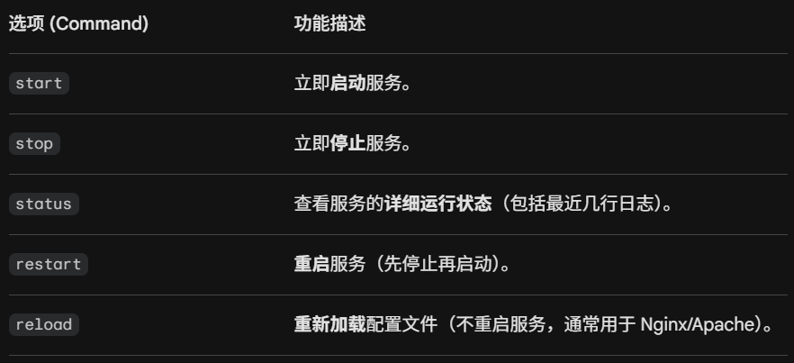
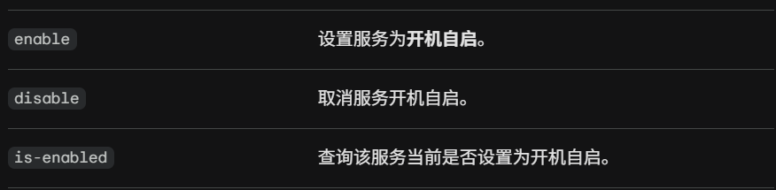

- [Linux基础知识](#linux基础知识)
  - [Linux背景知识](#linux背景知识)
  - [文件系统相关命令](#文件系统相关命令)
  - [Shell运算符](#shell运算符)
  - [权限入门](#权限入门)
    - [常用目录](#常用目录)
  - [python3提供的httpserver](#python3提供的httpserver)
  - [进程入门](#进程入门)
    - [crontab](#crontab)
  - [软件包与软件仓库](#软件包与软件仓库)
    - [apt vs dpkg](#apt-vs-dpkg)
    - [update与upgrade两兄弟的分工](#update与upgrade两兄弟的分工)

# Linux基础知识

ssh username@ip可以ssh（secure shell）远程登陆到ip主机
## Linux背景知识
名称 “Linux“ 实际上指的是一个类UNIX的开源操作系统内核。Ubuntu、CentOS、Kali 这些系统都是直接基于 Linux 内核构建。我们平时说的“安装 Linux 系统”，实际上安装的是 Linux 发行版（Flavours of Linux）。它是把 Linux 内核 + GNU 工具（如文件管理器、编译器）+ 桌面环境（如 GNOME）打包在一起形成的完整操作系统。

## 文件系统相关命令
- echo:也就是print，后面接上我们想要输出的内容（需要双引号）
- whoami：查看当前我们登录的用户。
- ls：listing 列出当前目录下文件以及文件夹
    - -a：可以列出所有文件（夹），包括隐藏。文件名第一个字符是"."的是隐藏文件
    - -l：列出文件（夹）详细信息。
- cd：change directory 更改目录
- cat：concatenate 连接，可用来输出文件内容
- pwd：print working directory 打印当前工作目录
- find：寻找我们需要的文件。比如，寻找所有的txt文件就可以用`find -name *.txt`
- grep：在整个文件中查找包含我们想要查找的值的条目。用法是`grep "?" filename`
    
    其中-R参数可以实现递归搜索。例如，要在当前目录及其子文件夹中的所有文件中搜索某个变量，我们可以运行：
    `grep -R "?" /etc/`
- wc：word count 单词统计，但是不只能统计单词。用法为`wc -option filename` 

    常用的参数有：

    - -l：lines 统计文件一共有多少行
    - -w：words 统计有多少个由空格分隔的字符串
    - -c：Bytes 统计文件的大小（单位：字节）
    - -m：Characters	统计字符数（处理中文等宽字符时与 -c 不同）
- touch：创建新文件
- mkdir：make directory创建新文件夹
- cp：copy 复制文件或文件夹，接受两个参数`cp a.txt b.txt`把a的内容复制到b内。
- scp：ssh copy。它允许我们：将当前系统中的文件和目录复制到远程系统，或将远程系统中的文件和目录复制到当前系统。
```
比如以下场景
目标主机IP：1.2.3.4
目标主机用户：bob
本地系统上的文件：aaa.txt
我们希望在目标主机上该文件的名称：bbb.txt

则将文件传输过去的命令为
scp aaa.txt bob@1.2.3.4:/home/bob/bbb.txt
将文件拷贝回来的命令为
scp bob@1.2.3.4:/home/bob/bbb.txt aaa.txt
```
- mv：move 移动文件或文件夹。接受两个参数`mv ./a.txt ../b.txt`本质是将a移动到../并改名为b。不写路径默认当前目录，不写文件名默认原文件名。所以mv命令也被用来重命名文件。
- rm：remove 移除文件或文件夹。

    移除文件夹时，需要加-R选项。本质是一种“递归”，先进到这个目录下递归把所有文件全部删除，再把这个目录删除。
- file：确定文件的类型。
- nano：接受一个filename参数，可以编辑该文件。
- vim：用法上是升级版的nano，以后再了解。
- wget：www get，从万维网上获取资源接受一个URI并尝试下载该资源。

## Shell运算符
- &：此运算符允许我们在终端后台运行命令。
- &&：此运算符允许我们将多个命令组合在终端的一行中。例如`A && B`，但这种情况下只有A成功执行才可以执行B。
- \>：此运算符是重定向器 - 意味着我们可以获取命令的输出（例如使用 cat 输出文件）并将其定向到其他地方。
- \>>：此运算符执行与运算符\>有相似的功能，但会追加输出而不是替换（这意味着不会覆盖任何内容）。

## 权限入门
- su：切换登录用户，如`su root`加上`-l`可以直接把我们带到新登录用户的主目录。
### 常用目录
- /etc：这个根目录是系统中最重要的根目录之一。etc文件夹（etcetera 的缩写）是存储操作系统所用系统文件的常用位置。 
- /var：variable data是Linux系统安装的主要根目录之一。该目录存储系统上运行的服务或应用程序经常访问或写入的数据。例如，运行中的服务和应用程序的日志文件会写入此处（/var/log），其他不一定与特定用户关联的数据（例如数据库等）也会写入此处。
- /tmp：这是Linux系统中一个独特的根目录。/tmp是“temporary”的缩写，它是一种易失性目录，用于存储只需访问一两次的数据。与计算机内存类似，计算机重启后，此文件夹中的内容将被清除。

    对我们渗透测试人员来说，这个文件夹的妙处在于，默认情况下任何用户都可以写入该文件夹。这意味着一旦我们获得了目标机器的访问权限，它就成了存储枚举脚本等文件的理想场所。
- /root：这个文件夹实际上是系统用户“root”的home目录。除此之外，这个文件夹本身并没有什么特别之处。不过，值得一提的是，通常情况下，root 用户的数据会保存在类似“ /home/root ”这样的目录中。
## python3提供的httpserver
Ubuntu系统预装了Python3。Python提供了一个轻量级且易于使用的模块“HTTPServer”。该模块可以将你的计算机变成一个快速简便的Web服务器，你可以用它来提供自己的文件，然后其他计算机可以使用诸如`curl`和`wget`之类的命令来下载这些文件。

在下面的代码片段中，我们从名为“webserver”的目录提供服务，该目录下只有一个名为“file”的文件。
```
使用 Python 启动 Web 服务器
tryhackme@linux3:/webserver# python3 -m http.server
Serving HTTP on 0.0.0.0 port 8000 (http://0.0.0.0:8000/) ...
```
现在，让我们使用wget 10.67.160.196 这个地址和文件名来下载文件。请记住，由于 Python 3 服务器运行在 8000 端口，我们需要在 wget 命令中指定端口号。例如：
```
以下是一个运行在 8000 端口上的 Web 服务器的 wget 命令示例
tryhackme@mymachine:~# wget http://10.67.160.196:8000/myfile
```
## 进程入门
每一个运行的进程都会有一个PID。
- ps：查看当前用户会话中正在运行的进程列表，以及一些附加信息，例如进程的状态代码、运行该进程的会话、进程占用的 CPU 使用时间以及正在执行的实际程序或命令的名称。
- ps aux：查看其他用户运行的进程以及那些不在会话中运行的进程。
- top：实时查看系统中运行进程的各项统计数据。数据每隔 10 秒会自动刷新一次。
- kill：后加PID可以结束该进程。
- systemctl：进程控制命令。`systemctl [option] [service]`

    其中option的基本选项有：
    
    
- ctrl+z：挂起当前前台运行的进程
- bg：使当前前台运行的进程改为后台运行
- fg：使当前后台运行的进程改为前台运行
### crontab

简单来说，crontab 是 Linux 系统中的任务计划表。

它的名字来源于 Cron Table，作用是让系统在特定的时间自动执行你预设好的命令或脚本。

1. 核心格式：五颗“星”
打开 crontab 文件，你会看到每一行任务都遵循这个经典格式：

```
* * * * * command to be executed
- - - - -
| | | | |
| | | | +----- 星期几 (0 - 6) (0是周日)
| | | +------- 月份 (1 - 12)
| | +--------- 每月几号 (1 - 31)
| | +----------- 小时 (0 - 23)
+------------- 分钟 (0 - 59)
```
举几个直观的例子：
```
30 2 * * * /backup.sh：每天 凌晨 2:30 执行备份。

0 0 * * 1 /clean.sh：每周一 0 点 执行清理。

*/5 * * * * /check.sh：每隔 5 分钟 运行一次检查。
```
2. 特殊快捷方式

为了偷懒，Linux 提供了一些预设的“别名”，不需要写那五颗星：

@reboot：系统开机/重启时运行一次。

@daily：每天午夜运行一次（相当于 0 0 * * *）。

@hourly：每小时运行一次（相当于 0 * * * *）。
## 软件包与软件仓库
当开发者希望向社区提交软件时，他们会将其提交到 “apt” 软件仓库。一旦通过审核，他们的程序和工具就会被公开发布。

"apt" 仓库就像是 Linux 界的“应用商店服务器”。我们只需要输入 `sudo apt install <文件名>`，系统就会自动从这些仓库里帮你抓取并安装。

### apt vs dpkg
dpkg 就像手动安装一个 .exe 文件，它不管依赖项；而 apt 就像应用商店，它会自动帮你把运行该软件所需的其他小插件一并装好，并且能自动升级。

### update与upgrade两兄弟的分工
在 Linux 中，更新系统通常分两步，它们的作用完全不同：

第一步：sudo apt update（更新索引/目录）
动作：你的电脑会连接到远程服务器，下载一份最新的软件包清单（包含软件名、版本号、下载地址）。

结果：执行完后，你的软件一个都没有变新。系统只是知道了：“哦，原来 Nginx 出 1.25 版了，但我现在装的是 1.24 版。”

第二步：sudo apt upgrade（真正的一键更新）
动作：根据第一步下载好的“新菜单”，把本地旧版本的软件全部替换成服务器上的新版本。

结果：执行完后，你的软件才真正变新了。