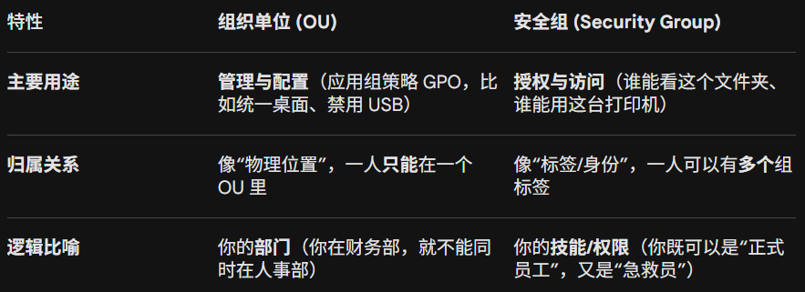

- [Windows基础知识](#windows基础知识)
  - [NTFS文件系统](#ntfs文件系统)
  - [windows文件夹](#windows文件夹)
  - [用户](#用户)
    - [用户帐户控制](#用户帐户控制)
  - [系统配置和高级系统设置](#系统配置和高级系统设置)
  - [命令提示符cmd-基础命令](#命令提示符cmd-基础命令)
    - [注册表编辑器](#注册表编辑器)
- [AD(active directory)基础](#adactive-directory基础)
    - [Security Groups安全组 vs Organizational Units组织单位](#security-groups安全组-vs-organizational-units组织单位)
  - [GPO](#gpo)
  - [身份验证](#身份验证)
    - [Kerberos验证流程：](#kerberos验证流程)

# Windows基础知识

## NTFS文件系统
现代版本的 Windows 使用的文件系统是 New Technology File System（新技术文件系统），简称 NTFS。

1. NTFS 被称为**日志型文件系统**。如果发生故障，文件系统可以利用存储在日志文件中的信息，自动修复磁盘上的文件夹或文件。这种功能在 FAT 系统上是无法实现的。

    NTFS 解决了之前文件系统的许多局限性，例如：
    - 支持大于 4GB 的单个文件
    - 可以对文件夹和文件设置特定的权限
    - 支持文件夹和文件压缩
    - 支持加密（即加密文件系统，简称 EFS）
2. NTFS 的另一个特性是备用数据流（Alternate Data Streams，简称 ADS）。

    ADS 是 NTFS 特有的一种文件属性。每个文件至少拥有一个数据流（即 $DATA），而 ADS 允许文件包含多个数据流。原生状态下，Windows 资源管理器不会向用户展示这些 ADS 信息。

    从安全角度来看，恶意软件编写者曾利用 ADS 来隐藏数据。但并非所有 ADS 的用途都是恶意的。例如，当我们从互联网下载文件时，系统会在 ADS 中写入标识符，用以识别该文件来源于网络（这也就是为什么我们打开下载的文件时，系统有时会提示“此文件来自另一台计算机，可能被锁定”）。
## windows文件夹
Windows 文件夹（C:\Windows ）通常被称为包含 Windows 操作系统的文件夹。 文件夹不一定非得位于 C 盘。它可以位于任何其他驱动器，理论上甚至可以位于不同的文件夹中。

Windows 目录的系统环境变量是%windir% 

“Windows”文件夹内有很多子文件夹。众多文件夹之一是**System32**。 System32 文件夹包含对操作系统至关重要的重要文件。

## 用户
在典型的本地 Windows 系统中，用户帐户可以分为两种类型：管理员和 标准用户。 

用户帐户类型决定了用户可以在该特定 Windows 系统上执行哪些操作。 

- 管理员可以对系统进行更改：添加用户、删除用户、修改组、修改系统设置等。 
- 标准用户只能更改属于该用户的文件夹/文件，不能执行系统级更改，例如安装程序。

一种获取用户信息及其他信息的方法是使用本地用户和组管理：右键单击“开始”菜单，然后单击“运行”（WIN+R）。
### 用户帐户控制
绝大多数家庭用户都以本地管理员身份登录Windows系统。为了保护拥有此类权限的本地用户，微软引入了用户帐户控制（User Account Control ）。

UAC的工作原理是：当管理员账户类型的用户登录系统时，当前会话不会以提升的权限运行（也就是会以普通用户的权限运行）。当需要执行需要更高权限的操作时，系统会显式提示（弹出对话框）用户确认是否允许该操作运行。 
## 系统配置和高级系统设置
- msconfig：系统配置实用程序。用于高级故障排除，其主要目的是帮助诊断启动问题。忘记系统工具（如注册表等）的地址（启动方法）是可以从这个程序的tools页面查看。
- compmgmt.msc：有三个主要部分：系统工具、存储以及服务和应用程序。
- lusrmgr.msc：打开本地用户和组。
- Msinfo32：该工具会收集有关您计算机的信息，并显示硬件、系统组件和软件环境的全面视图，我们可以使用这些信息来诊断计算机问题。
- resmon：Resource Monitor。资源监视器显示每个进程和汇总信息
## 命令提示符cmd-基础命令
- hostname：输出计算机名称
- whoami：输出登录用户的名称
- ipconfig：显示计算机的网络地址设置
- /?：每个命令后面加这个，可以显示该命令的使用手册。
- cls：清除cmd屏幕。
- netstat：显示协议统计信息和当前 TCP/IP 网络连接。
- net：根名令，通过子命令来管理网络环境。当输入net而不带子命令时，输出将显示net命令的语法，并显示一些你可以使用的子命令。要想查看帮助手册，需要添加help参数而不是/?。比如想知道net view怎么用，就输入net help view。
### 注册表编辑器
Windows 注册表是一个中央分层数据库，用于存储为一个或多个用户、应用程序和硬件设备配置系统所需的信息。
注册表包含 Windows 在运行过程中不断引用的信息，例如：

- 每个用户的个人资料
- 计算机上安装的应用程序以及每个应用程序可以创建的文档类型
- 文件夹和应用程序图标的属性表设置
- 系统上有哪些硬件
- 正在使用的端口

使用`regedt32.exe`可以打开

# AD(active directory)基础
简而言之，Windows domain是指由特定企业管理的一组用户和计算机。域背后的主要思想是将 Windows 计算机网络中常用组件的管理集中到一个称为 Active Directory 的存储库中。

要在 Active Directory 中配置用户、组或计算机，我们需要登录到域控制器，然后从开始菜单运行“Active Directory 用户和计算机”
### Security Groups安全组 vs Organizational Units组织单位

- 组织单位（OUs） 对于向用户和计算机应用策略（Policies）非常方便。这些策略包含了针对企业中不同角色的用户群体所进行的特定配置。请记住，一个用户在同一时间内只能属于一个 OU，因为如果试图向同一个用户应用两套不同的策略，逻辑上是行不通的。

- 相比之下，安全组（Security Groups） 则用于授予对资源的权限。例如，如果你想允许某些用户访问共享文件夹或网络打印机，你就会使用“组”。一个用户可以同时属于多个组，这对于授予多种不同资源的访问权限是必不可少的。

对比图：

通过`delegate control`可以委托给一个组织单位或某个成员某项权限。
## GPO
Windows通过组策略对象（Group Policy Objects，简称GPO）来管理这些策略。简单来说，GPO就是一组可以应用到组织单位（OU）上的设置集合。GPO既可以包含针对用户的策略，也可以包含针对计算机的策略，这让你能够为特定的机器和身份建立一套标准配置基线。

若要配置GPO，可以使用“组策略管理”(Group Policy Management)工具，该工具可以从“开始”菜单中找到。

如果我们创建并链接了 GPO，但由于某种原因它们仍然不起作用，可以运行命令`gpupdate /force`来强制更新 GPO

## 身份验证
使用 Windows 域时，所有凭据都存储在域控制器中。每当用户尝试使用域凭据对服务进行身份验证时，该服务都需要向域控制器请求验证凭据是否正确。Windows 域中可以使用两种协议进行网络身份验证：

- Kerberos：适用于所有最新版本的 Windows 系统。这是所有现代域中的默认协议。
- NetNTLM：为了兼容性而保留的传统身份验证协议。
### Kerberos验证流程：
1. 客户端向AS(Authentication Service)申请TGT (Ticket Granting Ticket)票据许可票据
2. 客户端拿着上面的TGT，向TGS(Ticket Granting Service，票据授予服务)申请ST(Service Ticket)服务票据。
3. 客户端拿着ST向服务器申请，服务器验证ST后开放服务。