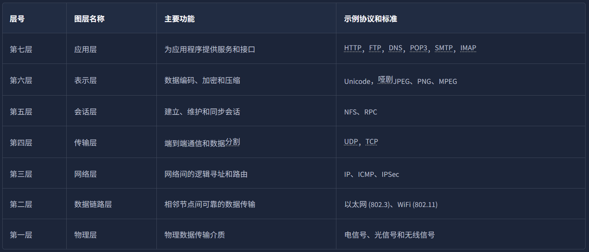
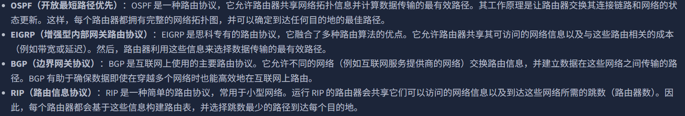
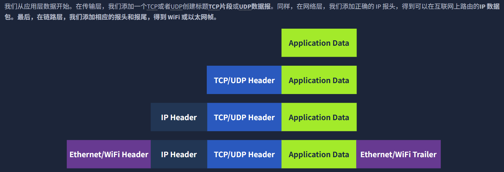
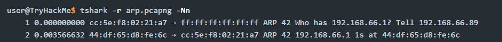
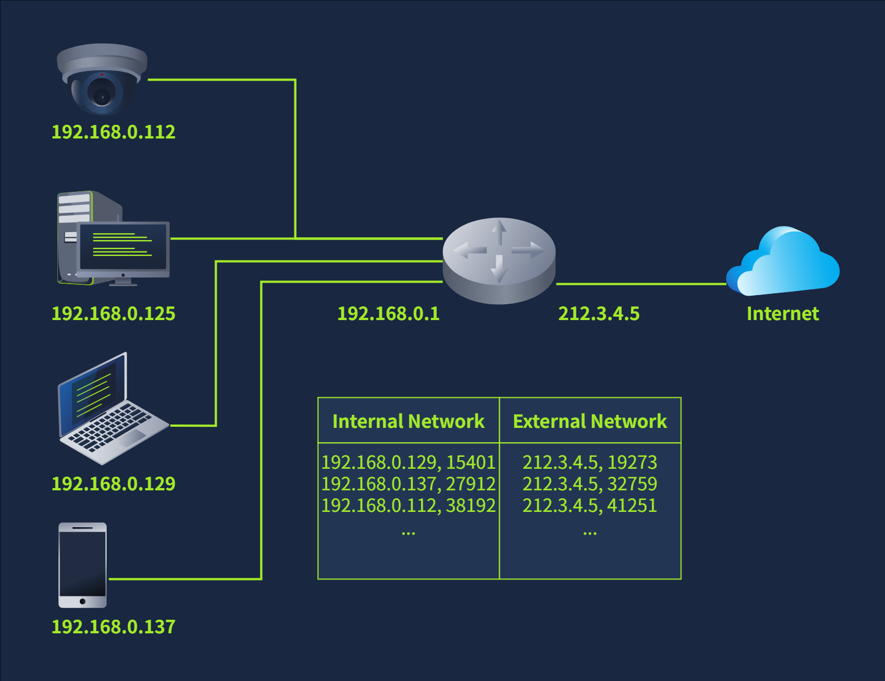
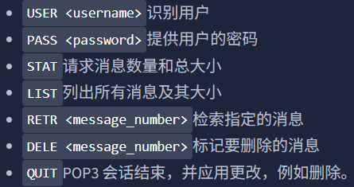
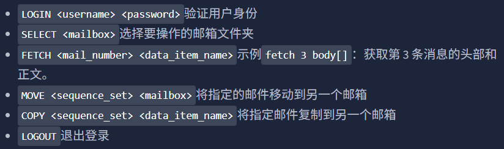
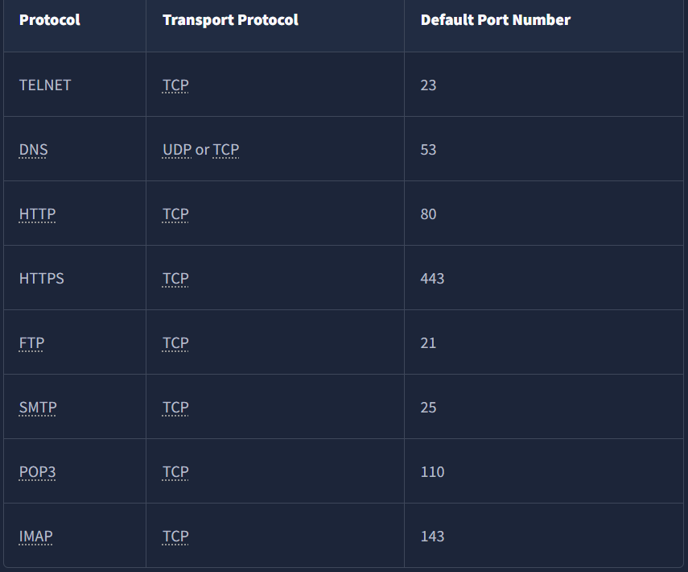
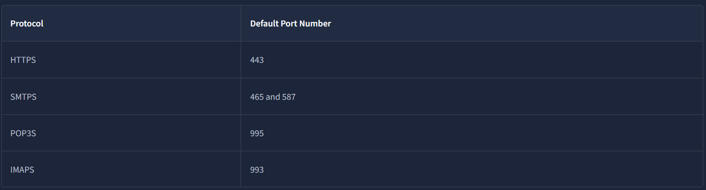

# 网络入门
## OSI模型
物理层、数据链路层、网络层、运输层、会话层、表示层、应用层（口诀：物联网叔会使用）

①物理层：处理设备之间的物理连接，这包括传输介质（例如电线）以及二进制数字 0 和 1 的定义。

②数据链路层：负责在同一个物理链路（比如同一根网线、同一个 WiFi 信号范围）中，把数据从一个设备传给另一个设备。例子包括以太网和 WiFi。以太网和 WiFi 地址均为六个字节。它们的地址称为 MAC 地址，其中 MAC 代表媒体访问控制地址 (Media Access Control)。

③网络层：负责在不同网络之间传输数据。更具体地说，网络层负责逻辑寻址和路由，也就是找到在不同网络之间传输网络数据包的路径。

④传输层：实现了不同主机上运行的应用程序之间的端到端通信。例子包括传输控制协议 （TCP）和用户数据报协议（UDP）。

⑤会话层：负责建立、维护和同步运行在不同主机上的应用程序之间的通信。示例包括网络文件系统（NFS）和远程过程调用（RPC）。

⑥表示层：确保数据以应用层可以理解的形式传递。负责数据编码、压缩和加密。编码的一个例子是字符编码，例如 ASCII 或 Unicode。

⑦应用层：直接向终端用户应用程序提供网络服务。示例：HTTP，FTP，DNS，POP3，SMTP，和IMAP。

## TCP/IP模型
该模型的优势之一在于，即使网络的部分功能中断（例如，由于军事攻击），它也能确保网络继续运行。这种能力部分得益于**路由协议的设计**，使其能够随着网络拓扑结构的变化而进行调整。

***提到TCP/TP模型，大多数教材都采用了五层架构而非OSI的七层架构。（将OSI的会话层、表示层、应用层合并成了应用层）。***

### IP地址和子网
P 地址由4个字节（即 32 bits）组成。一个字节可以表示 0 到 255 之间的十进制数。

*0地址结尾代表这个网络，255结尾作为广播地址*

#### 私有IP地址范围
- 10.0.0.0 - 10.255.255.255 (10/8)
- 172.16.0.0 - 172.31.255.255 (172.16/12)
- 192.168.0.0 - 192.168.255.255 (192.168/16)

私网 IP 地址无法被外部网络访问或访问。它就像一座与世隔绝的城市或社区，所有房屋和公寓都按顺序编号，彼此之间可以轻松交换邮件，但无法与外界联系。**私网 IP 地址要访问互联网，路由器必须拥有公网 IP 地址，并且必须支持网络地址转换 (NAT)。**

#### 路由
从技术角度来说，**路由器负责将数据包转发到正确的网络。**

通常情况下，数据包在到达最终目的地之前会经过多个路由器。路由器在网络第三层工作，它会检查IP地址，并将数据包转发到最佳网络（路由器），从而使数据包更接近其目的地。

#### 路由算法

### TCP/UDP
UDP是一个简单的无连接协议，运行在传输层，即第 4 层。无连接意味着它不需要建立连接。UDP甚至没有提供任何机制来知道数据包是否已送达。

TCP传输控制协议是一种面向连接的传输协议。它使用各种机制来确保网络主机上不同进程发送的数据能够可靠地传输。由于它是面向连接的，因此需要建立连接。TCP必须先建立连接才能发送任何数据。
- 三次握手、四次挥手

### 封装
封装指的是每一层在接收到的数据单元中***添加头部（有时还会添加尾部）***，并将“封装”后的数据单元发送到下一层的过程。

## Telnet
**TELNET协议是一种用于远程终端连接的网络协议。**

简单来说，telnet客户端允许您连接到远程系统并与之通信，还可以发送文本命令。telnet 的作用是“搭桥”：在一些场景下，它的任务仅仅是建立 TCP 连接（比如使用SMTP）。

虽然最初它用于远程管理，但我们也可以使用它telnet来连接到任何监听指定 TCP 端口号的服务器。

# 网络要点
## DHCP
如何保证同一网段下的两台设备的IP地址不会撞？解决之道在于使用动态主机配置协议（Dynamic Host Configuration Protocol）。DHCP 是一种依赖于 UDP 的应用层协议。DHCP服务器监听 UDP 67 号端口，而客户端通过 UDP 68 号端口发送DCHP请求。

DHCP遵循四个步骤：发现、提供、请求和确认（DORA）：

1. DHCP发现：客户端广播 DHCP DISCOVER 消息以查找本地 DHCP 服务器。
2. DHCP提供：服务器以 DHCP OFFER 消息响应，其中包含可供客户端接受的 IP 地址。
3. DHCP请求：客户端以 DHCP REQUEST 消息进行响应，表明它已接受所提供的 IP 地址。
4. DHCP确认：服务器回复 DHCP ACK 消息，确认所提供的 IP 地址已分配给该客户端。

## ARP
地址解析协议 (Address Resolution Protocol) 使得在以太网上查找另一台设备的 MAC 地址成为可能。它的作用就是根据IP地址查MAC地址。

示例：IP 地址为 的主机A 192.168.66.89 想要与 IP 地址为192.168.66.1 的另一台主机B通信。

主机A发送一个 ARP 请求，请求 IP 地址为 的主机192.168.66.1做出响应。请求从主机A的 MAC 地址发送到广播 MAC 地址ff:ff:ff:ff:ff:ff。具有该 IP 地址的主机B 192.168.66.1以其 MAC 地址进行响应。至此，两台主机即可交换数据链路层帧。

*ARP请求与ARP回复并未封装在UDP数据包或IP数据包中；它直接封装在以太网帧中。*

## ICMP
互联网控制消息协议 (nternet Control Message Protocol) 主要用于网络诊断和错误报告。

有两个常用的命令依赖于 ICMP，它们在网络故障排除和网络安全方面发挥着重要作用。这两个命令是：

- ping：此命令使用 ICMP 协议测试与目标系统的连接，并测量往返时间 (RTT)。换句话说，它可以用来判断目标系统是否正常运行，以及其回复能否到达我们的系统。ping命令会发送一个 ICMP 回显请求（ICMP 类型8），接收端的计算机以 ICMP 回显应答（ICMP 类型0）进行响应。
- traceroute：该命令在 Linux 和类 UNIX 系统以及MS Windows 系统上均可调用tracert。它使用 ICMP 协议来发现从您的主机到目标的路由。

## NAT
NAT 的基本原理是使用一个公网 IP 地址为多个私有 IP 地址提供互联网访问。

支持 NAT 的路由器维护一个转换表，用于转换内部网络和外部网络之间的网络地址。通常，内部网络使用私有 IP 地址范围，而外部网络使用公共 IP 地址。

例如，上图中，笔记本电脑可能与某个 Web 服务器建立连接。从笔记本电脑的角度来看，连接是通过其内部 IP 地址192.168.0.129和 TCP 源端口号15401发起的；然而，Web 服务器看到的同一连接是通过IP地址 212.3.4.5和 TCP 端口号19273建立的。

# 网络核心协议
主要包括这些协议：
- WHOIS
- DNS
- HTTP和FTP
- SMTP，POP3， 和IMAP
## DNS
DNS 运行在 ISO OSI 模型中的应用层，即第 7 层。DNS 流量默认使用 UDP 53 端口，并将 TCP 53 端口作为默认的备用方案。

DNS主要包括以下四个记录：
- **A 记录**：A（地址）记录将主机名映射到一个或多个 IPv4 地址。例如，您可以将其设置example.com为解析为172.17.2.172。
- **AAAA 记录**：AAAA 记录类似于 A 记录，但它是用于 IPv6 的。
- **CNAME 记录**：规范名称（Canonical Name）记录将一个域名映射到另一个域名。例如，www.example.com 可以映射到 example.com，甚至可以映射到 example.org。
- **MX 记录**：邮件交换（Mail Exchange）记录指定负责处理域的电子邮件的邮件服务器。

`nslookup example.com`可以用来查询置顶域名的IP地址

## WHOIS
WHOIS 记录提供域名注册实体的相关信息，包括名称、电话号码、电子邮件地址和地址。

通过WHOIS记录，我们可以查看记录的首次创建时间和最后更新时间，还可以找到注册人的姓名、地址、电话号码和电子邮件地址。

## HTTP(S)
网络浏览器通常会向网络服务器发出以下一些命令或方法：

- GET：从服务器检索数据，例如 HTML 文件或图像。
- POST：向服务器提交新数据，例如提交表单或上传文件。
- PUT：用于在服务器上创建新资源，以及更新和覆盖现有信息。
- DELETE：用于删除服务器上指定的文件或资源。

HTTP 和 HTTPS 通常分别使用 TCP 端口 80 和 443，较少使用其他端口，如 8080 和 8443。

## FTP
该协议旨在传输文件。在相同条件下，它传输文件的效率比HTTP高。

**FTP服务器默认监听 TCP 端口 21** ，数据传输通过客户端到服务器的另一个连接进行。也就是说，FTP 比较特殊，它将“控制”和“数据”设在了不同的端口。

`ftp example.com`可以连接到目标服务器的21端口。下载命令用get。

## SMTP
简单邮件传输协议（Simple Mail Transfer Protocol）定义了邮件客户端如何与邮件服务器通信以及邮件服务器如何与其他邮件服务器通信。

**SMTP 服务器默认监听 TCP 端口 25。** 使用时首先先用telnet连接到服务器的25号端口，然后再输入SMTP的相关命令：

①HELO或EHLO：发起 SMTP 会话

②MAIL FROM：指定发件人的电子邮件地址

③RCPT TO：指定收件人的电子邮件地址

④DATA：表示客户端将开始发送电子邮件的内容。

⑤`.`：单独一行发送，表示电子邮件结束。

## POP3
The Post Office Protocol version 3（POP3）旨在允许客户端与邮件服务器通信并检索电子邮件。

**POP3 服务器默认监听 TCP 端口 110** 使用时首先先用telnet连接到服务器的110号端口，然后再输入POP3的相关命令.

一些常见的POP3命令如下：

## IMAP
Internet Message Access Protocol 允许同步已读、已移动和已删除的消息。当我们通过多个客户端查看电子邮件时，IMAP非常方便。

**IMAP 服务器默认监听 TCP 端口 143** 使用时首先先用telnet连接到服务器的143号端口，然后再输入IMAP的相关命令：

## 小结：各个协议的默认端口号

# 网络安全协议
## TLS
与其前身 SSL 一样，TLS 是一种运行在 OSI 模型传输层的加密协议。它允许客户端与服务器在不安全的网络上进行安全通信。所谓的“安全”，我们是指机密性和完整性；TLS 确保了没有任何人能够读取或修改交换的数据。

如今，数十种协议通过简单地加入 TLS 实现了安全性升级。例如 HTTP、DNS、MQTT 和 SIP，它们分别演变成了 HTTPS、DoT（DNS over TLS）、MQTTS 和 SIPS，其中后缀 “S” 代表由于使用了 SSL/TLS 而变得“安全”（Secure）。
### 认证过程
任何需要证明自己身份的服务器（或客户端），其第一步都是获取一份经签名的 TLS 证书。通常情况下，服务器管理员会创建一个证书签名请求 (CSR) 并将其提交给证书颁发机构 (CA)；CA 随后会审核该 CSR 并颁发一份数字证书。

一旦收到了这份（已签名的）证书，它就可以用来向他人证明服务器（或客户端）的身份，而他人则可以确认该签名的有效性。为了让一台主机能够确认签名证书的有效性，主机上必须预先安装好这些签名机构（CA）的证书。

## HTTPS
HTTPS 代表超文本传输​​安全协议 (Hypertext Transfer Protocol Secure)。它本质上是基于 TLS 的 HTTP 协议。因此，通过 HTTPS 请求页面需要以下三个步骤（在解析域名之后）：

1. 建立一个TCP与目标服务器进行三次握手
2. 建立 TLS 会话
3. 使用HTTP协议进行通信；例如，发出HTTP请求，例如：GET / HTTP/1.1

## SMTPS、POP3S和IMAPS
添加TLS到SMTP，POP3，和IMAP与添加TLS到HTTP并无不同。因此，HTTPS 讨论中的几乎所有要点都适用于这些协议。

这里列出这些协议添加TLS后的端口号。

## SSH
SSH（Secure Shell）是一种加密的网络传输协议，专门用于在不安全的网络中代替Telnet为计算机之间提供安全的远程登录和命令行执行。默认运行在22号端口。

`ssh username@hostname`此命令用于远程SSH登录。

OpenSSH（一个SSH的开源实现）的优点：

- 安全认证：除了基于密码的认证外，SSH 还支持公钥认证和双因素认证。
- 保密性：OpenSSH 提供端到端加密，防止窃听。此外，它还会通知您新的服务器密钥，以防止中间人攻击。
- 完整性：除了保护交换数据的机密性之外，密码学还可以保护流量的完整性。
- 隧道：SSH 可以创建一个安全的“隧道”，将其他协议的流量通过 SSH 传输。这种设置可以建立类似 VPN 的连接。
- X11 转发：如果您连接到具有图形用户界面的类 Unix 系统，SSH 允许您通过网络使用该图形应用程序。
## SFTP和FTPS
SFTP 代表 SSH FTP，支持安全的文件传输。它是 SSH 协议族的一部分，并共享相同的端口号 22。如果在 OpenSSH 服务器配置中启用了该功能，你可以使用类似于 `sftp 用户名@主机名` 的命令进行连接。登录后，你可以执行 get 文件名 来下载文件，或执行 put 文件名 来上传文件。总的来说，SFTP 的命令风格类似于 Unix，与普通的 FTP 命令有所不同。

而FTPS 是使用 TLS 进行加密的,通常使用 990 端口。它需要配置证书，并且由于它沿用了 FTP 那种“控制连接”与“数据连接”分离的机制，在严格的防火墙环境下配置起来会比较麻烦。

搭建 SFTP 服务器非常简单，只需在 OpenSSH 服务器中启用一个选项即可。而 FTPS 则像 HTTPS、SMTPS、POP3S、IMAPS 以及其他依赖 TLS 的协议一样，需要一份正式的 TLS 证书 才能安全运行。

## VPN
VPN 的全称是 Virtual Private Network（虚拟专用网络）。

简单来说，VPN 的核心作用是为你建立一条“私密隧道”，把你原本暴露在公共网络（互联网）上的流量，通过加密包裹起来传输。

### 它是如何工作的？

当你开启 VPN 后，过程如下：

①加密：你的设备把数据包用加密算法（如 TLS, IPsec, WireGuard）打包。

②隧道传输：数据通过这条加密的“隧道”发送给 VPN 服务器。

③身份切换：VPN 服务器收到后解密，再以“服务器的 IP”去访问目标网站。

④返回：目标网站把数据发给 VPN 服务器，服务器再加密后传回给你。

**结果：网站只看到了 VPN 服务器的 IP，而看不见你真实的 IP。**

### VPN 的三个主要用途：

1. 保护隐私与安全（最原始的用途）：
在公共 Wi-Fi（如咖啡馆、机场）下，黑客很容易截获你的流量。VPN 强制将所有数据加密，即使被截获，黑客也只能看到一堆乱码。

2. 访问受限资源：
有些网络环境对访问权限有限制，通过连接到特定地区的 VPN 服务器，你可以像身处当地一样访问该地区的互联网资源。

3. 远程办公（企业 VPN）：
这是 VPN 的“正统”用途。公司内网资源通常是不联网的，员工在家里办公时，必须通过 VPN 拨入公司内网，就像物理上连接了公司的交换机一样安全地访问内部文件和系统。
# 网络工具入门
这些工具不是理论知识，记笔记没有太大意义，要在事件中学习。
## Wireshark
Wireshark 是一款开源、跨平台的网络数据包分析工具，能够嗅探和调查实时流量，并检查数据包捕获文件（PCAP）。它被公认为最出色的数据包分析工具之一。

它有多种用途：
- 检测和排除网络问题，例如网络负载故障点和拥塞。
- 检测安全异常情况，例如恶意主机、异常端口使用情况和可疑流量。
- 调查和学习协议细节，例如响应代码和有效载荷数据。
### Wireshark filter
要按协议名称筛选，只需输入协议名称并按回车键，或单击显示筛选栏右侧的箭头按钮。

要按协议端口号筛选，可以使用以下结构`TCP.port == <端口号>`或`UDP.port == <端口号>`。例如，如果您只想查看http数据包，您可以使用过滤器输入`TCP.port == 80`，然后按回车键。

按 IP 地址筛选：
在分析数据包捕获时，经常需要筛选出特定的 IP 地址。要筛选出特定的 IP 地址，可以使用结构`ip.addr == <IP 地址>`。例如，如果您需要查找 IP 地址 192.168.1.2，则筛选条件为`ip.addr == 192.168.1.2`。