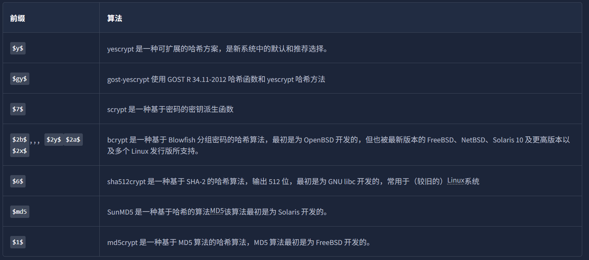
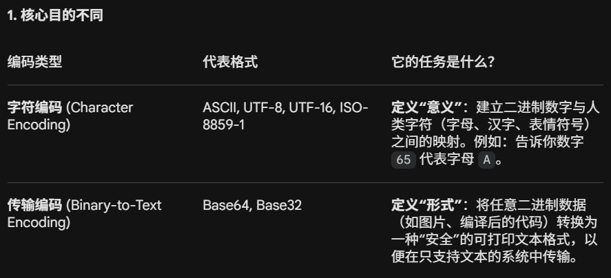

- [密码学基础](#密码学基础)
    - [常用名词中英文对应](#常用名词中英文对应)
  - [SSH](#ssh)
    - [生成ssh密钥对](#生成ssh密钥对)
  - [数字签名和证书](#数字签名和证书)
    - [什么是数字签名 (Digital Signature)？](#什么是数字签名-digital-signature)
    - [什么是证书 (Certificates)？](#什么是证书-certificates)
  - [PGP和GPG](#pgp和gpg)
  - [哈希函数](#哈希函数)
    - [Linux密码](#linux密码)
    - [Windows密码](#windows密码)
  - [Hashcat破解哈希](#hashcat破解哈希)
    - [核心优势](#核心优势)
    - [基础语法结构](#基础语法结构)
    - [四种核心攻击模式](#四种核心攻击模式)
    - [掩码攻击符号对照表](#掩码攻击符号对照表)
    - [使用流程](#使用流程)
    - [命令示例](#命令示例)
    - [区分哈希、编码与加密](#区分哈希编码与加密)
  - [John the Ripper](#john-the-ripper)
    - [基本语法](#基本语法)
    - [自动破解](#自动破解)
    - [哈希值类型确定](#哈希值类型确定)
    - [格式特定破解](#格式特定破解)
    - [Windows的密码哈希：NTHash / NTLM](#windows的密码哈希nthash--ntlm)
    - [Linux的密码哈希文件](#linux的密码哈希文件)
    - [单一破解模式（Single Crack Mode）](#单一破解模式single-crack-mode)
    - [使用单裂变模式](#使用单裂变模式)
    - [自定义规则](#自定义规则)
    - [John破解压缩包密码](#john破解压缩包密码)
    - [John破解SSH私钥密码](#john破解ssh私钥密码)

# 密码学基础
***由于这部分在学校课程中涉猎较多，所以笔记只挑重点记。***
### 常用名词中英文对应
- Plaintext：明文
- Ciphertext：密文
- Cipher：加密算法
- Key：密钥
- Encryption：加密
- Decryption：解密
## SSH
```
root@TryHackMe# ssh 10.10.244.173
The authenticity of host '10.10.244.173 (10.10.244.173)' can't be established.
ED25519 key fingerprint is SHA256:lLzhZc7YzRBDchm02qTX0qsLqeeiTCJg5ipOT0E/YM8.
This key is not known by any other name.
Are you sure you want to continue connecting (yes/no/[fingerprint])? yes
Warning: Permanently added '10.10.244.173' (ED25519) to the list of known hosts...
```
在上述互动中，SSH客户端确认我们是否识别服务器的公钥指纹。在本例中，ED25519 是用于生成和验证数字签名的公钥算法。SSH客户端无法识别此密钥，并要求我们确认是否继续连接。出现此警告是因为可能存在中间人攻击；恶意服务器可能拦截了连接并冒充目标服务器进行回复。

在这种情况下，用户必须对服务器进行身份验证，即通过检查公钥签名来确认服务器的身份。一旦您回答“是”，SSH客户端会将此主机的公钥签名记录下来。以后，除非此主机回复不同的公钥，否则客户端将静默连接。
### 生成ssh密钥对
`ssh-keygen`是通常用于生成密钥对的程序。它支持多种算法：
- DSA（数字签名算法）是一种专门为数字签名设计的公钥密码算法。
- ECDSA（椭圆曲线数字签名算法）是 DSA 的一种变体，它使用椭圆曲线密码学来提供更小的密钥长度，同时保持相同的安全性。
- ECDSA-SK（带安全密钥的 ECDSA）是 ECDSA 的扩展版本。它集成了基于硬件的安全密钥，以增强私钥保护。
- Ed25519是一个使用 EdDSA（Edwards 曲线数字签名算法）和 Curve25519 的公钥签名系统。
- Ed25519-SK（带安全密钥的 Ed25519）是 Ed25519 的一个变体。与 ECDSA-SK 类似
## 数字签名和证书
### 什么是数字签名 (Digital Signature)？
数字签名是物理世界中“手写签名”或“盖章”的数字化对等物，主要用于证明电子文档的真实性（Authenticity）和完整性（Integrity）。

工作原理：它利用非对称加密技术。发送者使用自己的私钥对文件（或文件的哈希值）进行加密生成签名。

验证过程：任何人都可以使用发送者的公钥来解密并验证。如果解密后的内容与原始文件匹配，就证明：

- 身份真实：文件确实是由私钥持有者签署的（因为私钥只有本人有）。
- 内容完整：文件在传输过程中没有被篡改。注意：它不同于简单的“电子签名”（比如在文档里贴一张签名的图片），后者无法保证文档不被修改。

### 什么是证书 (Certificates)？
证书是公钥密码学的重要应用，主要用于证明“你确实是你”。它就像是数字世界里的“身份证”。

核心作用：解决信任问题。例如，当你访问一个网站时，证书能证明该服务器确实是真实的目标网站（如 tryhackme.com），而不是钓鱼网站。

信任链 (Chain of Trust)：
- 证书不是自封的，而是由受信任的证书颁发机构 (CA) 签署的。
- 你的浏览器或操作系统预装了一份信任名单（根 CA）。
- 链条逻辑：浏览器信任 CA $\rightarrow$ CA 信任某个组织 $\rightarrow$ 该组织签署了网站证书。因此，浏览器最终信任该网站。

实际应用：最常见于 HTTPS。网站管理员可以向 CA 支付费用获取证书，或者通过 Let's Encrypt 等机构免费获取，从而实现加密传输。
## PGP和GPG
PGP代表 Pretty Good Privacy（良好隐私保护）。它是一款用于加密文件、执行数字签名等的加密软件。GnuPG或GPG是 OpenPGP 标准的开源实现。

常用命令：

使用`gpg --import backup.key` 从 backup.key 导入密钥。

使用 `gpg --decrypt confidential_message.gpg` 来解密消息。
## 哈希函数
哈希值是由哈希函数计算出的固定长度的字符串或字符。哈希函数接受任意长度的输入，并返回固定长度的输出，即哈希值。

提取文件哈希值的命令：md5sum、sha256sum、sha512sum、sha1sum

**加盐存储的目的**：防止彩虹表暴力破解，本质上是人为把你的密码修改掉，你用123456当密码，彩虹表一定有，但是加盐变成123456U$*iop以后，彩虹表就不一定有了，但是用户的体感还是自己输入了123456。

### Linux密码
Linux密码的哈希值存储在/etc/shadow文件中，只有root用户可以读取

加密后的密码字段包含四个组成部分的哈希口令：前缀（算法 ID）、选项（参数）、盐（Salt）以及哈希值。

其保存格式为 `$prefix$options$salt$hash`。前缀使得识别 Unix 和 Linux 风格的密码变得容易；它指定了用于生成该哈希值的加密算法。

常见前缀：


### Windows密码
在微软Windows系统中，密码哈希值存储在安全帐户管理器（SAM）中。微软Windows会尽量阻止普通用户导出这些哈希值，但像mimikatz这样的工具可以绕过微软Windows的安全机制。值得注意的是，SAM中的哈希值分为NT哈希值和LM哈希值。

## Hashcat破解哈希
Hashcat 被誉为世界上最快、最强大的密码恢复工具。它通过榨干 GPU的算力，利用大规模并行计算来破解各种类型的加密哈希值。

### 核心优势

1. 硬件加速：支持 GPU、CPU、FPGA 等硬件，利用 OpenCL/CUDA 架构实现极速破解。

2. 支持广泛：支持 300+ 种哈希算法（如 MD5, SHA-1, SHA-512, bcrypt, WPA2, Office 文件密码等）。

3. 灵活性极高：提供强大的规则系统（Rules），支持多种复杂的破解逻辑。

### 基础语法结构
命令格式：`hashcat [选项] [哈希文件] [字典/掩码/目录]`

关键参数：

- -m (Hash Mode): 指定哈希算法类型（如 0 是 MD5，3200 是 bcrypt）。

- -a (Attack Mode): 指定攻击模式。

- --force: 忽略驱动警告（虚拟机用户必备）。

- --show: 显示已破解出的明文密码，不再重新运行。

### 四种核心攻击模式 
|模式编号|名称|描述|适用场景|
|---|---|---|---|
|-a 0|字典攻击|使用现成的密码本（如 rockyou.txt）逐行比对|针对常用密码、弱口令|
|-a 3|掩码攻击|暴力破解，尝试特定规则的字符组合|知道密码长度或大致格式|
|-a 1|组合攻击|将两个字典中的单词进行两两拼接|针对“单词+单词”组合|
|-a 6|混合攻击|字典单词 + 掩码（在单词前后附加字符）|针对“单词+年份/符号”

### 掩码攻击符号对照表
在 -a 3 模式下，使用以下占位符代表不同的字符集：

- ?l : 小写字母 (abc...)

- ?u : 大写字母 (ABC...)

- ?d : 数字 (0-9)

- ?s : 特殊符号 (!@#...)

- ?a : 以上所有字符的合集

示例：破解 4 位数字密码，掩码为 ?d?d?d?d。

### 使用流程
1. 识别哈希：观察哈希长度和前缀（如 $2a$ 为 bcrypt）。
2. 查找编号：在 Hashcat Example Hashes 官方页面查找对应的 -m 值。
3. 先易后难：
    - 先用在线破解服务（如 CrackStation）
    - 再用 hashcat -a 0 跑常用字典。
    - 最后才考虑耗时最长的暴力破解。

### 命令示例
①基础字典攻击 (MD5)

命令：`hashcat -m 0 -a 0 target.txt /usr/share/wordlists/rockyou.txt`

②暴力破解 (SHA-256)
假设密码是 6 位纯小写字母：

命令：`hashcat -m 1400 -a 3 target.txt ?l?l?l?l?l?l`

③破解特定设备 (Cisco-ASA MD5)

命令：`hashcat -m 2410 -a 0 cisco.txt rockyou.txt`

### 区分哈希、编码与加密
**哈希**是一种将输入数据转换为哈希值的过程，哈希值是一个固定长度的字符串，也称为摘要。该哈希值唯一地表示数据，数据的任何变化，无论多么微小，都会导致哈希值的变化。哈希不应与加密或编码混淆；哈希是单向的，无法逆向还原原始数据。

**编码**是将数据转换为特定格式以实现系统兼容的过程。ASCII、ISO-8859-1 和 Windows-1252 是早期的字符编码方式，主要支持英语及西欧语言；而 UTF-8、UTF-16 和 UTF-32 属于 Unicode 编码标准，能够兼容全球所有语言（如阿拉伯语、日语等）。

与上述用于表示文字的编码不同，Base32 和 Base64 是另一种常用的编码方式。它们不针对特定语言，而是将任意二进制数据转换为可打印的文本格式，**以便在网络发送或存储时保持数据的完整性。**


**加密**能使用加密算法和密钥来保护数据机密性。只要我们知道加密算法并能获取密钥，加密就是可逆的。

## John the Ripper
强大的哈希破解工具

### 基本语法

`john [options] [file path]`

- john：调用开膛手约翰程序
- [options]：指定要使用的选项
- [file path]：包含您要破解的哈希值的文件；如果它在同一目录中，则无需指定路径，只需指定文件名即可。

### 自动破解
John 内置了检测哈希类型并选择相应规则和格式进行破解的功能；虽然这种方法并非总是最佳选择，因为它可能不太可靠，但如果您无法识别哈希类型并想尝试破解，这不失为一个好办法！

为此，我们使用以下语法：

`john --wordlist=[path to wordlist] [path to file]`

- --wordlist=：指定使用字典模式，从您提供的路径中的文件中读取数据。
- [path to wordlist]：字典路径。

用法示例：

`john --wordlist=/usr/share/wordlists/rockyou.txt hash_to_crack.txt`

### 哈希值类型确定
使用kali中集成的hashid即可，命令如下`hashid [filepath]`

### 格式特定破解
一旦你确定了要处理的哈希值，就可以告诉 John 在破解提供的哈希值时使用它，语法如下：

`john --format=[format] --wordlist=[path to wordlist] [path to file]`

- --format=：这是告诉 John 你提供的哈希值是特定格式的，并使用以下格式进行破解的标志。
- [format]：哈希值的格式。

用法示例：

`john --format=raw-md5 --wordlist=/usr/share/wordlists/rockyou.txt hash_to_crack.txt`

*关于格式的说明：*

*当你告诉 John 使用格式时，如果你处理的是标准哈希类型，例如 MD5 ,如上例所示，您需要在哈希类型前加上前缀`raw-`告诉 John 您处理的是标准哈希类型，但这并非总是如此。要检查是否需要添加前缀，您可以使用 `john --list=formats` 列出 John 的所有格式，然后手动检查或使用类似 `john --list=formats | grep -iF "md5"` 的命令查找您的哈希类型。*

### Windows的密码哈希：NTHash / NTLM

用于john时参数为`--format=NT`

NTHash 是现代 Windows 操作系统用于存储用户和服务密码的哈希格式。它通常也被称为 NTLM，这个名称参考了早期 Windows 用于哈希密码的旧版格式（即 LM），因此合称为 NT/LM。

在 Windows 中，SAM（安全账户管理器） 被用来存储用户账户信息，包括用户名和经过哈希处理的密码。你可以通过导出 Windows 机器上的 SAM 数据库、使用像 Mimikatz 这样的工具，或者利用活动目录（Active Directory）的数据库文件 NTDS.dit 来获取 NTHash/NTLM 哈希值。

在提权过程中，你可能并不一定要破解这些哈希值，因为通常可以采用“哈希传递”（Pass the Hash）攻击来代替。但在密码策略较弱的情况下，破解哈希有时也是一种可行的选择。

### Linux的密码哈希文件
/etc/shadow 是 Linux 机器上存储密码哈希值的文件。它还存储了其他信息，例如上次修改密码的日期以及密码过期信息。系统中的每个用户或用户账户在该文件中都对应一行记录。通常情况下，该文件仅对 root 用户可见。

John 对于能够处理的数据格式非常挑剔。因此，为了破解 /etc/shadow 中的密码，你必须将其与 /etc/passwd 文件合并，这样 John 才能理解它被赋予的数据。

**为了实现这一点，我们使用 John 工具包中内置的一个名为 unshadow 的工具。unshadow 的基本语法如下：**

`unshadow [passwd文件路径] [shadow文件路径]`

- unshadow：调用 unshadow 工具。

- [path to passwd]：指你从目标机器上获取的 /etc/passwd 文件的副本路径。

- [path to shadow]：指你从目标机器上获取的 /etc/shadow 文件的副本路径。

用法示例：`unshadow local_passwd local_shadow > unshadowed.txt`

*如果是unshadow生成的文件，一般不需要指定format，如果失败的话，就手动指定`--format=sha512crypt`（这是现代Linux默认的加密算法）*

### 单一破解模式（Single Crack Mode）
在这种模式下，John仅使用用户名中提供的信息，通过稍微改变用户名中的字母和数字，尝试启发式地推断可能的密码。（比如根据bob，尝试bob1，bob2，bob*等等）

这种**单词变形（Word Mangling）**实现方案还具备与 UNIX 操作系统以及类 UNIX 操作系统（如 Linux）中 GECOS 字段的兼容性。

比如， /etc/shadow 和 /etc/passwd 中的条目。仔细观察你会发现，各个字段是由冒号 : 分隔的。用户账户记录中的第五个字段就是 GECOS 字段：它存储了关于用户的通用信息，例如用户的全名、办公室编号和电话号码等。当使用单一破解模式破解 /etc/shadow 哈希时，John 可以提取这些记录中存储的信息（如全名和家目录名称），并将其添加到它自动生成的生成字典中。

### 使用单裂变模式
要使用单密码破解模式，我们使用的语法与之前大致相同；例如，如果我们想使用单密码破解模式破解名为“Mike”的用户的密码，我们将使用：

`john --single --format=[format] [path to file]`

- --single此标志告诉 John 你想使用单哈希破解模式
- --format=[format]和以往一样，确定正确的格式至关重要。
用法示例：

`john --single --format=raw-sha256 hashes.txt`

如果你使用单次破解模式破解哈希值，你需要更改提供给 John 的文件格式，以便它能够识别并创建字典文件。**具体做法是在哈希值前面加上它所属的用户名**。因此，根据上面的例子，我们需要更改hashes.txt文件。

从 1efee03cdcb96d90ad48ccc7b8666033

到 mike:1efee03cdcb96d90ad48ccc7b8666033

### 自定义规则
自定义规则在 john.conf 配置文件中。它通常位于：/etc/john/john.conf。

如果要自定义一个规则的话：

首先写`[List.Rules:THMRules]`：这行代码用于定义规则的名称。在本例中，规则名为 THMRules。当你运行 John 命令并调用自定义规则时，就需要用到这个名字。

接着，我们使用类似于**正则**风格的模式匹配来定义单词的修改位置。这里我们只介绍最基础且最常用的几个修饰符：

- Az：选中该单词，并在其末尾追加你定义的字符。

- A0（注意是数字0）：选中该单词，并在其开头添加你定义的字符。

- c：按位置将字符大写化。

这些修饰符可以组合使用，从而精确定义你想在单词的哪个位置、进行什么样的修改。

最后，我们必须定义哪些字符应该被追加、前推或包含。具体做法是在双引号 " " 内部的修饰符后面，用方括号 [ ] 括起字符集。

💡 深度解析：举个实战例子
如果你在 john.conf 里写了下面这一个规则（必须分两行）：
```
[List.Rules:MyRule]
Az"[0-9]"
```

它的意思是：
- Az：在单词末尾追加。
- [0-9]：尝试 0 到 9 的每一个数字。

完整命令`john --wordlist=[path to wordlist] --rule=MyRule [path to file]`

### John破解压缩包密码
我们会使用 John 工具套件中的另一个组件`zip2john`将 Zip 文件转换成 John 可以识别的格式。对于rar文件，则是`rar2john`（用法与zip2john基本完全相同）。

主要用法如下：

`zip2john [options] [zip file] > [output file]`

- [options]：允许您传递特定的校验和选项给zip2john，这通常没有必要。
- [zip file]：要获取哈希值的 Zip 文件的路径
- \>：这会将此命令的输出重定向到另一个文件
- [output file]：这是用于存储输出结果的文件。

用法示例：

`zip2john zipfile.zip > zip_hash.txt`

`john --wordlist=/usr/share/wordlists/rockyou.txt zip_hash.txt`

解压命令`unzip [zip]` `unrar x [rar]`

### John破解SSH私钥密码
我们通常使用密码进行 SSH 登录验证。然而，我们可以配置基于密钥的身份验证，这允许我们使用自己的私钥（id_rsa）作为身份验证密钥，通过 SSH 登录到远程机器。但是，这样做通常需要一个密码才能访问该私钥； John 可以破解这个密码，从而允许我们使用该密钥进行 SSH 身份验证。

通俗来说，私钥是钥匙，但是被锁在了密码保险箱里，我们要用john来破解的就是这个密码。

主要用法：

`ssh2john [id_rsa private key file] > [output file]`
- ssh2john：调用该ssh2john工具
- [id_rsa private key file]：要获取哈希值的 id_rsa 文件的路径
- [output file]这是用于存储输出结果的文件，得到这个文件后直接用john爆破即可。