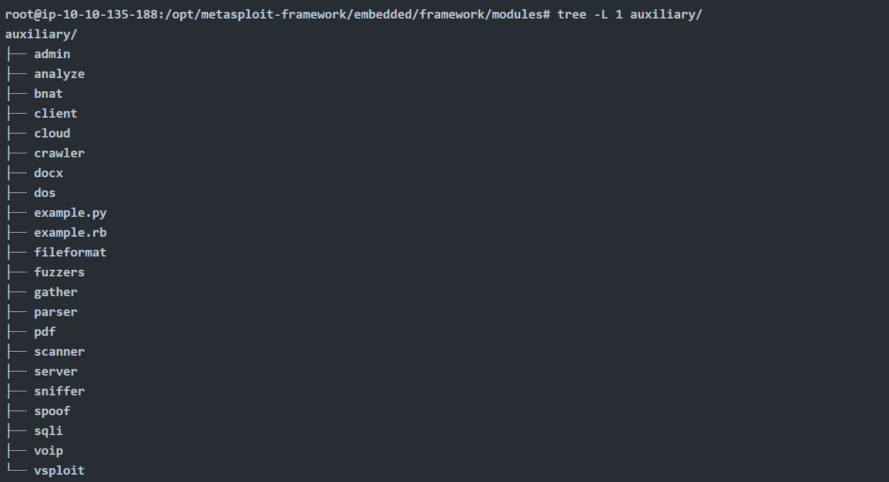
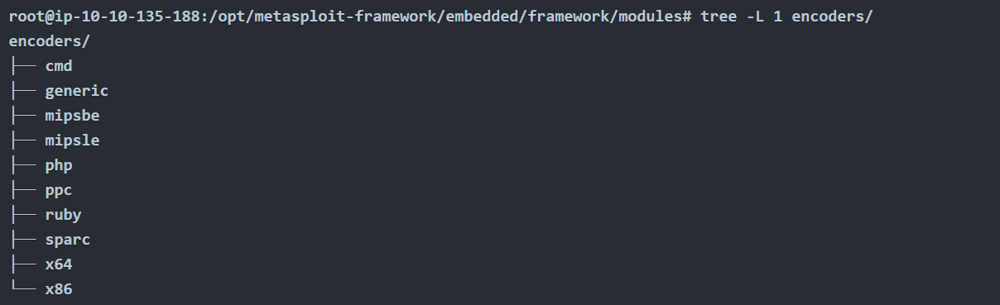
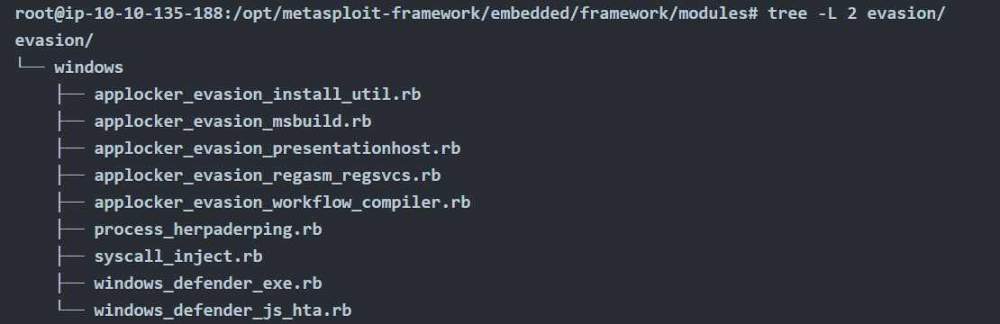
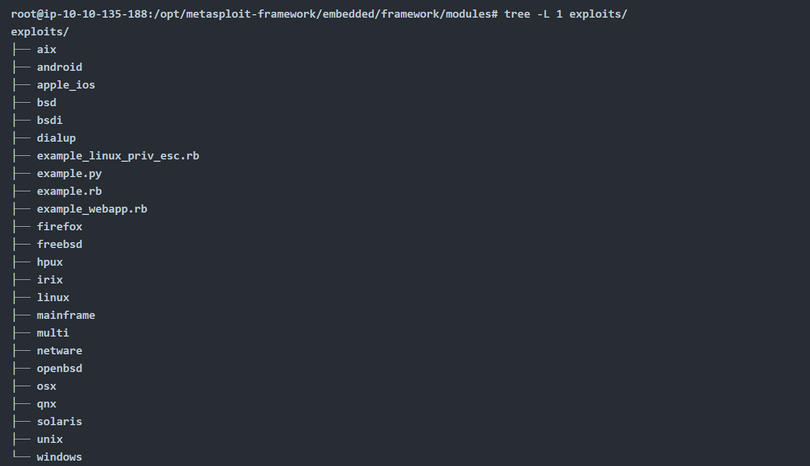
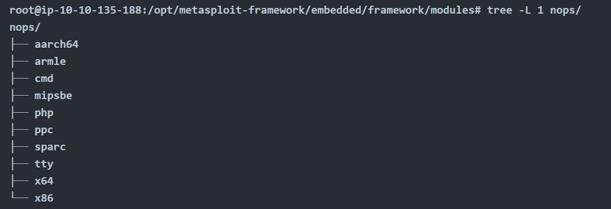
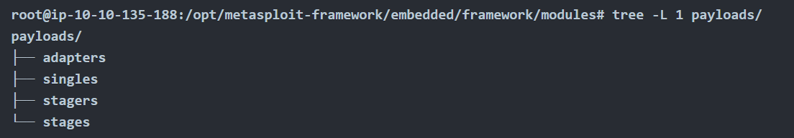
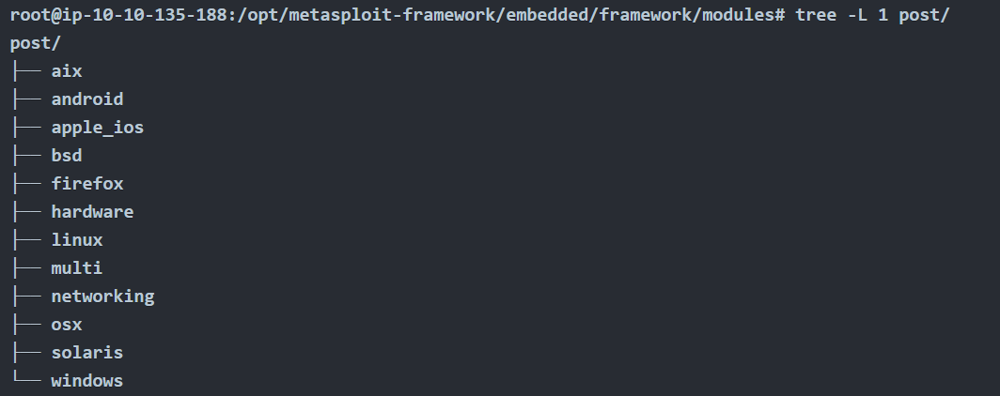

- [Metasploit介绍](#metasploit介绍)
    - [Metasploit Framework](#metasploit-framework)
- [使用方法](#使用方法)
  - [模块及其类别](#模块及其类别)
    - [辅助模块 (Auxiliary)](#辅助模块-auxiliary)
    - [编码器 (Encoders)](#编码器-encoders)
    - [免杀模块 (Evasion)](#免杀模块-evasion)
    - [漏洞利用 (Exploits)](#漏洞利用-exploits)
    - [空指令 (NOPs)](#空指令-nops)
    - [攻击载荷 (Payloads)](#攻击载荷-payloads)
    - [后期渗透模块 (Post)](#后期渗透模块-post)
  - [msf控制台](#msf控制台)
    - [命令](#命令)
    - [常用参数](#常用参数)
    - [会话](#会话)

# Metasploit介绍
Metasploit 是目前应用最广泛的漏洞利用框架。它是一款功能强大的工具，能够支持渗透测试任务的各个阶段——从信息收集到后期渗透（post-exploitation）。

Metasploit 主要有两个版本：
- Metasploit Pro：商业版本，旨在简化任务的自动化与管理。该版本拥有图形用户界面（GUI）。
- Metasploit Framework：开源版本，通过命令行界面进行操作。它已预装在大多数常用的渗透测试 Linux 发行版中。

### Metasploit Framework 
是一套集合了信息收集、扫描、漏洞利用、漏洞开发及后期渗透等功能的工具集。虽然它的主要用途集中在渗透测试领域，但对于漏洞研究和漏洞开发也同样非常有用。

Metasploit Framework 的主要组成部分可总结如下：
- msfconsole：主要的命令行操作界面。
- Modules（模块）：包括漏洞利用模块（exploits）、扫描模块（scanners）、攻击载荷（payloads）等支持模块。
- Tools（工具）：旨在辅助漏洞研究、漏洞评估或渗透测试的独立工具。其中一些工具包括 msfvenom、pattern_create 和 pattern_offset。
# 使用方法
在使用 Metasploit Framework 时，你主要通过 Metasploit 控制台进行交互。你可以在 终端输入 msfconsole 命令来启动它。该控制台是你与 Metasploit 框架中各类**模块**交互的核心界面。

**模块（Modules）** 是 Metasploit 框架中的小型组件，旨在执行特定任务，例如利用漏洞、扫描目标或进行暴力破解攻击。

**漏洞 (Vulnerability)**： 目标系统中存在的设计、编码或逻辑缺陷。利用漏洞可能导致机密信息泄露，或允许攻击者在目标系统上执行代码。

**利用程序 (Exploit)**： 一段用于利用目标系统中存在的漏洞的代码。

**攻击载荷 (Payload)**： 虽然“利用程序”负责触发漏洞，但如果我们想要达到预期的结果（如获取目标系统的访问权限、读取机密信息等），则需要使用“攻击载荷”。攻击载荷是指最终在目标系统上运行的代码，是你想达到的目的。

***在使用 msfconsole 时，通常的流程就是：先找一个能用的 Exploit，然后再给它配上一个你想要的 Payload。***

## 模块及其类别
### 辅助模块 (Auxiliary)
任何支撑性模块都可以在这里找到，例如扫描器 (scanners)、爬虫 (crawlers) 和 模糊测试工具 (fuzzers)。

### 编码器 (Encoders)
编码器允许你对“利用程序（exploit）”和“攻击载荷（payload）”进行编码，以期能够绕过基于特征码（signature-based）的杀毒软件检测。

基于特征码的杀毒软件和安全解决方案拥有一个已知威胁数据库。它们通过将可疑文件与该数据库进行对比来检测威胁，如果匹配成功，就会发出警报。因此，编码器的成功率通常有限，因为现代杀毒软件还会执行额外的安全检查（如启发式分析或行为监测）。

### 免杀模块 (Evasion)
虽然编码器 (Encoders) 会对攻击载荷进行编码，但它们并不被视为规避杀毒软件的直接手段。相比之下，“免杀 (Evasion)” 模块则是专门为此设计的，它们会尝试绕过安全软件，尽管成功率会有所波动。

### 漏洞利用 (Exploits)
漏洞利用程序，按目标系统整齐分类。

### 空指令 (NOPs)
NOPs (No OPeration) 字面意思就是“无操作”，它们什么都不做。在 Intel x86 CPU 架构中，它由十六进制代码 0x90 表示，CPU 执行到它时会空转一个时钟周期。它们通常被用作缓冲区（填充物），以确保攻击载荷（payload）的大小保持一致。

### 攻击载荷 (Payloads)
攻击载荷是最终在目标系统上运行的代码。

利用程序 (Exploits) 负责利用目标系统上的漏洞，但为了达到预期的结果，我们需要配合使用攻击载荷。常见的例子包括：获取一个 Shell、在目标系统上植入恶意软件或后门、执行某条命令，或者运行 calc.exe（计算器）作为概念验证 (PoC) 写入渗透测试报告。通过远程启动 calc.exe 是一种无害的方式，用以证明我们确实拥有在目标系统上执行命令的能力。

虽然在目标系统上运行单条命令已经是迈出了重要的一步，但如果能建立一个交互式连接，让你能够实时输入并执行命令，效果会更好。这种交互式的命令行界面被称为 "Shell"。Metasploit 提供了发送多种不同攻击载荷的能力，可以在目标系统上开启各种类型的 Shell。

如图，在攻击载荷（Payloads）目录下，你会看到四个不同的子目录：adapters、singles、stagers 和 stages。

1. 适配器 (Adapters)
适配器用于封装“单一攻击载荷（Singles）”，将其转换为不同的格式。

    例子：可以将一个普通的单个有效负载封装在 PowerShell 适配器中，该适配器会生成一个 PowerShell 命令来执行该有效负载。

2. 单一载荷 (Singles)
单一载荷是独立且完整的代码（如：添加用户、启动记事本等），它们运行不需要下载任何额外的组件。

3. 分阶段传输器 (Stagers)
Stagers 负责在 Metasploit 和目标系统之间建立连接通道。

    工作原理：在使用“分阶段载荷（Staged Payloads）”时非常有用。这种方式会先向目标系统上传一个小巧的 Stager，然后由它负责下载载荷的剩余部分（即 Stage）。

    优势：初始发送的代码体积非常小，比起一次性发送庞大的完整载荷，这种方式更容易通过某些限制。

4. 阶段载荷 (Stages)
Stages 是由上述的 Stager 下载的后续组件。

    特点：由于它是分步下载的，这允许你使用体积更大、功能更复杂的攻击载荷（例如强大的 Meterpreter 终端）。

Metasploit它以一种巧妙的方式帮助您识别单个（也称为“内联”）有效载荷和分阶段有效载荷。
- generic/shell_reverse_tcp
- windows/x64/shell/reverse_tcp

两者都是反向Windows shell。前者是单个有效载荷，如“shell”和“reverse”之间的“_”所示。而后者是分阶段有效载荷，如“shell”和“reverse”之间的“/”所示。
### 后期渗透模块 (Post)
Post 模块在上述渗透测试流程的最后一个阶段——后期渗透（Post-exploitation）中非常有用。

## msf控制台
在任何安装了metasploit framework的机器上输入`msfconsole`启动

**支持Tab键补全命令**

它受上下文管理。这意味着，除非设置为全局变量，否则如果您更改所使用的模块，所有参数设置都将丢失。
### 命令
支持大多数Linux命令，也有一些不支持（如不支持输出重定向）。

- help：后跟命令可以查看命令手册
- history：查看历史命令
- use：后跟模块路径可以调用该模块
- show options：在模块语境下使用可查看该模块所需要的参数

    *show 命令可以在任何语境下使用，只需在其后跟上模块类型（如 auxiliary、payload、exploit 等），即可列出所有可用的模块。*
- set [options] [value]：将某项参数设定为某个值
- unset [option]：清除某项参数值。如果写all就是清除所有参数值。
- setg [options] [value]：设置一个全局值，该值将一直使用，直到您退出 Metasploit 或使用该 unsetg 命令清除它为止。
- back：退出当前上下文
- info：在模块上下文中输入可显示模块的详细信息
- search：该命令会在 Metasploit Framework 数据库中搜索与给定搜索参数相关的模块。您可以使用 CVE 编号、漏洞名称（例如 eternalblue、heartbleed 等）或目标系统进行搜索。

    可以用type或platform等关键词进行高级搜索。比如`search type:auxiliary telnet`
- exploit/run：当所有模块参数设置完成后，使用该命令启动模块。若后面跟`-z`参数，表示在执行漏洞利用程序后，一旦会话开启，会立即将其转入后台运行。
    - 不加 -z：成功后直接进入对方电脑，开始操作。
    - 加上 -z：成功后留在原地，对方的控制权像“挂起的小窗口”一样存在后台，你可以随时通过 `sessions -i 1` 命令再进去。
-  check：某些模块支持此选项。此选项会在不利用漏洞的情况下检查目标系统是否存在漏洞。

### 常用参数
- RHOSTS： “远程主机”，即目标系统的 IP 地址。可以设置单个 IP 地址或网络地址范围。这将支持 CIDR（无类别域间路由）表示法（/24、/16 等）或网络地址范围（10.10.10.x – 10.10.10.y）。您还可以使用目标列表文件，每行一个目标，格式为 file:/path/of/the/target_file.txt。
- RPORT： “远程端口”，即存在漏洞的应用程序在目标系统上运行的端口。
- PAYLOAD：您将在exp中使用的有效载荷。
- LHOST： “本地主机”，攻击机（您的 AttackBox 或 Kali Linux）的 IP 地址。
- LPORT： “本地端口”，即反向 shell 连接所用的端口。这是攻击机上的一个端口，您可以将其设置为任何其他应用程序未使用的端口。
- Session：使用 Metasploit 与目标系统建立的每个连接都会有一个Session ID。您将使用此Session ID 来运行后渗透模块，这些模块将利用现有连接连接到目标系统。

### 会话
漏洞被成功利用后，将创建一个会话。这是目标系统和 Metasploit 之间建立的通信通道。

可以使用`background`命令或`CTRL+Z`将会话提示符置于后台，然后返回到 msfconsole 提示符。

可以在 msfconsole 提示符或任何上下文中使用`sessions`命令来查看现有会话。要与任何会话进行交互，您可以使用`sessions -i`命令，后跟所需的会话编号。
