一次入门级别的渗透，基于[thm的blue房间](https://tryhackme.com/room/blue)
# 侦察阶段
本节问题
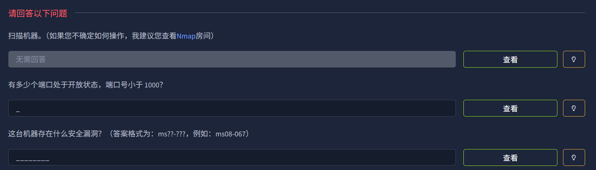
*tips：扫描并了解这台机器的漏洞所在。请注意，这台机器不响应 ping（ICMP）请求*

提取关键信息： “不响应 ping (ICMP) 请求”。 大多数扫描工具（如 Nmap）默认会先发送 ICMP Echo 请求来确认主机是否存活。如果目标禁用了 ICMP，扫描器可能会误判主机为“关闭”状态而停止扫描。

所以，在使用 Nmap 时，必须使用 -Pn（No Ping） 参数（跳过主机发现）。这将强制扫描器假设目标在线，直接进行端口扫描。
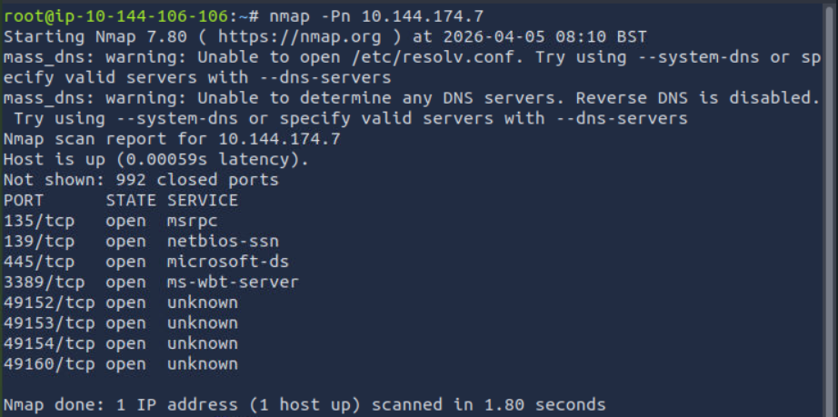
使用`nmap -Pn`扫描发现，目标机共开启了8个端口，其中端口号小于1000的有3个。故第二题答案为3。

通过`nmap -Pn -sC -sV`进行更加深入的扫描。
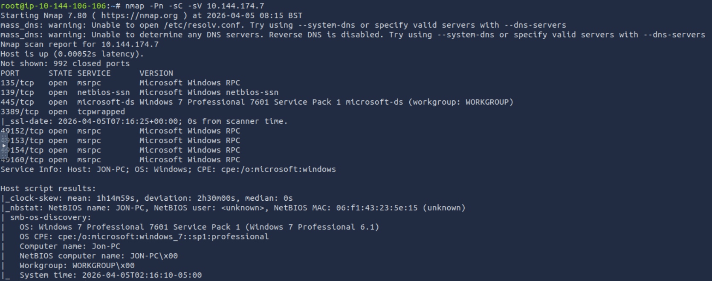
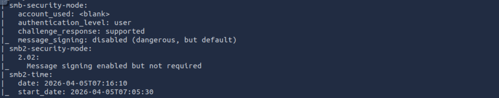
获得了更加详细的信息，发现其操作系统是老旧的Windows 7 Professional 7601 Service Pack 1，并且开放了445端口SMB 服务，且该端口的扫描结果为：message_signing: disabled (dangerous, but default)，也就是所它关闭了签名验证机制。推测其可能存在永恒之蓝漏洞。所以第三题答案为ms17-010.

接下来我们启动msf，调用永恒之蓝的扫描模块对目标机进行扫描，发现其确实存在永恒之蓝漏洞。并且我们得知，**目标机是x64系统。**
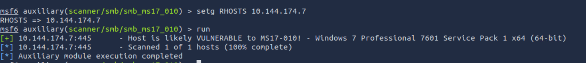

# 获取访问权限
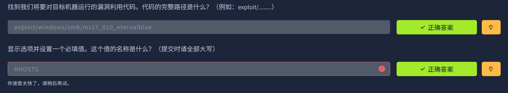
根据我们搜集到的情报，我们使用模块`exploit/windows/smb/ms17_010_eternalblue`来进行渗透。这也是第一题的答案。

`show payloads | grep x64 `来显示可用的攻击载荷。
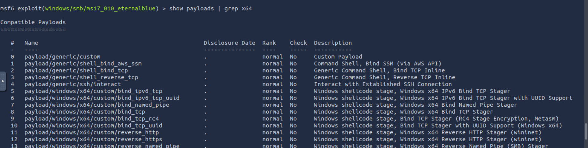
这里题目要求我们设置载荷为`windows/x64/shell/reverse_tcp`。按要求设置好，并设置好RHOSTS（第二题答案）。
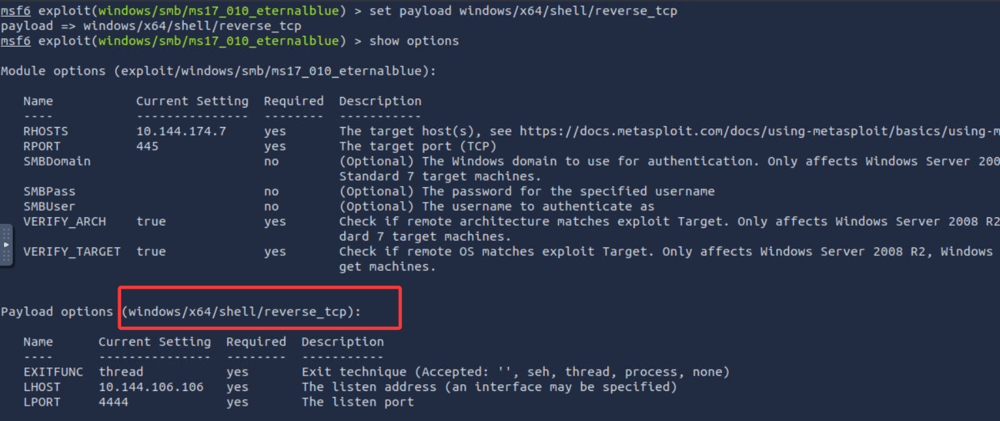
`run`发起攻击。
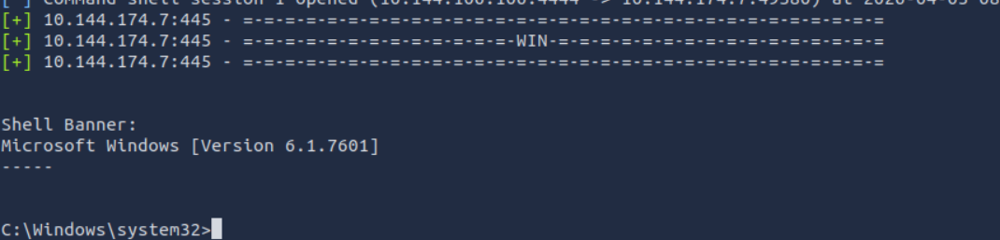
成功骇入。

# 升级提权
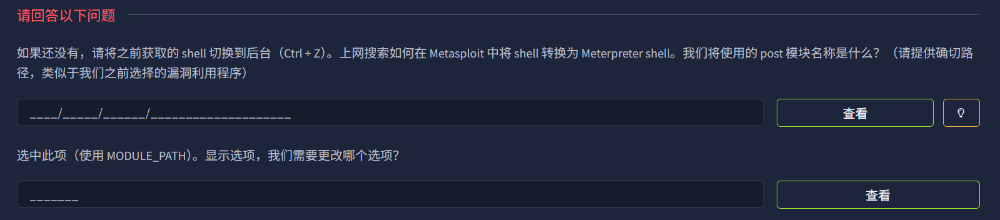
CTRL+Z将当前session挂后台。
调用模块`post/multi/manage/shell_to_meterpreter`（第一题答案），设置好session（第二题答案），将shell转换为mpt。
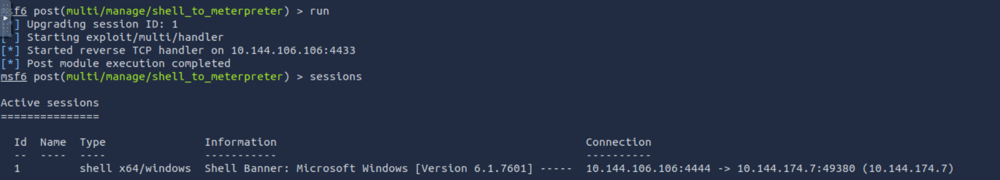
发现升级不成功。将LPORT换为443，升级成功（新开了一个Session 2作为mpt，而不是原来的Session 1）。推测可能为防火墙拦截4433端口。
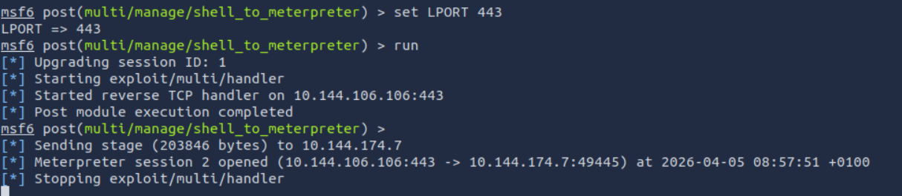
进入后，通过getuid发现我们是system权限。首先我们将mpt迁移到稳定的lsass.exe中。
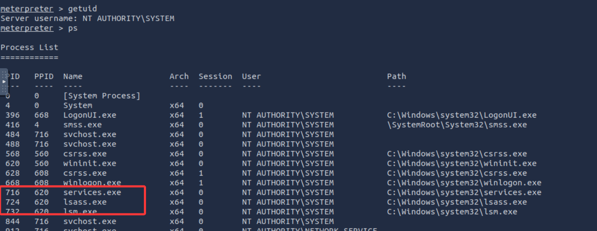
# 破解
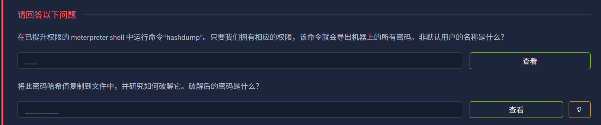
直接运行hashdump，获得所有用户的信息和密码哈希（第一题答案Jon）。
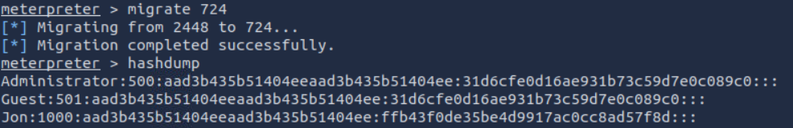
去彩虹表在线网站进行破解，得到密码（第二题答案alqfna22）

# 寻找Flags
*找到插在这台机器上的三面旗帜。这些并非传统意义上的旗帜，而是代表 Windows 系统中的关键位置。请根据以下提示完成此房间的谜题！*
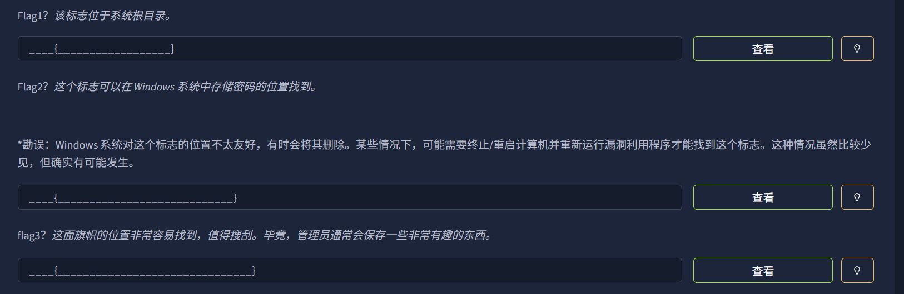
### flag1
根据提示，flag1在根目录。我们回退到根目录，并用`ls -f`列出所有文件（不要目录），发现目标。
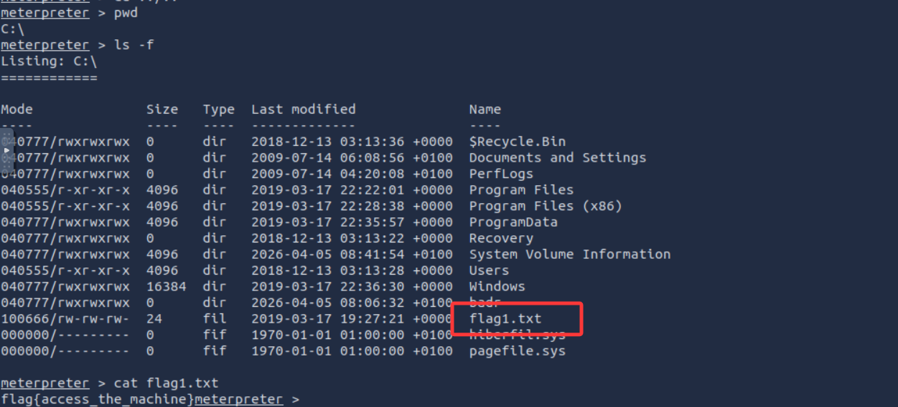
cat输出得到flag1：flag{access_the_machine}

### flag2
提示告诉我们flag2在系统中存储密码的地方.

在 Windows 系统中，存储本地用户账户哈希（密码加密形式）的物理路径只有一个：

路径： C:\Windows\System32\config\

文件名： SAM (Security Accounts Manager)

所以我们进入C:\Windows\System32\config\目录下，列出所有文件，得到flag2.txt
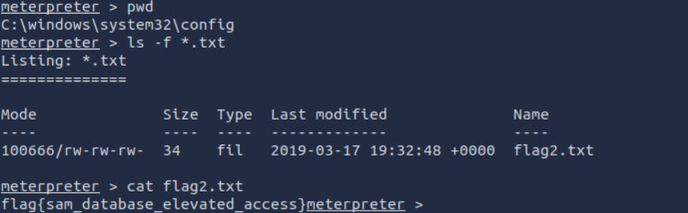
cat输出内容得到flag2：flag{sam_database_elevated_access}

### flag3
提示告诉我们与管理员账户有关。我们首先cd到`C:\Users`查看。
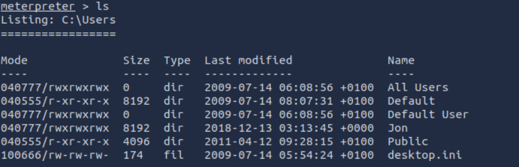
发现没有名为Administrator的用户文件。推测可能Jon就是这个计算机的管理员。
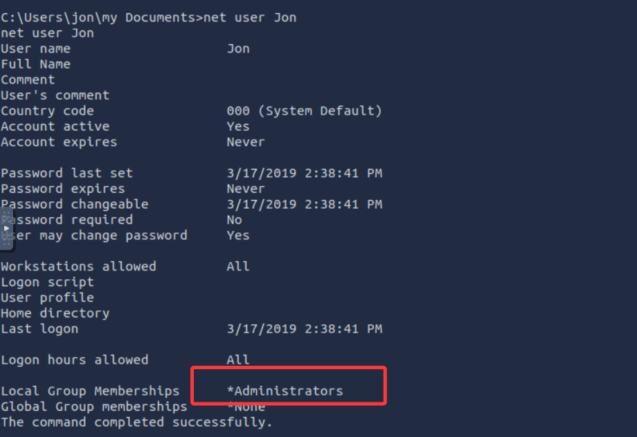
经`net user Jon`验证，其确实为管理员。
进入Jon目录下，我们使用`dir /s /b flag3.txt`进行查找，发现flag3文件
- /s：递归搜索（搜索当前目录及其所有子文件夹）。
- /b：简洁模式（只显示文件路径，不显示文件大小、日期等杂乱信息）。

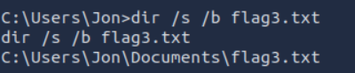

最终，我们type输出一下，获得flag3：flag{admin_documents_can_be_valuable}

## 写在后面
这是我第一次真正意义上完成了一次简单的渗透，虽然它真的很简单（笑）。做的还挺爽的，这一章节学到的东西很多都用到了，有一种及时检验成果的感觉。thm真棒😋👍。