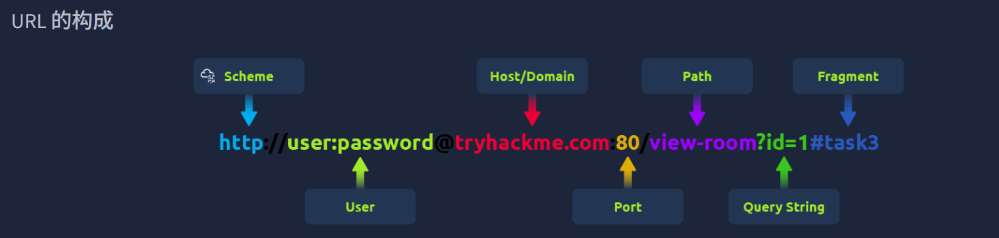

- [Web应用程序基础知识](#web应用程序基础知识)
  - [Web程序的组成](#web程序的组成)
    - [前端](#前端)
    - [后端](#后端)
  - [统一资源定位符（URL）](#统一资源定位符url)
    - [scheme](#scheme)
    - [user](#user)
    - [host/domain](#hostdomain)
    - [port](#port)
    - [path](#path)
    - [query string](#query-string)
    - [fragment](#fragment)
  - [HTTP消息](#http消息)
    - [**起始行 (Start Line)**](#起始行-start-line)
    - [**报文首部 (Headers)**](#报文首部-headers)
    - [**空行 (Empty Line)**](#空行-empty-line)
    - [**报文主体 (Body)**](#报文主体-body)
  - [HTTP请求：请求行和方法](#http请求请求行和方法)
    - [请求行](#请求行)
    - [**HTTP 方法 (HTTP Methods)**](#http-方法-http-methods)
      - [**GET**](#get)
      - [**POST**](#post)
      - [**PUT**](#put)
      - [**DELETE**](#delete)
    - [**其他特定用途的方法：**](#其他特定用途的方法)
      - [OPTIONS](#options)
      - [TRACE](#trace)
      - [CONNECT](#connect)
    - [**HTTP 版本 (HTTP Version)**](#http-版本-http-version)
  - [HTTP请求：请求头和请求体](#http请求请求头和请求体)
    - [**常用请求首部 (Common Request Headers)**](#常用请求首部-common-request-headers)
    - [**请求主体 (Request Body)**](#请求主体-request-body)
      - [**URL 编码 (application/x-www-form-urlencoded)**](#url-编码-applicationx-www-form-urlencoded)
      - [**表单数据 (multipart/form-data)**](#表单数据-multipartform-data)
      - [**JSON (application/json)**](#json-applicationjson)
      - [**XML (application/xml)**](#xml-applicationxml)
  - [HTTP响应：状态行和状态码](#http响应状态行和状态码)
    - [**状态码与原因短语**](#状态码与原因短语)
    - [**常用状态码**](#常用状态码)
  - [HTTP 响应：标头和正文](#http-响应标头和正文)
    - [**必要的响应首部**](#必要的响应首部)
    - [**其他常用响应首部**](#其他常用响应首部)
    - [**响应主体 (Response Body)**](#响应主体-response-body)
  - [**安全首部 (Security Headers)**](#安全首部-security-headers)
    - [**Content-Security-Policy (CSP) - 内容安全策略**](#content-security-policy-csp---内容安全策略)
    - [**Strict-Transport-Security (HSTS) - 强制安全传输**](#strict-transport-security-hsts---强制安全传输)
    - [**X-Content-Type-Options**](#x-content-type-options)
    - [**Referrer-Policy - 引用者策略**](#referrer-policy---引用者策略)

# Web应用程序基础知识
## Web程序的组成
*不妨将Web应用程序比作一颗行星，宇航员可以前往行星表面进行探索。*
### 前端

HTML（超文本标记语言）是Web应用程序的基础组成部分。它是一组指令或代码，用于指示Web浏览器显示什么内容以及如何显示。这可以比作地球上的简单生物；这些生物拥有DNA，DNA包含了构成这些简单生物的指令。

CSS（层叠样式表）描述了标准的外观，例如特定的颜色、文本类型和布局。继续用 DNA 来类比，这些样式可以比作 DNA 中决定生物体颜色、形状、大小和纹理的各个部分。

JavaScript  (JS) 是 Web 应用程序前端的一部分，它支持 Web 浏览器中更复杂的操作。HTML 可以被视为一组简单的指令，用于控制页面显示内容；而 JavaScript 则是一组更高级的指令，它允许对显示内容进行选择和决策。如果用行星来比喻，JavaScript 可以被视为一个高级生物体的大脑，它能够根据与之交互的内容和方式做出决策。

### 后端
数据库 (database)是存储、修改和检索信息的地方。例如，一个网络应用程序可能需要存储和检索访问者关于显示或隐藏内容的偏好信息；这些信息就会存储在数据库中。一个星球上可能居住着更高级的居民，他们会在地图上记录位置信息，在日记中记笔记，或者把书籍放在图书馆里，把文件放在文件柜里。

WAF（Web Application Firewall）防火墙是 Web 应用程序的一个可选组件。它有助于过滤掉 Web 服务器接收到的危险请求，从而提供一定的保护。这类似于行星大气层保护居民免受有害紫外线的侵害。

支撑Web应用程序运行的基础设施组件还有很多，例如Web服务器、应用服务器、存储设备、各种网络设备以及其他支持Web应用程序的软件。这就好比在一个星球上，道路、行驶在道路上的汽车以及为汽车提供动力的燃料一样。

## 统一资源定位符（URL）

### scheme
scheme是用于访问网站的协议。最常见的方案有：HTTP超文本传输​​协议 (HTTP) 和安全超文本传输​​协议 ( HTTPS )。HTTPS 更安全，因为它会对连接进行加密，因此浏览器和网络安全专家都推荐使用它。网站通常会强制使用 HTTPS 以增强安全性。

### user
有些网址可能包含用户的登录信息（通常是用户名），用于需要身份验证的网站。这种情况大多发生在需要凭据才能访问特定资源的网址中。然而，**如今这种情况已很少见**，因为将登录信息放在网址中并不安全——它可能会泄露敏感信息，从而造成安全风险。

### host/domain
主机名或域名是 URL 中最重要的部分，因为它告诉你正在访问哪个网站。每个域名都必须是唯一的，并且通过域名注册商进行注册。从安全角度来看，要寻找那些看起来几乎与真实域名相似但存在细微差别的域名（typosquatting）。拼写错误抢注这些虚假域名经常被用于网络钓鱼旨在诱骗人们泄露敏感信息的攻击。

### port
端口号有助于引导浏览器访问 Web 服务器上的正确服务。它就像告诉服务器通信时应该使用哪个入口。端口号的范围从 1 到 65,535，但最常用的是80。HTTPHTTPS 的返回值为443。

### path
路径指向服务器上您尝试访问的特定文件或页面。它就像一张路线图，告诉浏览器该往哪里走。网站需要保护这些路径，以确保只有授权用户才能访问敏感资源。

### query string
查询字符串是 URL 中以问号 (?) 开头的部分。它通常用于搜索词或表单输入等。由于用户可以修改这些查询字符串，因此必须安全地处理它们，以防止注入等攻击（恶意代码可能被添加到其中）。

### fragment
该片段以井号 (#) 开头，用于指向网页的特定部分，例如直接跳转到特定标题或表格。用户也可以修改此片段，因此与查询字符串一样，务必检查并清理此处的数据，以避免注入攻击等问题。

## HTTP消息
HTTP消息是用户（客户端）和Web服务器之间交换的数据包。这些消息对于理解Web应用程序的工作原理至关重要，因为它们展示了用户请求和服务器响应是如何通信的。

有两种类型的HTTP消息：
- HTTP请求：由用户发送以触发 Web 应用程序上的操作。
- HTTP响应：服务器响应用户请求而发送的内容。

### **起始行 (Start Line)**
起始行相当于信息的“前言”。它定义了正在发送的消息类型——是来自用户的**请求 (Request)**，还是来自服务器的**响应 (Response)**。这一行还提供了关于如何处理该消息的重要细节（如 HTTP 版本和状态码）。

### **报文首部 (Headers)**
首部由一系列**键值对 (Key-Value Pairs)** 组成，为 HTTP 消息提供额外信息。它们向处理请求或响应的客户端及服务器发出指令。这些首部涵盖了安全、内容类型等各个方面，确保通信过程顺畅无误。

### **空行 (Empty Line)**
空行是分隔首部与主体的“分界线”。它的存在至关重要，因为它标示了首部的结束和消息实际内容的开始。如果没有这个空行，消息格式就会混乱，导致客户端或服务器产生误判并引发错误。

### **报文主体 (Body)**
主体是存储**实际数据**的地方。在请求中，主体可能包含用户想要发送给服务器的数据（如表单数据）；在响应中，主体则是服务器存放用户所请求内容的地方（如网页或 API 返回的数据）。

## HTTP请求：请求行和方法
### 请求行
请求行 (Request Line)，也称为起始行，是 HTTP 请求的第一部分。它告诉服务器正在处理的请求类型。请求行主要包含三个部分：HTTP 方法、URL 路径以及 HTTP 版本。

例如`METHOD /path HTTP/version`

### **HTTP 方法 (HTTP Methods)**
**HTTP 方法**用于告知服务器，用户希望对 URL 路径所标识的资源执行什么操作。以下是一些最常用的方法及其潜在的安全问题：

#### **GET**
用于从服务器**获取**数据，而不会进行任何更改。
> **安全提醒：** 请确保仅公开用户有权查看的数据。避免在 GET 请求中放置令牌（Tokens）或密码等敏感信息，因为它们会以明文形式显示（在 URL 中）。

#### **POST**
向服务器**发送**数据，通常用于创建或更新某些内容。
> **安全提醒：** 务必对输入进行验证和清洗，以防止 SQL 注入或 XSS（跨站脚本）等攻击。

#### **PUT**
**替换或更新**服务器上的现有内容。
> **安全提醒：** 在接受请求之前，请确保用户已获得修改权限。

#### **DELETE**
从服务器上**移除**某些内容。
> **安全提醒：** 与 PUT 类似，需确保只有获得授权的用户才能删除资源。

### **其他特定用途的方法：**
#### OPTIONS
告知针对特定资源有哪些可用的方法，帮助客户端了解其对服务器可以执行的操作。

#### TRACE
与 OPTIONS 类似，它会显示允许的方法，通常用于调试。出于安全考虑，许多服务器会禁用此方法。

#### CONNECT
用于建立安全连接（例如 HTTPS）。虽然不像其他方法那样常用，但对于加密通信至关重要。

### **HTTP 版本 (HTTP Version)**

* **HTTP/0.9 (1991)** 最初的版本，仅支持 GET 请求。
* **HTTP/1.0 (1996)** 引入了首部（Headers），并增强了对不同内容类型的支持，改进了缓存机制。
* **HTTP/1.1 (1997)** 带来了持久连接（Persistent Connections）、分块传输编码（Chunked Transfer Encoding）以及更完善的缓存处理。至今仍被广泛使用。
* **HTTP/2 (2015)** 引入了多路复用（Multiplexing）、首部压缩和优先级排序等特性，大幅提升了性能。
* **HTTP/3 (2022)** 基于 HTTP/2 构建，但采用了全新的 **QUIC** 协议，以实现更快速、更安全的连接。

## HTTP请求：请求头和请求体

### **常用请求首部 (Common Request Headers)**

| 请求首部 (Request Header) | 示例 (Example) | 描述 (Description) |
| :--- | :--- | :--- |
| **Host** | `Host: tryhackme.com` | 指定请求目标 Web 服务器的名称。 |
| **User-Agent** | `User-Agent: Mozilla/5.0` | 分享发出请求的浏览器相关信息。 |
| **Referer** | `Referer: https://www.google.com/` | 指明请求来源的 URL（即你是从哪个页面跳转过来的）。 |
| **Cookie** | `Cookie: user_type=student; room=introtowebapplication;...` | 包含 Web 服务器此前要求浏览器存储的信息。 |
| **Content-Type** | `Content-Type: application/json` | 描述请求主体（Body）中数据的类型或格式。 |

### **请求主体 (Request Body)**

在 **POST** 和 **PUT** 等 HTTP 请求中，数据是被“发送”到 Web 服务器（而非向服务器“请求”数据），这些数据就位于 **HTTP 请求主体**内。数据的格式有多种形式，常见的包括：**URL 编码 (URL Encoded)**、**表单数据 (Form Data)**、**JSON** 或 **XML**。

---

#### **URL 编码 (application/x-www-form-urlencoded)**
这是一种将数据结构化为**键值对 (key=value)** 的格式。多个键值对之间使用实号 (**&**) 分隔，例如：`key1=value1&key2=value2`。特殊字符会进行**百分比编码 (Percent-encoded)**。
#### **表单数据 (multipart/form-data)**
允许发送多个数据块，每个数据块之间由一个**边界字符串 (Boundary String)** 分隔。该边界字符串在请求自身的文件头（Header）中定义。这种格式通常用于发送**二进制数据**，例如向 Web 服务器上传文件或图片时。
```
POST /upload HTTP/1.1
Host: example.com
Content-Type: multipart/form-data; boundary=----WebKitFormBoundary7MA4YWxkTrZu0gW

------WebKitFormBoundary7MA4YWxkTrZu0gW
Content-Disposition: form-data; name="username"

admin
------WebKitFormBoundary7MA4YWxkTrZu0gW
Content-Disposition: form-data; name="avatar"; filename="avatar.jpg"
Content-Type: image/jpeg

[这里是图片的二进制数据...]
------WebKitFormBoundary7MA4YWxkTrZu0gW--
```
#### **JSON (application/json)**

在这种格式中，数据使用 **JSON（JavaScript 对象表示法）** 结构进行发送。数据以 **名称 : 值 (name : value)** 的对形式进行排版。多个键值对之间用**逗号**分隔，所有内容都包含在**花括号 `{ }`** 之中。
#### **XML (application/xml)**

在 **XML** 格式中，数据被组织在称为**标签 (Tags)** 的标记内部。标签成对出现，分为**起始标签**和**结束标签**。这些标签可以相互**嵌套**。在下面的示例中，你可以看到通过起始和结束标签来发送关于名为 Aleksandra 的用户详细信息。
```xml
<user>
    <name>Aleksandra</name>
    <role>Admin</role>
    <id>42</id>
</user>
```

## HTTP响应：状态行和状态码
每个HTTP响应的第一行称为状态行。它提供三个关键信息：
- HTTP版本：这告诉您是哪个版本的HTTP正在使用中。
- 状态码：一个三位数，显示您的请求结果。
- 原因短语：用人类可读的语言解释状态码的简短消息。

### **状态码与原因短语**
* **信息性响应 (100-199)**：
    这些代码表示服务器已接收到请求的一部分，正在等待剩余部分。这是一个“请继续”的信号。

* **成功响应 (200-299)**：
    这些代码表示一切按预期运行。服务器已处理请求并返回了所请求的数据。

* **重定向消息 (300-399)**：
    这些代码告知你所请求的资源已移动到其他位置，通常会提供一个新的 URL。

* **客户端错误响应 (400-499)**：
    这些代码表明请求本身存在问题。可能是 URL 错误，或者缺少某些必要信息（例如身份验证）。

* **服务器错误响应 (500-599)**：
    这些代码表示服务器在尝试履行请求时遇到了错误。这通常是服务器端的问题，而不是客户端的错。
### **常用状态码**
* **100 (Continue / 继续)**
    服务器已收到请求的第一部分，并准备好接收剩余部分。
* **200 (OK / 成功)**
    请求成功，服务器正在返回所请求的资源。
* **301 (Moved Permanently / 永久移动)**
    你请求的资源已永久移动到新的 URL。从现在起请使用该新地址。
* **404 (Not Found / 未找到)**
    服务器无法在给定的 URL 处找到资源。请仔细检查地址是否输入正确。
* **500 (Internal Server Error / 服务器内部错误)**
    服务器端出现故障，无法处理你的请求。

## HTTP 响应：标头和正文
当 Web 服务器响应 HTTP 请求时，它会包含 HTTP 响应首部 (Response Headers)，这些本质上也是键值对。这些首部提供了关于响应的重要信息，并告知客户端（通常是浏览器）应当如何处理该响应。
### **必要的响应首部**
有些响应首部对于确保 HTTP 响应正常工作至关重要。它们提供了客户端和服务器正确处理信息所需的关键数据。以下是其中几个重要的首部：

* **Date (日期)**
    * **示例**：`Date: Fri, 23 Aug 2024 10:43:21 GMT`
    * 此首部显示了服务器生成该响应的具体日期和时间。
* **Content-Type (内容类型)**
    * **示例**：`Content-Type: text/html; charset=utf-8`
    * 它告知客户端接收到的内容类型，例如是 HTML、JSON 还是其他格式。它还包含字符集（如 UTF-8），以帮助浏览器正确显示内容。
* **Server (服务器)**
    * **示例**：`Server: nginx`
    * 此首部显示了处理该请求的服务器软件类型。虽然这对调试很有帮助，但也可能泄露对攻击者有用的服务器信息，因此许多人会选择移除或隐藏此首部。

### **其他常用响应首部**
除了上述必要首部外，还有一些常用的首部可以为客户端或浏览器提供额外指令，并帮助控制响应的处理方式。

* **Set-Cookie (设置 Cookie)**
    * **示例**：`Set-Cookie: sessionId=38af1337es7a8`
    * 该首部将 Cookie 从服务器发送到客户端，客户端随后会将其存储并在未来的请求中带回服务器。为了确保安全，请务必为 Cookie 设置 `HttpOnly` 标志（防止 JavaScript 访问）和 `Secure` 标志（确保仅通过 HTTPS 发送）。
* **Cache-Control (缓存控制)**
    * **示例**：`Cache-Control: max-age=600`
    * 此首部告知客户端在再次向服务器核实之前，可以将该响应缓存多久。如果需要，它还可以防止敏感信息被缓存（使用 `no-cache`）。
* **Location (位置)**
    * **示例**：`Location: /index.html`
    * 此首部用于重定向（3xx）响应。它告知客户端如果资源已移动，下一步该去哪里。如果用户在请求期间可以修改此首部，请务必进行验证和清洗——否则，可能会导致**开放重定向（Open Redirect）漏洞**，攻击者借此可以将用户重定向到恶意网站。

### **响应主体 (Response Body)**
**HTTP 响应主体**是实际数据存放的地方——例如服务器发送回客户端的 HTML、JSON、图像等。为了防止跨站脚本（XSS）等**注入攻击**，在将任何数据（尤其是用户生成的内容）包含在响应主体之前，务必进行清洗和转义处理。

## **安全首部 (Security Headers)**

**HTTP 安全首部**通过提供针对跨站脚本 (XSS)、点击劫持 (Clickjacking) 等攻击的缓解措施，帮助提升 Web 应用程序的整体安全性。我们将深入探讨以下安全首部：

* **Content-Security-Policy (CSP)**
* **Strict-Transport-Security (HSTS)**
* **X-Content-Type-Options**
* **Referrer-Policy**
---

### **Content-Security-Policy (CSP) - 内容安全策略**
CSP 首部是一个额外的安全层，有助于缓解 XSS 等常见攻击。恶意代码可能托管在独立的网站或域名上并植入到有漏洞的网站中。CSP 为管理员提供了一种声明哪些域名或来源是“安全”的方法。

在首部中，你会看到 `default-src` 或 `script-src` 等属性。这些选项允许管理员以不同的颗粒度定义各类内容允许的域名。**`'self'`** 是一个特殊关键字，代表托管该网站的同源域名。

**示例解析：**
`Content-Security-Policy: default-src 'self'; script-src 'self' https://cdn.tryhackme.com; style-src 'self'`

* **default-src**：指定默认策略为 `'self'`，即仅限当前网站。
* **script-src**：指定脚本加载策略，允许来自当前网站（self）以及 `https://cdn.tryhackme.com` 的脚本。
* **style-src**：指定 CSS 样式表的加载策略，仅允许来自当前网站（self）。

---

### **Strict-Transport-Security (HSTS) - 强制安全传输**
HSTS 首部确保浏览器始终通过 **HTTPS** 进行连接。

**示例解析：**
`Strict-Transport-Security: max-age=63072000; includeSubDomains; preload`

* **max-age**：此设置的有效期（单位：秒）。
* **includeSubDomains**（可选）：指示浏览器将此设置应用于所有子域名。
* **preload**（可选）：允许将网站列入“预加载列表”。浏览器可以在用户首次访问网站前就强制执行 HSTS。

---

### **X-Content-Type-Options**
该首部用于指示浏览器不要“猜测”资源的 MIME 类型，而必须严格遵循 `Content-Type` 首部。

**示例解析：**
`X-Content-Type-Options: nosniff`

* **nosniff**：此指令指示浏览器停止“嗅探”或猜测 MIME 类型（防止黑客将恶意脚本伪装成图片等文件）。

---

### **Referrer-Policy - 引用者策略**
当用户从源服务器跳转到目标服务器（例如点击链接）时，此首部控制发送给目标服务器的信息量。

**常见示例：**
* **no-referrer**：完全禁用发送任何 Referrer 信息。
* **same-origin**：仅当目标与源同源时才发送 Referrer 信息。这对于在站内传递信息非常有用，同时避免信息流向外部网站。
* **strict-origin**：仅在协议级别相同时（例如 HTTPS 跳转 HTTPS）发送源信息（Origin）。
* **strict-origin-when-cross-origin**：与 `strict-origin` 类似，但在同源请求时会发送完整的 URL 路径。