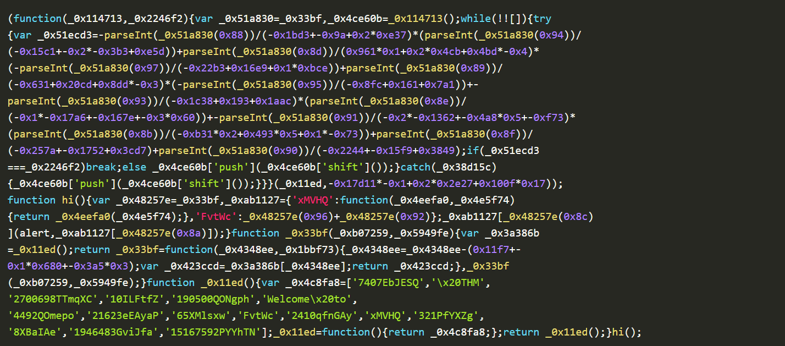

# Javascript
JavaScript (JS) 是一种流行的脚本语言，它允许 Web 开发人员为包含 HTML 和 CSS（样式）的网站添加交互功能。创建 HTML 元素后，您可以通过 JS 添加交互功能，例如验证、点击事件、动画等。学习 JavaScript 与学习 HTML 和 CSS 同等重要。JS 脚本主要与 HTML 一起使用。

---

## 基本概念
### 变量 (Variables)

在 JS 中有三种声明变量的方式：`var`、`let` 和 `const`。其中 `var` 是**函数作用域**（function-scoped），而 `let` 和 `const` 都是**块级作用域**（block-scoped），这使得在特定的代码块内对变量可见性的控制更加出色。

### 数据类型 (Data Types)
在 JS 中，数据类型定义了变量可以保存的值的类型。示例包括：
* **String**（字符串/文本）
* **Number**（数字）
* **Boolean**（布尔值，即 true/false）
* **Null**（空值）
* **Undefined**（未定义）
* **Object**（对象，用于处理数组或对象等更复杂的数据）

### 函数 (Functions)
函数代表为了执行特定任务而设计的一段代码块。在函数内部，你可以将执行相似任务的代码归类在一起。

例如，你正在开发一个 Web 应用程序，需要向网页打印学生的成绩。理想的做法是创建一个名为 `PrintResult(rollNum)` 的函数，该函数接收学生的学号（roll number）作为参数。
```js
        function PrintResult(rollNum) {
            alert("学号 " + rollNum + "通过考试");
        }
        const rollNumbers = [101, 102, 103];
        for (let i = 0; i < 100; i++) {
            PrintResult(rollNumbers[i]); 
        }
```
### 循环 (Loops)

循环允许你在条件为 **true**（真）的情况下多次运行同一段代码块。JavaScript 中常见的循环包括 `for`、`while` 和 `do...while`，它们通常用于重复执行任务，例如遍历项目列表。上面代码中的for循环就是一个例子。

## 在HTML中集成JS
分为内部集成（直接在HTML文件中写JS代码）和外部集成（写单独的.js文件并在HTML文件中引用）

在对 Web 应用程序进行渗透测试时，检查网站使用的是内部 JS 还是外部 JS 非常重要。这可以通过**查看页面源代码**轻松验证。

## 对话功能
JavaScript 的主要目标之一是提供与用户交互的对话框，并动态更新网页内容。JS 提供了内置函数，如 alert、prompt 和 confirm 来实现这些交互。这些函数允许开发者显示消息、收集输入以及获取用户确认。

然而，如果实现方式不安全，攻击者可能会利用这些功能来执行攻击，例如跨站脚本攻击 (XSS)

### Alert (警报)

`alert` 函数会在带有一个“确定”按钮的对话框中显示一条消息，通常用于向用户传达信息或警告。例如，如果我们想向用户显示 “Hello THM”，我们会使用 `alert("Hello THM");`。

### Prompt (提示)

`prompt` 函数会显示一个对话框，请求用户输入。当用户点击“确定”时，它会返回所输入的值；如果用户点击“取消”，则返回 `null`。例如，要询问用户的姓名，我们会使用 `prompt("What is your name?");`。

```javascript
name = prompt("What is your name?");
alert("Hello " + name);
```
### Confirm (确认)

`confirm` 函数会显示一个包含消息和两个按钮（“确定”和“取消”）的对话框。如果用户点击“确定”，它返回 `true`；如果用户点击“取消”，则返回 `false`。例如，要请求用户确认，我们会使用 `confirm("Are you sure?");`。

## 控制流语句
### 控制流 (Control Flow)

JavaScript 中的**控制流**是指程序根据特定条件执行语句和代码块的顺序。JS 提供了几种控制流结构，例如用于做出决策的 `if-else` 和 `switch` 语句，以及用于重复执行操作的循环（如 `for`、`while` 和 `do...while`）。合理使用控制流可以确保程序能够有效地处理各种情况。

### 条件语句实战

最常用的条件语句之一是 `if-else` 语句，它允许你根据条件的计算结果是 **true**（真）还是 **false**（假）来执行不同的代码块。
```html
<!DOCTYPE html>
<html lang="en">
<head>
    <title>Age Verification</title>
</head>
<body>
    <h1>Age Verification</h1>
    <p id="message"></p>

    <script>
        age = prompt("What is your age")
        if (age >= 18) {
            document.getElementById("message").innerHTML = "You are an adult.";
        } else {
            document.getElementById("message").innerHTML = "You are a minor.";
        }
    </script>
</body>
</html>
```
在上述代码中，系统会弹出一个提示框询问你的年龄。如果你的年龄大于或等于 18 岁，页面将显示消息“You are an adult.”（你已成年）；否则，它将显示另一条消息。这种行为是由 `if-else` 语句控制的，它会检查 `age` 变量的值，并根据条件显示相应的消息。

## JS的压缩与混淆
JavaScript 中的**压缩**是通过移除所有不必要的字符（如空格、换行符、注释，甚至缩短变量名）来压缩 JS 文件的过程。这有助于减小文件体积并提高网页的加载速度，尤其是在生产环境中。压缩后的文件使代码变得更加紧凑，人类难以阅读，但它们的功能依然完全相同。

与之类似，**混淆**也经常被使用。它通过添加多余代码、将变量和函数重命名为无意义的名称，甚至插入虚假代码，使 JS 变得更加难以理解。

### 混淆
创建另一个名为 `hello.js` 的文件：

```javascript
function hi() {
  alert("Welcome to THM");
}
hi();
```
现在，我们将尝试使用在线工具对 JS 代码进行压缩和混淆。访问该[网站](https://obfuscator.io/)，复制 `hello.js` 的内容并将其粘贴到网站的对话框中。该工具将对代码进行压缩和混淆，将其变成一串如下所示的乱码字符：

但如果我们告诉你，这些乱码字符仍然是功能完备的代码呢？唯一的区别在于它们不再具备人类可读性，但浏览器仍然可以正确执行它们。该网站将我们的 JS 代码转换成了类似这样的形式：


代码虽然已经混淆，但其功能与之前完全一致。

### 反混淆

我们同样可以使用在线工具对混淆后的代码进行反混淆。访问该[网站](https://deobfuscate.io/)，然后将混淆后的代码粘贴到提供的对话框中。网站将为你生成等效的、人类可读的 JS 代码，使理解和分析原始脚本变得更加容易。

我们可以非常轻松地进行反混淆并找回原始代码。

## 最佳实践
以下实践将帮助你减少**攻击面**并降低受攻击的可能性。

---

#### 1. 避免仅依赖客户端验证
JS 的主要功能之一是执行**客户端验证**。开发者有时仅使用它来验证表单并完全依赖它，这并非良策。由于用户可以在客户端**禁用或篡改** JS，因此在**服务器端**进行验证同样至关重要。

#### 2. 避免添加不受信任的库
正如前面的任务所述，JS 允许你通过 `script` 标签内的 `src` 属性引入其他脚本。但你是否考虑过所引入的库是否来自可信源？不法分子在互联网上上传了大量名称与合法库非常相似的库包。如果你盲目引用恶意库，你的 Web 应用程序将面临威胁。

#### 3. 避免硬编码敏感信息（Secrets）
永远不要将 **API 密钥**、**访问令牌**或**凭据**等敏感数据硬编码到 JS 代码中，因为用户可以轻松查看源代码并获取密码。

> **[错误示范]**
> `const privateAPIKey = 'pk_TryHackMe-1337';` 

### 4. 压缩与混淆你的 JavaScript 代码
压缩和混淆 JS 代码可以减小文件体积、缩短加载时间，并增加攻击者理解代码逻辑的难度。因此，在**生产环境**中使用代码时，请务必进行**压缩 (Minify)** 和 **混淆 (Obfuscate)**。虽然攻击者最终仍可能通过逆向工程破解，但获取原始代码至少需要耗费他们一定的精力。

# SQL
网络安全是一个涵盖广泛主题的庞大领域，但其中鲜有像数据库这样无处不在的主题。此部分和学校课程重复较多，只挑重点记。

有两个主要分类：关系型数据库和非关系型数据库。
### 关系型数据库 (Relational Databases)
**存储结构化数据**，这意味着插入数据库的数据遵循特定的结构。例如，收集的用户数据可能由 `first_name`（名）、`last_name`（姓）、`email_address`（电子邮件地址）、`username`（用户名）和 `password`（密码）组成。当新用户加入时，数据库会按照此结构创建一条条目。这种结构化数据以**行和列**的形式存储在**表**中；随后可以在两个或多个表之间建立关联（例如“用户”表与“订单历史”表），“关系型数据库”一词也由此而来。

### 非关系型数据库 (Non-relational Databases)
与上述存储方式不同，它以**非表格格式**存储数据。例如，如果正在扫描包含不同类型和数量数据的文档，并将其存储在数据库中，就需要一种非表格的格式，例如：
```
 {
    _id: ObjectId("4556712cd2b2397ce1b47661"),
    name: { first: "Thomas", last: "Anderson" },
    date_of_birth: new Date('Sep 2, 1964'),
    occupation: [ "The One"],
    steps_taken : NumberLong(4738947387743977493)
}
```

## 常用命令
### 数据库操作命令
* `CREATE DATABASE database_name;` — 创建一个新的数据库。
* `SHOW DATABASES;` — 列出当前所有可用的数据库。
* `USE database_name;` — 切换并使用指定的数据库（设为当前活跃数据库）。
* `DROP DATABASE database_name;` — 删除指定的数据库及其所有内容。

### 表操作命令
* `CREATE TABLE table_name (column1 data_type, ...);` — 在当前数据库中创建一张新表。
* `SHOW TABLES;` — 列出当前数据库中的所有表。
* `DESCRIBE table_name;` — 查看表的结构详情（包括字段名、类型等）。
* `DESC table_name;` — `DESCRIBE` 命令的缩写形式，功能相同。
* `ALTER TABLE table_name ADD column_name data_type;` — 修改表结构，例如添加新的一列。
* `DROP TABLE table_name;` — 删除指定的表。
### CRUD 操作命令

CRUD 代表**创建 (Create)**、**读取 (Read)**、**更新 (Update)** 和 **删除 (Delete)**，是任何数据管理系统中最基础的操作。

#### 1. 创建操作 (INSERT)
* `INSERT INTO table_name (column1, column2, ...) VALUES (value1, value2, ...);` — 向指定表中插入一条新记录。

#### 2. 读取操作 (SELECT)
* `SELECT * FROM table_name;` — 检索表中的**所有**列和所有记录。
* `SELECT column1, column2 FROM table_name;` — 仅检索表中**指定**列的记录。

#### 3. 更新操作 (UPDATE)
* `UPDATE table_name SET column1 = value1 WHERE condition;` — 修改表中符合条件的现有记录。
* *注意：务必配合 `WHERE` 子句使用，否则会更新全表数据。*
#### 4. 删除操作 (DELETE)
* `DELETE FROM table_name WHERE condition;` — 从表中删除符合条件的记录。
* *注意：务必配合 `WHERE` 子句使用，否则会删除表中所有记录。*

好的，以下是从文中提取的 SQL 查询子句及其命令模板：

### SQL 高级查询子句模板

* `SELECT DISTINCT column_name FROM table_name;` — **去重查询**：仅返回指定列中的唯一不同值。
* `SELECT column_name, aggregate_function(column_name) FROM table_name GROUP BY column_name;` — **分组汇总**：根据一列或多列对结果集进行分组，常配合聚合函数（如 `COUNT`）使用。
* `SELECT * FROM table_name ORDER BY column_name ASC;` — **升序排序**：按指定列对结果进行从小到大排列（默认排序方式）。
* `SELECT * FROM table_name ORDER BY column_name DESC;` — **降序排序**：按指定列对结果进行从大到小排列。
* `SELECT column_name FROM table_name GROUP BY column_name HAVING condition;` — **分组后过滤**：在数据分组聚合之后，根据特定条件筛选结果（通常与 `GROUP BY` 配合使用）。


### 逻辑运算符
* `WHERE column_name LIKE "%pattern%";` — **模糊匹配**：查找包含特定模式的数据（`%` 代表任意数量的字符）。
* `WHERE condition1 AND condition2;` — **逻辑与**：只有当所有条件都为 `TRUE` 时才返回记录。
* `WHERE condition1 OR condition2;` — **逻辑或**：只要其中一个条件为 `TRUE` 就返回记录。
* `WHERE NOT condition;` — **逻辑非**：返回不满足条件的记录（取反）。
* `WHERE column_name BETWEEN value1 AND value2;` — **范围匹配**：查找处于指定范围（含边界值）之内的数据。

### 比较运算符
* `WHERE column_name = value;` — **等于**：查找与目标值完全一致的数据。
* `WHERE column_name != value;` — **不等于**（也可写为 `<>`）：查找与目标值不同的数据。
* `WHERE column_name < value;` — **小于**：查找小于给定值的数据（常用于数字或日期）。
* `WHERE column_name > value;` — **大于**：查找大于给定值的数据。
* `WHERE column_name <= value;` — **小于或等于**：查找不大于给定值的数据。
* `WHERE column_name >= value;` — **大于或等于**：查找不小于给定值的数据。

### 字符串函数
* `SELECT CONCAT(column1, " text ", column2) AS alias_name FROM table_name;` — **字符串拼接**：将多个列的内容或自定义文本合并为一个字符串。
* `SELECT column1, GROUP_CONCAT(column2 SEPARATOR ", ") FROM table_name GROUP BY column1;` — **分组拼接**：将属于同一组的多行数据合并到单个字段中，并用指定分隔符隔开。
* `SELECT SUBSTRING(column_name, start, length) AS alias_name FROM table_name;` — **提取子串**：从指定位置（start）开始提取特定长度（length）的字符。
* `SELECT LENGTH(column_name) AS alias_name FROM table_name;` — **获取长度**：返回字符串中字符的总数（包含空格和标点）。

### 聚合函数
* `SELECT COUNT(*) AS alias_name FROM table_name;` — **计数**：统计表中的总行数或符合条件的记录数。
* `SELECT SUM(column_name) AS alias_name FROM table_name;` — **求和**：计算指定数值列中所有值的总和。
* `SELECT MAX(column_name) AS alias_name FROM table_name;` — **最大值**：找出指定列中的最大值（如最高价格、最晚日期）。
* `SELECT MIN(column_name) AS alias_name FROM table_name;` — **最小值**：找出指定列中的最小值（如最低价格、最早日期）。

# Burpsuite（BP）
本质上，Burp Suite是一个基于 Java 的框架，旨在为进行 Web 应用程序渗透测试提供全面的解决方案。

### 其中的核心功能：

* **Proxy（代理）：** 这是 Burp Suite 最著名的组件。它允许在与 Web 应用程序交互时，拦截并修改请求（Requests）和响应（Responses）。
* **Repeater（重放器）：** 另一个广为人知的功能。Repeater 允许捕获、修改并多次重复发送同一个请求。这在通过不断试错来构建攻击载荷（例如在 **SQL 注入**中）或测试特定端点的漏洞功能时非常有用。
* **Intruder（入侵者）：** 尽管社区版对其频率有所限制，但 Intruder 仍可向端点发送大量请求流。它常用于**暴力破解攻击**或对端点进行**模糊测试（Fuzzing）**。
* **Decoder（解码器）：** 提供极其有用的数据转换服务。它可以对捕获的信息进行解码，或在发送载荷到目标之前进行编码。虽然市面上也有其他类似工具，但在 Burp 内部直接调用 Decoder 会非常高效。
* **Comparer（对比器）：** 顾名思义，它可以在单词或字节级别对两段数据进行对比。虽然这并非 Burp 独有功能，但只需一个快捷键就能将海量数据直接发送到对比工具，极大提高了测试效率。
* **Sequencer（序列分析器）：** 通常用于评估令牌（Tokens）的随机性，例如**会话 Cookie** 或其他理论上应随机生成的数值。如果生成这些值的算法缺乏足够的安全性（随机性不足），就可能导致极具破坏性的攻击。

除了这些内置功能外，Burp Suite 基于 Java 的代码架构使其能够通过扩展（Extensions）来增强框架功能。这些扩展可以用 Java、Python（使用 Jython）或 Ruby（使用 JRuby）编写。通过 **Extender** 模块可以快速加载扩展，而在被称为 **BApp Store** 的商店中，可以下载第三方模块。虽然某些扩展需要专业版许可，但仍有大量扩展可供社区版使用，例如用于增强内置日志记录功能的 **Logger++** 模块。

### 快捷键
* `Ctrl + Shift + D`：**仪表盘 (Dashboard)**
* `Ctrl + Shift + T`：**目标 (Target) 选项卡**
* `Ctrl + Shift + P`：**代理 (Proxy) 选项卡**
* `Ctrl + Shift + I`：**入侵者 (Intruder) 选项卡**
* `Ctrl + Shift + R`：**重放器 (Repeater) 选项卡**

## Proxy 代理
Burp **Proxy（代理）** 是 Burp Suite 中最基础且至关重要的工具。它能够捕获用户与目标 Web 服务器之间的请求（Requests）和响应（Responses）。这些拦截到的流量可以被篡改、发送到其他工具进行进一步处理，或者直接放行发送到目的地。

### 关于 Burp Proxy 必须掌握的关键点

* **拦截请求 (Intercepting Requests)：** 当请求通过 Burp Proxy 时，它们会被拦截并暂停发送。请求会显示在 **Proxy** 选项卡中，允许你执行转发（Forward）、丢弃（Drop）、编辑或发送到其他 Burp 模块等操作。点击 **“Intercept is on”** 按钮可以关闭拦截功能，让请求不经中断地通过代理。
* **掌控流量：** 拦截请求的能力让测试人员能够完全控制 Web 流量，这对于 Web 应用程序测试具有不可估量的价值。
* **捕获与日志记录：** 默认情况下，Burp Suite 会记录通过代理的所有请求，即使拦截功能已关闭。这种日志功能对于后续分析和复盘之前的请求非常有帮助。
* **WebSocket 支持：** Burp Suite 同样可以捕获并记录 WebSocket 通信，为分析 Web 应用程序提供额外支持。
* **日志与历史记录：** 捕获的请求可以在 **HTTP history** 和 **WebSockets history** 子选项卡中查看，以便进行回顾性分析，并根据需要将请求发送到其他 Burp 模块。

### 代理设置中的一些重要设置
点击 **Proxy settings**（代理设置）按钮可以访问代理特定的选项。这些选项提供了对代理行为和功能的广泛控制。

* **响应拦截 (Response Interception)：** 默认情况下，代理不会拦截服务器响应，除非针对单个请求明确要求。通过勾选“**Intercept responses based on the following rules**”（基于以下规则拦截响应）复选框并定义规则，可以实现更灵活的响应拦截。
* **查找与替换 (Match and Replace)：** 代理设置中的“**Match and Replace**”部分允许使用正则表达式（Regex）来修改传入和传出的请求。此功能支持动态更改，例如修改 User-Agent（用户代理）或操作 Cookies。

## Target（目标）
Burp Suite 中的 **Target（目标）** 选项卡不仅仅用于控制测试范围。它包含三个子选项卡：

* **Site map（站点地图）：** 该子选项卡允许我们以树状结构映射目标 Web 应用程序。在代理激活状态下，我们访问的每一个页面都会显示在站点地图中。通过简单地浏览应用程序，我们就能自动生成站点地图。在专业版中，还可以进行自动爬取；而在社区版中，这对于初期枚举（Enumeration）阶段积累数据非常有用，尤其是在映射 **API** 方面，任何被访问的 API 端点都会被捕获。
* **Issue definitions（漏洞定义）：** 虽然社区版没有专业版的完整漏洞扫描功能，但我们仍可以查看扫描器支持的所有漏洞列表。这里提供了详尽的漏洞描述和参考资料，对于编写报告或协助描述手动测试中发现的漏洞非常有价值。
* **Scope settings（范围设置）：** 该设置允许我们控制测试的目标范围。通过包含或排除特定的域名/IP，我们可以专注于特定的目标，避免捕获不必要的流量。

总体而言，Target 选项卡提供了超出“划定范围”的功能，让我们可以映射应用结构、精细化目标范围，并访问全面的 Web 漏洞参考库。

终于，我们来到了使用 Burp **Proxy（代理）** 最重要的环节之一：**Scoping（范围划定）**。

捕获并记录所有的流量很快就会变得令人眼花缭乱且极不方便，尤其是当我们只想专注于特定的 Web 应用程序时。这就是“范围划定”发挥作用的地方。

通过为项目设置一个“范围（Scope）”，我们可以定义哪些内容会被 Burp Suite 代理并记录。我们可以限制 Burp Suite 仅针对我们想要测试的具体 Web 应用。最简单的方法是切换到 **Target（目标）** 选项卡，在左侧列表中右键点击我们的目标，然后选择 **Add To Scope（添加到范围）**。随后 Burp 会提示我们是否要停止记录范围之外的任何内容，在大多数情况下，我们应该选择“**Yes（是）**”。

若要检查我们的范围设置，可以切换到 **Target** 选项卡下的 **Scope settings（范围设置）** 子选项卡。在 **Scope settings** 窗口中，我们可以通过包含（Include）或排除（Exclude）特定的域名/IP 来精确控制目标范围。这个部分功能非常强大，值得花时间去熟悉。

然而，即便我们禁用了对范围外流量的记录，代理服务器仍然会拦截所有流量。为了防止这种情况，我们需要进入 **Proxy settings（代理设置）** 子选项卡，在 **“Intercept Client Requests”（拦截客户端请求）** 部分勾选 **“And URL Is in target scope”（且 URL 在目标范围内）**。

启用此选项后，代理将完全忽略任何不在定义范围内的流量，从而让 Burp Suite 中的流量视图保持清爽。
