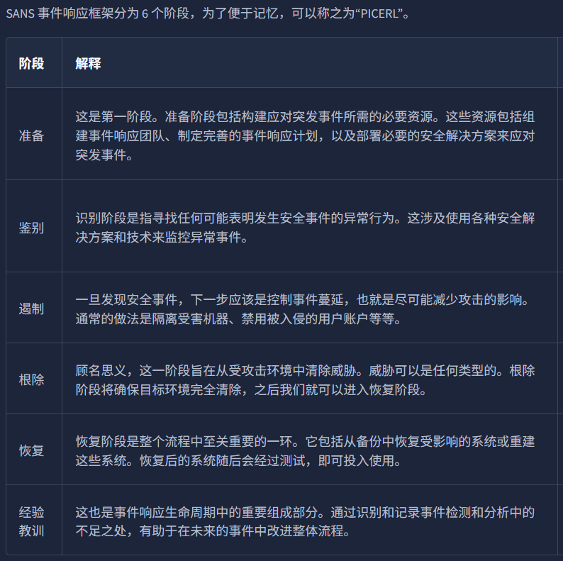
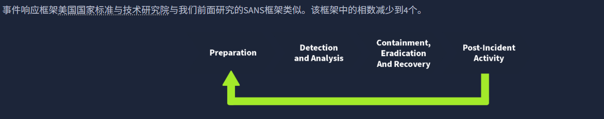

- [SOC](#soc)
    - [检测 (Detection)](#检测-detection)
    - [响应 (Response)](#响应-response)
    - [SOC 的三大支柱](#soc-的三大支柱)
  - [People](#people)
  - [Process](#process)
    - [1. 告警分选 (Alert Triage)](#1-告警分选-alert-triage)
    - [2. 报告 (Reporting)](#2-报告-reporting)
    - [3. 事件响应与取证 (Incident Response and Forensics)](#3-事件响应与取证-incident-response-and-forensics)
  - [Technology](#technology)
- [数字取证](#数字取证)
  - [数字取证的主要类型](#数字取证的主要类型)
  - [取证环节](#取证环节)
    - [1. 适当的授权 (Proper Authorization)](#1-适当的授权-proper-authorization)
    - [2. 监管链 (Chain of Custody)](#2-监管链-chain-of-custody)
    - [3. 写阻断器的使用 (Use of Write Blockers)](#3-写阻断器的使用-use-of-write-blockers)
  - [Windows 取证](#windows-取证)
    - [常用工具介绍](#常用工具介绍)
  - [案例：寻找被绑架的小猫 Gado](#案例寻找被绑架的小猫-gado)
    - [1. 文件元数据 (File Metadata)](#1-文件元数据-file-metadata)
    - [2. 照片 EXIF 数据 (Photo EXIF Data)](#2-照片-exif-数据-photo-exif-data)
- [事件响应](#事件响应)
  - [什么是事件](#什么是事件)
    - [1. 事件、日志与安全解决方案](#1-事件日志与安全解决方案)
    - [2. 警报 (Alerts)：误报与正报](#2-警报-alerts误报与正报)
    - [3. 事件响应与严重性等级](#3-事件响应与严重性等级)
  - [常见的安全事件类型](#常见的安全事件类型)
  - [事件响应流程](#事件响应流程)
    - [SANS](#sans)
    - [NIST](#nist)
  - [事件响应技术](#事件响应技术)
- [日志基础](#日志基础)
  - [日志类型](#日志类型)
  - [Windows事件日志分析](#windows事件日志分析)
    - [1. 事件查看器 (Event Viewer)](#1-事件查看器-event-viewer)
    - [2. Windows 事件日志详解](#2-windows-事件日志详解)
    - [3. 核心事件 ID 对照表](#3-核心事件-id-对照表)
    - [4. 筛选功能 (Filter Current Log)](#4-筛选功能-filter-current-log)
  - [Web服务器访问日志分析](#web服务器访问日志分析)
    - [1. 访问日志的核心字段](#1-访问日志的核心字段)
    - [2. Linux 命令行取证常用工具](#2-linux-命令行取证常用工具)

# SOC
安全运营中心（Security Operations Center）是由专业安全团队运行的专用设施。该团队旨在持续监控组织的资源和网络，识别可疑活动以防范损害。他们每周 7 天、每天 24 小时全天候运转。

SOC 团队的核心任务是确保**检测**与**响应**能力的完备。为此，SOC 团队配备了一系列安全解决方案资源，通过将全公司的网络和所有系统集成到统一的中心化位置进行监控。为了能够实时发现并应对各类安全事件，持续监控是必不可少的。

### 检测 (Detection)
* **检测漏洞：** SOC 可能会发现一批必须针对特定已知漏洞进行补丁修复的 Windows 电脑。严格来说，修补漏洞不一定是 SOC 的直接职责，但未修复的漏洞会影响全公司的安全水平。
* **检测未经授权的活动：** 假设攻击者窃取了员工的用户名和密码并以此登录公司系统。在造成损害之前，快速检测到此类未经授权的活动至关重要。可以利用地理位置等多种线索来辅助识别此类异常。
* **检测违反策略的行为：** 安全策略是为了保护公司免受安全威胁并确保合规性而制定的一套规则和程序。不同公司对“违规”的定义各不相同，典型的例子包括下载盗版媒体文件或以不安全的方式发送公司机密文件。
* **检测入侵：** 入侵是指对系统和网络的未经授权访问。场景之一可能是攻击者成功利用了 Web 应用程序的漏洞；另一种场景则是用户访问了恶意网站导致其电脑被感染。

### 响应 (Response)
* **支持事件响应：** 一旦检测到安全事件，必须采取特定步骤进行处置。响应工作包括尽可能减小事件的影响，并进行根本原因分析（RCA）。SOC 团队会协助事件响应（IR）团队执行这些关键步骤。

---

### SOC 的三大支柱
SOC 包含三大支柱：**人员（People）**、**流程（Process）**和**技术（Technology）**。只有具备这三大支柱，SOC 团队才能走向成熟，并高效地检测及应对各类不同事件。

这三者在 SOC 环境中相辅相成：一支由**专业人员**组成的团队，在完善的**流程**指导下，操作最前沿的**安全工具**，这便构成了一个成熟的 SOC 环境。

## People
无论安全任务自动化的演进如何，**人员（People）** 始终是 SOC 中最重要的因素。在 SOC 环境中，安全解决方案可能会生成海量的告警，从而产生巨大的“噪声”。

在 SOC 中，如果没有人工干预，单纯依靠安全解决方案，你最终会把精力耗费在大量无关紧要的问题上。始终需要由**人员**来协助安全系统识别真正有害的活动，并确保做出及时响应。

这些人员被称为 **SOC 团队**。该团队通常包含以下角色和职责：

* **SOC 分析师 (一级/L1)：** 安全解决方案检测到的任何内容都会首先经过这些分析师。他们是所有检测任务的第一响应者。L1 分析师进行基础的告警分选（Triage），以确定特定检测是否具有危害性，并负责通过适当渠道报告这些发现。
* **SOC 分析师 (二级/L2)：** 虽然 L1 进行初步分析，但某些检测可能需要更深入的调查。L2 分析师协助进行深度探究，并关联来自多个数据源的数据，以进行妥善的分析。
* **SOC 分析师 (三级/L3)：** L3 分析师是资深专业人士，他们会主动搜寻威胁指标（Threat Indicators）并支持事件响应活动。由 L1 和 L2 报告的关键严重级检测通常已构成安全事件，需要详细的响应处理，包括遏制、根除和恢复。这正是 L3 分析师经验的用武之地。
* **安全工程师 (Security Engineer)：** 所有的分析师都要操作安全解决方案，而这些方案需要部署和配置。安全工程师负责这些系统的部署与配置，确保其平稳运行。
* **检测工程师 (Detection Engineer)：** 安全规则是安全解决方案背后的逻辑，用于检测有害活动。L2 和 L3 分析师经常编写这些规则，但有时 SOC 团队也会设立专门的检测工程师岗位来独立承担此职责。
* **SOC 经理 (SOC Manager)：** SOC 经理负责管理团队遵循的流程并提供支持。此外，SOC 经理还负责与组织的**首席信息安全官 (CISO)** 保持沟通，汇报 SOC 团队当前的安保态势及工作进展。

> **注：** SOC 团队的角色划分可能会根据组织的规模和业务关键程度而增加或减少。

## Process
我们已经探讨了 SOC 团队中不同人员的角色与职责。正如我们所看到的，每个角色都有其对应的**流程（Processes）**，例如一级 SOC 分析师作为第一响应者，负责执行告警分选并判断其危害性。

接下来，让我们讨论 SOC 中涉及的一些重要流程：

### 1. 告警分选 (Alert Triage)
告警分选是 SOC 团队运作的基石。对任何告警的第一反应都是进行分选。分选的核心在于分析特定告警，从而确定其**严重程度**并帮助我们排列**优先级**。

告警分选的关键在于回答 **"5W"** 问题。以下是一个针对“主机 GEORGE PC 发现恶意软件”告警的 5W 分析示例：

| 5W 维度 | 详细解析 | 回答示例 |
| :--- | :--- | :--- |
| **What (什么)** | 发生了什么事？ | 组织网络内的一台主机检测到了恶意文件。 |
| **When (何时)** | 何时发生的？ | 该文件于 2024 年 6 月 5 日 13:20 被检测到。 |
| **Where (何地)** | 在哪里发生的？ | 该文件位于主机 "GEORGE PC" 的特定目录中。 |
| **Who (谁)** | 涉及哪些相关人员？ | 该文件是在用户 George 的账户下检测到的。 |
| **Why (为什么)** | 发生的原因是什么？ | 调查发现该文件下载自一个盗版软件网站。经与用户核实，其为了免费使用某软件而下载了该文件。 |

---

### 2. 报告 (Reporting)
检测到的有害告警需要升级（Escalation）给更高级别的分析师，以便及时响应和解决。这些告警通常以“工单（Tickets）”的形式进行流转并分配给相关人员。
* **报告要求：** 报告应包含完整的 5W 分析以及深入的研判结论。
* **证据保存：** 必须附带截图作为该活动的证据。

---

### 3. 事件响应与取证 (Incident Response and Forensics)
有时，报告的检测结果指向极其恶意的关键活动。在这种情况下，高级团队会启动事件响应（IR）流程。

* **事件响应：** 这是一个旨在处置威胁、减少影响并恢复业务的标准化过程（详见“事件响应”专属模块）。
* **数字取证：** 在某些情况下，需要进行详细的取证工作。取证活动的目的是通过分析系统或网络中的**人工制品（Artifacts，如日志、文件残留等）**，来确定事件的**根本原因（Root Cause）**。

## Technology
在 SOC 三大支柱中，“**技术（Technology）**”能有效减少 SOC 团队在检测和应对威胁时的手动工作量。

一个组织的网络由众多设备和应用程序组成。作为安全团队，如果去逐一检测和响应每个设备或应用中的威胁，将耗费巨大的精力和资源。安全解决方案能够将网络中所有设备或应用的信息进行**中心化**处理，并实现检测与响应能力的**自动化**。

以下是一些常见安全解决方案的简要介绍：

* **SIEM (安全信息和事件管理)：** 这是几乎每个 SOC 环境中都会使用的流行工具。它从各种网络设备（称为“日志源”）中收集日志。SIEM 中配置了**检测规则**，这些规则包含识别可疑活动的逻辑。SIEM 会关联多个日志源进行分析，一旦匹配到任何规则，就会向我们发出告警。现代 SIEM 已经超越了传统的基于规则的分析，还提供用户行为分析（UBA）和威胁情报能力，并辅以机器学习算法来增强检测。
    * **注：** 在 SOC 环境中，SIEM 主要提供的是**检测（Detection）**能力。
* **EDR (终端检测与响应)：** EDR 为 SOC 团队提供设备活动的详细实时视图和历史记录。它在终端级别运行，并能执行自动化响应。EDR 针对终端拥有强大的检测能力，让你只需点击几下即可进行详细调查并做出响应。
* **防火墙 (Firewall)：** 防火墙纯粹用于网络安全，充当内部网络与外部网络（如互联网）之间的屏障。它监控流入和流出的网络流量，并过滤任何未经授权的流量。防火墙也部署了一些检测规则，帮助我们在可疑流量到达内部网络之前将其识别并拦截。

此外，还有许多其他安全解决方案在 SOC 环境中发挥着独特的作用，例如**杀毒软件 (Antivirus)**、**EPP**、**IDS/IPS**、**XDR**、**SOAR** 等。在 SOC 中部署何种技术，取决于对组织威胁面（Threat Surface）的仔细评估以及可用资源的考量。

# 数字取证
数字取证团队面临的案例各异，需要不同的工具和技术。然而，美国国家标准与技术研究院（**NIST**）为所有案例定义了一个通用流程。NIST 致力于为包括网络安全在内的各个技术领域制定框架，并将数字取证过程分为四个阶段：

* **收集 (Collection)：** 这是数字取证的第一阶段。识别所有可以采集数据的设备至关重要。调查人员通常会在犯罪现场发现个人电脑、笔记本电脑、数码相机、USB 驱动器等。在收集证据时，必须确保原始数据不被篡改，并维持一份记录所有采集物品详细信息的妥善文件。
* **检查 (Examination)：** 收集到的数据量可能过于庞大，令调查人员无从下手。因此通常需要对数据进行过滤，并提取感兴趣的数据。例如，你从犯罪现场的数码相机中提取了所有多媒体文件，但你只关心特定日期和时间记录的内容。在检查阶段，你会筛选出所需时间段的文件，进入下一阶段。同理，你可能只需要从包含众多账户的系统中提取特定用户的数据。
* **分析 (Analysis)：** 这是一个关键阶段。调查人员现在必须通过关联多份证据来分析数据，从而得出结论。分析取决于案例场景和可用数据，其目的是按时间顺序梳理出与案件相关的活动。
* **报告 (Reporting)：** 在最后阶段，需要编写一份详细报告。报告包含调查方法、从收集证据中得出的详细发现，也可能包含相关建议。该报告将提交给执法部门和高层管理人员。考虑到接收方的理解水平，报告中包含一份**执行摘要（Executive Summary）**非常重要。

---

## 数字取证的主要类型

在收集阶段，我们会发现现场存在各种类型的证据。分析这些不同类别的证据需要多样的工具和技术，以下是几种最常见的数字取证类型：

* **计算机取证 (Computer Forensics)：** 最常见的类型，主要涉及对计算机的调查，因为计算机是犯罪中最常用的设备。
* **移动取证 (Mobile Forensics)：** 涉及调查移动设备并提取通话记录、短信、GPS 位置等证据。
* **网络取证 (Network Forensics)：** 取证范围超越了单个设备，涵盖整个网络。网络中发现的大部分证据是网络流量日志。
* **数据库取证 (Database Forensics)：** 许多关键数据存储在专用数据库中。此类取证调查任何导致数据篡改或外泄的数据库入侵行为。
* **云取证 (Cloud Forensics)：** 涉及调查存储在云基础设施上的数据。由于云端留下的证据有时较少，这对调查人员来说可能具有挑战性。
* **邮件取证 (Email Forensics)：** 电子邮件是专业人士之间最常用的沟通方式，已成为数字取证的重要组成部分。通过调查邮件来确定其是否属于网络钓鱼或诈骗活动的一部分。

## 取证环节

### 1. 适当的授权 (Proper Authorization)
在收集任何数据之前，取证团队应获得相关部门的授权。未经事先批准而收集的证据可能被法院视为**无效证据**。取证证据通常包含组织或个人的私密及敏感数据，因此，在收集这些数据前获得适当授权，是确保调查在法律框架内进行的必要前提。

### 2. 监管链 (Chain of Custody)
想象一下：调查小组从犯罪现场收集了所有证据，但几天后部分证据丢失了，或者证据内容发生了变化。在这种情况下，由于没有规范的文档来记录证据的保管人，没有人能为此负责。

通过维护**监管链（Chain of Custody）**文档可以解决这一问题。监管链是一份包含证据所有详细信息的正式文件。其关键内容包括：
* 证据描述（名称、类型）。
* 证据收集人员的姓名。
* 证据收集的日期和时间。
* 每件证据的存放位置。
* 证据的访问时间及访问人员记录。

这能够建立起完整的证据追踪轨迹，有助于证据的保护。监管链文件可用于向法庭证明所提交证据的**完整性**和可靠性。

### 3. 写阻断器的使用 (Use of Write Blockers)
写阻断器（又称写保护卡/器）是数字取证工具箱中不可或缺的工具。

假设你正在从嫌疑人的硬盘中收集证据，并将该硬盘连接到了取证工作站。在收集过程中，取证工作站的一些后台任务可能会修改硬盘上文件的**时间戳**。这会干扰后续分析，最终导致错误的结论。

如果在同样的场景下，使用写阻断器从硬盘中收集数据，嫌疑人的硬盘将保持其**原始状态**。因为写阻断器能够拦截任何可能导致证据被篡改的写入操作。

## Windows 取证

在犯罪现场收集的最常见的证据类型是台式机和笔记本电脑，因为大多数犯罪活动都涉及个人系统。这些设备运行着不同的操作系统。在本节任务中，我们将讨论 **Windows 操作系统**的证据获取与分析，这是在各类案例调查中最为常见的操作系统。

作为数据收集阶段的一部分，调查人员会获取 Windows 操作系统的**取证镜像（Forensic Images）**。取证镜像是指对整个操作系统进行“位对位”（bit-by-bit）的完整复制。针对 Windows 系统，通常会提取两类不同的镜像：

* **磁盘镜像 (Disk Image)：** 磁盘镜像包含存储设备（如 HDD、SSD 等）上的所有数据。这些数据是**非易失性**的，意味着即使系统重启，磁盘数据依然存在。例如：媒体文件、文档、浏览器历史记录等。
* **内存镜像 (Memory Image)：** 内存镜像包含操作系统 **RAM（内存）**中的数据。这些数据是**易失性**的，意味着一旦系统断电或重启，数据就会丢失。为了捕获打开的文件、运行中的进程、当前的连接等信息，必须**优先**提取嫌疑系统的内存镜像；否则，任何重启或关机操作都会导致这些易失性数据被抹除。

在对 Windows 系统进行数字取证时，收集磁盘和内存镜像至关重要。

---

### 常用工具介绍

以下是一些用于 Windows 系统磁盘及内存镜像获取与分析的流行工具：

#### **磁盘取证工具**
* **FTK Imager：** 一款广泛使用的磁盘镜像获取工具。它提供友好的图形界面，支持创建多种格式的镜像文件。该工具不仅能用于**获取**证据，还可以直接**分析**磁盘镜像的内容。
* **Autopsy：** 一款流行的开源数字取证平台。调查人员可以将获取的磁盘镜像导入该工具，它会自动进行深入分析。其功能包括关键字搜索、误删文件恢复、查看文件元数据、检测扩展名不匹配等。

#### **内存取证工具**
* **DumpIt：** 提供从 Windows 系统提取内存镜像的实用功能。该工具通过命令行界面操作，只需简单的指令即可创建不同格式的内存镜像。
* **Volatility：** 一款极其强大的开源内存镜像分析工具。它提供了大量实用的插件，每个插件可针对特定的“人工制品”（Artifact）进行分析。它支持包括 Windows、Linux、macOS 和 Android 在内的多种操作系统。

> **注：** 除上述工具外，行业内还有许多其他工具可用于 Windows 操作系统的镜像获取与分析。

我们在智能手机和电脑等数字设备上进行的任何操作都会留下痕迹。让我们看看如何利用这些痕迹进行后续调查。

## 案例：寻找被绑架的小猫 Gado
我们的小猫 Gado 被绑架了。绑架者向我们发送了一份 **MS Word** 格式的赎金要求文件。为了方便分析，我们已将其转换为 **PDF** 格式，并提取了 Word 文件中的图片。

---

### 1. 文件元数据 (File Metadata)
当你创建简单的文本文件（.txt）时，操作系统会保存文件创建日期、最后修改日期等基础元数据。但如果你使用更高级的编辑器（如 MS Word），文件中会保留更多的信息。即使将文件导出为 PDF，根据所使用的 PDF 生成器，原始文档的大部分元数据通常仍会保留。

#### 使用 `pdfinfo` 查看元数据
在取证中，我们可以使用 `pdfinfo` 工具读取 PDF 的元数据（如标题、主题、作者、创建工具和日期）。

**操作示例：**
```bash
root@tryhackme:~# pdfinfo DOCUMENT.pdf
Creator:        Microsoft® Word for Office 365
Producer:       Microsoft® Word for Office 365
CreationDate:   Wed Oct 10 21:47:53 2018 EEST
...
```
从上述输出可以清楚地看到：该文件是 2018 年 10 月 10 日使用 **MS Word for Office 365** 创建的。

---

### 2. 照片 EXIF 数据 (Photo EXIF Data)
**EXIF**（可交换图像文件格式）是图像文件中保存元数据的标准。无论使用智能手机还是数码相机拍摄照片，图像中都会嵌入大量信息：

* **设备信息：** 相机或智能手机型号。
* **时间戳：** 照片拍摄的具体日期和时间。
* **拍摄参数：** 焦距、光圈、快门速度、ISO 等。
* **地理位置：** 由于现代手机配有 GPS，照片中极有可能包含 **GPS 坐标**（经纬度），揭示照片拍摄的精确位置。

#### 使用 `exiftool` 读取数据
`exiftool` 是一款强大的读取和写入多种文件元数据的命令行工具。

**操作示例：**
```bash
root@tryhackme:~# exiftool IMAGE.jpg
[...]
GPS Position : 51 deg 31' 4.00" N, 0 deg 5' 48.30" W
[...]
```

#### 地理位置追踪
将获取的坐标代入在线地图（如 Bing Maps 或 Google Maps），就能锁定位置。
* **搜索技巧：** 搜索时需将 `deg` 替换为 `°` 并删除多余空格。
* **输入示例：** 在地图搜索框输入 `51°31'4.0"N 0°05'48.3"W`。

通过这种方式，调查人员可以精确定位照片拍摄的街道，从而为破案提供关键线索。

# 事件响应
## 什么是事件
在你的计算设备（如笔记本电脑、手机等）上，运行着许多不同的进程。其中一些是**交互式**的，即由你执行的操作（如玩游戏、看视频）；还有一些是运行在后台的**非交互式**进程，它们不需要你干预，但对设备的正常运行至关重要。

这两类进程都会产生大量的**事件（Events）**。它们所做的任何操作都会被记录为事件日志。

### 1. 事件、日志与安全解决方案
由于设备上运行着大量进程并执行各种常规任务，系统会持续产生海量的事件。有时，这些事件可能预示着设备中正在发生某些糟糕的事情。

我们该如何从海量事件中揪出破坏性活动呢？**安全解决方案**（如 IDS/IPS、SIEM 等）就是为了解决这个问题而存在的。这些事件作为日志（Logs）输入到安全系统中，系统会自动从中识别有害活动。这大大减轻了我们的工作量，但真正的挑战在于安全系统发出警报之后。

---

### 2. 警报 (Alerts)：误报与正报
⚠️ 当安全解决方案发现一个或一组与潜在有害活动相关的事件时，它会触发**警报**。安全团队随后需要对这些警报进行分析。警报通常分为两类：

* **误报 (False Positive)：** 指警报提示了危险，但实际活动是无害的。
* **正报 (True Positive)：** 指警报提示了危险，且该活动确实是有害且危险的。

---

### 3. 事件响应与严重性等级
这些被证实的“正报”警报通常被称为**安全事件（Incidents）**。一旦某个警报被归类为安全事件，下一步就是为其设定**严重性等级（Severity Level）**。。根据事件可能产生的影响，它们通常被分为四个等级：紧急、高、中、低。

## 常见的安全事件类型

* **恶意软件感染 (Malware Infections)：** 恶意软件是一种旨在破坏系统、网络或应用程序的有害程序。大多数安全事件都与恶意软件有关。恶意软件种类繁多，每种都有其独特的破坏力。感染通常是由各种文件引起的，如文本、文档或可执行程序等。
* **安全违规/入侵 (Security Breaches)：** 当未经授权的人员获得了对机密数据的访问权限（即看到了不该看的内容或拿到了不该拿的数据）时，就发生了安全违规。由于许多业务严重依赖于机密数据，确保这些数据仅供授权人员访问至关重要。
* **数据泄露 (Data Leaks)：** 数据泄露是指个人或组织的机密信息被暴露给未经授权的实体。许多攻击者利用数据泄露来破坏受害者的名誉，或以此威胁受害者以获取利益。与安全入侵不同，数据泄露有时也可能是由人为错误或配置错误无意间造成的。
* **内部攻击 (Insider Attacks)：** 源自组织内部的安全事件被称为内部攻击。例如，一名心怀不满的员工在离职前最后一天，通过 USB 病毒感染了整个网络。内部人员发起的蓄意攻击属于此类。这类攻击极其危险，因为内部人员拥有的资源访问权限通常远高于外部攻击者。
* **拒绝服务攻击 (Denial of Service Attacks)：** 拒绝服务攻击（DoS）是指攻击者利用虚假请求淹没系统、网络或应用程序，最终导致合法用户无法正常使用。这是由于系统处理请求的资源被耗尽而导致的。

## 事件响应流程
### SANS

### NIST


## 事件响应技术
通过手动方式去寻找异常行为并识别安全事件是非常困难的。目前有多种安全解决方案，它们在检测安全事件中各司其职。其中一些方案甚至具备响应事件并执行生命周期中其他阶段（如遏制、根除等）的能力。以下是其中一些解决方案的简要说明：

* **SIEM（安全信息和事件管理）：** SIEM 解决方案将所有重要的日志收集到一个集中的位置，并对它们进行关联分析，以识别安全事件。
* **AV（杀毒软件）：** 杀毒软件用于检测系统中已知的恶意程序，并对系统进行定期扫描。
* **EDR（终端检测与响应）：** EDR 部署在每台设备（终端）上，保护其免受某些高级威胁。该方案还可以对威胁进行遏制和根除。

当安全事件被识别出来后，必须遵循特定的程序，包括调查攻击的影响范围、采取必要行动防止进一步损害，并从根源上消除威胁。针对不同类型的事件，这些步骤可能会有所不同。在这种情况下，拥有一套处理每种事件的详细分步说明可以帮你节省大量时间。这类指令集被称为 **剧本（Playbooks）**。

以下是一个针对钓鱼邮件（Phishing Email）事件的剧本示例：

* 通知所有与该钓鱼邮件事件相关的利益相关者。
* 通过分析邮件的头部（Header）和正文（Body）来判断邮件是否具有恶意。
* 查找邮件中是否存在任何附件并对其进行分析。
* 确认是否有人打开了这些附件。
* 将受感染的系统从网络中隔离。
* 封禁邮件发送者。

与此相对，**操作手册（Runbooks）** 则是针对不同事件中特定步骤的详细、分步执行流程。这些步骤可能会根据可用于调查的资源而有所不同。

# 日志基础
## 日志类型

| 日志类型 | 用途 | 示例 |
| :--- | :--- | :--- |
| **系统日志 (System Logs)** | 用于排除操作系统运行故障。提供各种操作系统活动的信息。 | - 系统启动与关闭事件<br>- 驱动加载事件<br>- 系统错误事件<br>- 硬件事件 |
| **安全日志 (Security Logs)** | 帮助检测和调查安全事件。提供系统中与安全相关的活动信息。 | - **身份验证事件 (登录)**<br>- 授权事件<br>- 安全策略变更<br>- 用户账户变更<br>- 异常活动事件 |
| **应用日志 (Application Logs)** | 包含与应用程序相关的特定事件。应用内部的任何交互或非交互活动都会记录在此。 | - 用户交互事件<br>- 应用程序变更<br>- 应用更新事件<br>- 应用错误事件 |
| **审计日志 (Audit Logs)** | 提供系统变更和用户事件的详细信息。有助于满足合规性要求，并在安全监控中发挥关键作用。 | - 数据访问事件<br>- 系统修改事件<br>- 用户活动记录<br>- 策略执行事件 |
| **网络日志 (Network Logs)** | 提供网络进出流量的信息。在排除网络故障和安全事件调查中起着至关重要的作用。 | - 入站网络流量<br>- 出站网络流量<br>- 网络连接日志<br>- **网络防火墙日志** |
| **访问日志 (Access Logs)** | 提供资源访问的详细信息。这些资源可以是各种类型。 | - Web 服务器访问日志<br>- 数据库访问日志<br>- 应用访问日志<br>- **API 访问日志** |

> **注意：** 根据应用程序和服务的功能不同，还可能存在许多其他类型的日志。

## Windows事件日志分析
与许多操作系统一样，Windows 也会记录其发生的各种活动。这些记录被存储在分类明确的日志文件中。在 Windows 系统中，有几种至关重要的日志类型：

* **应用程序 (Application)：** 记录运行在操作系统上的各种应用程序的信息，包括错误、警告、兼容性问题等。
* **系统 (System)：** 记录操作系统本身的运行操作信息，如驱动程序问题、硬件问题、系统启动与关闭信息、服务信息等。
* **安全 (Security)：** 从安全角度来看，这是 **最重要** 的日志文件。它记录所有与安全相关的活动，包括用户身份验证（登录/注销）、用户账户变更、安全策略更改等。

除了这些，Windows 还有许多其他专门为特定操作和应用设计的日志文件。

### 1. 事件查看器 (Event Viewer)
与某些需要特殊工具查看的日志不同，Windows 提供了一个名为 **“事件查看器”** 的内置实用程序。它拥有友好的图形界面（GUI），方便用户查看和搜索日志。

* **打开方式：** 点击 Windows 开始按钮，输入 “Event Viewer”。
* **界面分区：** 1.  **左侧：** 树状目录，可以找到“Windows 日志”下的各个分类。
    2.  **中间：** 日志条目列表，显示不同级别的事件（信息、警告、错误）。
    3.  **右侧：** 操作面板，提供筛选、搜索、保存日志等选项。

### 2. Windows 事件日志详解
当我们双击某条日志时，可以看到以下核心字段：
* **描述 (Description)：** 活动的详细文字信息。
* **日志名称 (Log Name)：** 指明该日志属于哪个文件（如 Security）。
* **记录时间 (Logged)：** 活动发生的精确时间。
* **事件 ID (Event ID)：** **这是最关键的字段。** 每个事件 ID 代表一种特定的活动类型。通过搜索特定的 ID，可以快速定位嫌疑行为。

---

### 3. 核心事件 ID 对照表
在数字取证中，熟记以下 ID 能极大提高效率：

| 事件 ID | 描述 |
| :--- | :--- |
| **4624** | 用户账户**成功登录** |
| **4625** | 用户账户**登录失败** |
| **4634** | 用户账户成功注销 |
| **4720** | **创建**了一个用户账户 |
| **4724** | 尝试**重置**账户密码 |
| **4722** | 启用了一个用户账户 |
| **4725** | 禁用了一个用户账户 |
| **4726** | 删除了一个用户账户 |

---

### 4. 筛选功能 (Filter Current Log)
使用“筛选当前日志”功能，你可以直接输入事件 ID（如 4624），系统会过滤掉所有无关信息，只显示登录成功的记录。

## Web服务器访问日志分析

我们每天都会与许多网站互动。无论是浏览页面、登录账户还是上传文件，这些行为本质上都是向网站发出的**请求（Requests）**。所有的请求都会被记录并存储在 Web 服务器的访问日志（Access Logs）中。

在 **Apache** Web 服务器中，默认日志文件通常位于 `/var/log/apache2/access.log`。

### 1. 访问日志的核心字段

示例日志：
`172.16.0.1 - - [06/Jun/2024:13:58:44] "GET /products HTTP/1.1" 404 "-" "Mozilla/5.0 (Windows NT 10.0; Win64; x64) AppleWebKit/537.36 (KHTML, like Gecko) Chrome/58.0.3029.110 Safari/537.36"`

通过分析日志中的一行数据，我们可以提取出以下关键取证信息：

* **IP 地址 (IP Address):** 发起请求的用户 IP（如 `172.16.0.1`）。
* **时间戳 (Timestamp):** 请求发生的精确时间（如 `[06/Jun/2024:13:58:44]`）。
* **请求详情 (Request):**
    * **HTTP 方法:** 如 `GET`（获取数据）或 `POST`（提交数据）。
    * **URL:** 请求的具体路径或资源（如 `/` 代表首页，`/admin` 代表后台）。
    * **状态码 (Status Code):** 服务器的响应结果。`200` 表示成功，`404` 表示页面不存在，`500` 表示服务器错误。
* **用户代理 (User-Agent):** 发起请求者的操作系统、浏览器版本等详细信息。

---

### 2. Linux 命令行取证常用工具

在 Linux 环境下，我们可以利用强大的命令行工具手动分析海量日志：

#### **cat —— 查看与合并**
* **查看：** `cat access.log` 可直接在终端列出所有日志内容。
* **合并：** 由于系统通常会进行**日志轮转（Rotation）**（将旧日志存为不同文件），你可以用 `cat access1.log access2.log > combined_access.log` 将多个日志合并成一个。

#### **grep —— 搜索关键词**
* **功能：** 在文件中搜索特定的字符串或模式。
* **取证应用：** 如果你想查看某个特定 IP 的POST活动，输入：
    `grep "192.168.1.1" access.log | grep "POST"`
    系统将只显示与该 IP 相关的行。

#### **less —— 分页与交互式搜索**
* **功能：** 逐页查看大型日志文件，避免刷屏。
* **操作技巧：**
    * `空格键`: 下一页。
    * `b`: 上一页。
    * `/关键词`: 在当前文件中直接搜索（按 **Enter** 确认）。
    * `n`: 跳转到下一个搜索结果。
    * `N`: 回退到上一个搜索结果。
