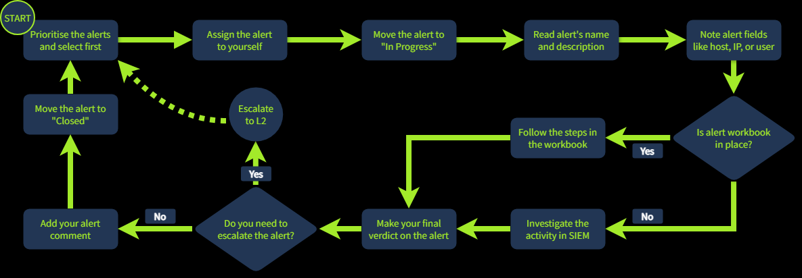

- [SOC警报分类](#soc警报分类)
  - [一、从事件到告警](#一从事件到告警)
    - [告警管理平台 (Alert Management Platforms)](#告警管理平台-alert-management-platforms)
    - [L1 分析师在告警分选中的角色](#l1-分析师在告警分选中的角色)
  - [二、告警属性 (Alert Properties)](#二告警属性-alert-properties)
    - [告警属性详解](#告警属性详解)
  - [三、告警优先级](#三告警优先级)
  - [四、警报分类](#四警报分类)
    - [告警分选参考流程](#告警分选参考流程)
    - [1. 初始操作 (Initial Actions)](#1-初始操作-initial-actions)
    - [2. 调查阶段 (Investigation)](#2-调查阶段-investigation)
    - [3. 最终操作 (Final Actions)](#3-最终操作-final-actions)
- [SOC警报报告](#soc警报报告)
  - [一、告警漏斗](#一告警漏斗)
    - [1. 告警报告 (Alert Reporting)](#1-告警报告-alert-reporting)
    - [2. 告警升级 (Alert Escalation)](#2-告警升级-alert-escalation)
    - [3. 沟通 (Communication)](#3-沟通-communication)
  - [二、报告撰写指南](#二报告撰写指南)
    - [告警报告的核心目的](#告警报告的核心目的)
    - [报告格式：五要素原则 (The Five Ws)](#报告格式五要素原则-the-five-ws)
  - [三、升级指南](#三升级指南)
    - [什么时候需要升级？](#什么时候需要升级)
    - [升级步骤](#升级步骤)
  - [四、沟通指南](#四沟通指南)
    - [常见沟通场景与对策](#常见沟通场景与对策)

# SOC警报分类
## 一、从事件到告警

网络安全监控遵循一个核心流程：
1. **事件发生 (Event Occurs)**：例如用户登录、进程启动或文件下载。
2. **日志记录 (Logging)**：操作系统、防火墙或云服务商记录该事件。
3. **日志传输 (Shipping)**：将所有日志汇聚到 **SIEM** 或 **EDR** 等安全解决方案中。

**告警 (Alert)** 的意义：
SOC 团队每天可能接收到来自数千个系统的数百万条日志。**告警**是安全系统在发现特定异常或可疑行为时生成的通知。它能将分析师从海量的原始日志中解放出来，使其每天只需处理几十条经过筛选的高价值告警。

---

### 告警管理平台 (Alert Management Platforms)

| 解决方案 | 示例工具 | 描述 |
| :--- | :--- | :--- |
| **SIEM 系统** | Splunk ES, Elastic | 具备强大的告警管理能力，是大多数 SOC 团队的首选。 |
| **EDR 或 NDR** | MS Defender, CrowdStrike | 虽然 EDR/NDR 拥有自己的仪表板，但通常建议将其接入 SIEM 或 SOAR 使用。 |
| **SOAR 系统** | Splunk SOAR, Cortex SOAR | 大型 SOC 团队利用 SOAR 汇总并集中管理来自多个方案的告警。 |
| **ITSM 系统** | Jira, TheHive | 部分团队会使用专门的工单系统（如 Trello 亦可适配）进行定制化的告警处理流程。 |

---

### L1 分析师在告警分选中的角色

**L1 分析师**是防御的第一线，也是与告警打交道最多的人。根据公司规模，L1 分析师每天可能处理 0 到 100 条告警，而每一条都可能潜藏着网络攻击。

在 SOC 团队中，各角色在告警分选（Triage）中的分工如下：
* **SOC L1 分析师**：审查告警，区分“好”与“坏”，并在发现真实威胁时通知 L2。
* **SOC L2 分析师**：接收 L1 升级的告警，进行更深入的分析和漏洞修复。
* **SOC 工程师**：确保告警包含足够的信息，以便分析师高效地进行分选。
* **SOC 经理**：追踪告警分选的速度和质量，确保真实攻击不会被遗漏。

## 二、告警属性 (Alert Properties)

### 告警属性详解

| 编号 | 属性名称 | 描述 | 示例 / 说明 |
| :--- | :--- | :--- | :--- |
| **1** | **告警时间 (Alert Time)** | 显示告警生成的时间。通常在实际事件发生几分钟后触发。 | **告警时间**: 3月21日 15:35 **事件时间**: 3月21日 15:32 |
| **2** | **告警名称 (Alert Name)** | 基于检测规则名称，简要概括发生了什么。 | 异常登录地理位置 被标记为钓鱼的邮件 Windows RDP 暴力破解 |
| **3** | **告警严重程度 (Severity)** | 定义告警的紧急程度。最初由检测工程师设置，分析师可根据需要修改。 | (🟢) 低危 / 信息级 (🟡) 中危 (🟠) 高危 (🔴) 严重 / 紧急 |
| **4** | **告警状态 (Status)** | 说明是否有人正在处理该告警，或分选工作是否已完成。 | (🆕) 新建 / 未分配 (🔄) 处理中 / 待定 (✅) 已关闭 / 已解决 |
| **5** | **告警判定 (Verdict)** | 也称为告警分类，说明该告警是真实威胁还是误报噪音。 | (🔴) **真阳性 (True Positive)**: 真实威胁 (🟢) **假阳性 (False Positive)**: 误报/非威胁 |
| **6** | **负责人 (Assignee)** | 显示负责审查该告警的分析师。 | 负责人有时被称为“告警所有者”，对该告警的处理结果负责。 |
| **7** | **告警描述 (Description)** | 解释告警的具体含义，通常包含三个部分。 | 1. 触发规则的逻辑 2. 为什么该活动可能预示攻击 3. (可选) 如何分选此告警 |
| **8** | **告警字段 (Alert Fields)** | 提供触发告警的具体原始数值及分析师的备注。 | 受影响的主机名 输入的命令行指令 以及其他相关技术细节 |

## 三、告警优先级
每个 SOC 团队都会制定自己的优先级规则，并通常在 SIEM 或 EDR 中设置相应的排序逻辑来实现自动化。以下是一种最通用、最简单且最常用的处理方法：

---

#### 1. 过滤告警
确保你不会领用到那些其他分析师已经审查过，或者队友正在调查的告警。你应当只领取那些**全新的、尚未被查看且未解决**的告警。

#### 2. 按严重程度排序
遵循“从重到轻”的原则：先处理**严重 (Critical)**，然后是**高危 (High)**、**中危 (Medium)**，最后是**低危 (Low)**。
* **逻辑：** 检测工程师在设计规则时，通常将那些更有可能是真实重大威胁、且造成的影响远超中低危事件的告警设定为“严重”。

#### 3. 按时间排序
在同一严重级别内，遵循“先入先出”原则：**先处理最早发生的告警，最后处理最新的告警**。
* **逻辑：** 如果两个告警都涉及违规入侵，发生时间较早的那个，黑客可能已经进入了数据倾倒（导出）阶段；而那个“新面孔”可能才刚刚开始踩点和探索。
  
## 四、警报分类

### 告警分选参考流程

*注意：实际工作中，流程可能会因团队而异。*

### 1. 初始操作 (Initial Actions)
初始步骤旨在确保你已接手该告警，避免与其他分析师的工作发生冲突，并确认你已为详细调查做好准备。
* **领用**：将告警分配给自己。
* **更新状态**：将状态改为“**处理中 (In Progress)**”。
* **熟悉背景**：仔细阅读告警名称、描述以及关键指标（Indicators）。

### 2. 调查阶段 (Investigation)
这是最复杂的一步，需要你运用技术知识和经验，在 **SIEM** 或 **EDR** 日志中分析活动的合法性。为了辅助 L1 分析师，一些团队会编写**工作手册 (Workbooks/Playbooks/Runbooks)**，即针对特定类别告警的调查指南。如果没有手册，请参考以下核心建议：
* **确定受害者**：明确受影响的用户、主机名、云环境、网络或网站。
* **识别行为内容**：弄清楚告警描述的具体动作，如可疑登录、恶意软件运行或钓鱼攻击。
* **审查上下文事件**：查看告警发生前后的相关事件，寻找可疑的关联行为。
* **外部验证**：利用威胁情报平台或其他可用资源来验证你的推断。

### 3. 最终操作 (Final Actions)

* **做出判定**：确定告警是**真阳性 (True Positive)** 还是 **假阳性 (False Positive)**。
* **撰写备注**：准备详细的评论，说明你的分析步骤和判定理由。
* **归档**：回到仪表板，将状态改为“**已关闭 (Closed)**”。

# SOC警报报告
## 一、告警漏斗
为了确保告警的有效流转，需要掌握三个核心概念：**报告 (Reporting)**、**升级 (Escalation)** 和 **沟通 (Communication)**。

---

### 1. 告警报告 (Alert Reporting)
在关闭告警或将其移交给 L2 之前，你可能需要编写报告。
* **深度要求**：根据团队标准和告警的严重程度，你可能不能只写一条简单的备注，而是需要详细记录调查过程，并确保包含所有相关的证据。
* **重要性**：这对于需要升级的“真阳性”告警尤为重要。

### 2. 告警升级 (Alert Escalation)
如果一个真阳性告警需要采取额外行动或更深层的调查，你需要按照既定流程将其升级给 L2 分析师。
* **提效**：此时你的告警报告就派上了用场——L2 分析师将利用报告获取初步背景信息，从而避免从零开始分析，节省宝贵的时间。

### 3. 沟通 (Communication)
在分析过程中或分析结束后，你可能需要与其他部门进行沟通。
* **跨部门协作**：例如，询问 **IT 部门**是否确实向某位用户授予了管理员权限；或者联系 **HR 部门**了解某位新入职员工的背景信息。
## 二、报告撰写指南

### 告警报告的核心目的

| 目的 | 详细说明 |
| :--- | :--- |
| **为升级提供背景信息** | 一份详尽的报告能为 L2 分析师节省大量时间，帮助他们迅速理解事态。 |
| **记录并留存调查结果** | **SIEM 的原始日志**通常只保存 3-12 个月，但**告警记录**会永久保存。因此，将所有背景信息记录在告警中至关重要。 |
| **提升调查技能** | “如果你不能简单地解释它，说明你理解得还不够深。”撰写报告是 L1 分析师通过总结告警来提升核心技能的绝佳方式。 |

---

### 报告格式：五要素原则 (The Five Ws)

想象你是一名 L2 分析师、数字取证 (DFIR) 成员或 IT 专业人员，当你接手一个告警时，你希望看到什么？我们建议在报告中至少包含以下“**5W**”要素：

* **Who (何人)**：哪个用户进行了登录、运行了命令或下载了文件？
* **What (何事)**：具体执行了什么操作或发生了什么样的事件序列？
* **When (何时)**：可疑活动具体从何时开始，又在何时结束？
* **Where (何地)**：哪些设备、IP 地址或网站涉及其中？
* **Why (为何)**：这是**最重要**的一个环节——即你得出最终判定的逻辑推理过程。

## 三、升级指南

在完成判定并撰写完告警报告后，你需要决定是否将告警升级给 L2。虽然每个团队的规定不尽相同，但以下建议通常适用于大多数 **SOC** 团队。

### 什么时候需要升级？
如果出现以下情况，你应当升级告警：
* **重大攻击迹象**：告警预示着存在重大网络攻击，需要更深度的调查或数字取证（DFIR）。
* **需要补救行动**：需要执行清除恶意软件、隔离主机或重置密码等操作。
* **跨部门/外部沟通**：需要与客户、合作伙伴、管理层或执法机构进行对接。
* **超出处理能力**：如果你无法完全理解该告警，需要资深分析师的协助。

---

### 升级步骤
在大多数情况下，升级的操作非常简单：你只需**将告警重新分配给当班的 L2 分析师**，并通过企业聊天工具（如 Slack/Teams）或当面告知对方。不过，在某些流程严苛的团队中，你可能需要填写包含数十个必填项的正式书面升级请求。

无论流程如何，L2 最终会接收工单、阅读你的报告，并在有疑问时联系你。确认无误后，L2 分析师通常会：
1.  进一步研究告警细节。
2.  验证该告警是否确为**真阳性 (True Positive)**。
3.  必要时与其他部门沟通。
4.  对于重大事件，启动正式的**事件响应 (Incident Response)** 流程。

对于 L1 分析师来说，遇到不确定的情况请求资深人员支持是很正常的。尤其是在入职的前几个月，**与其盲目关闭一个自己都不懂的告警，不如去讨论它并理清 SOC 流程**

## 四、沟通指南

报告和升级听起来逻辑简单，但实际操作中往往会遇到各种突发状况。在理想情况下，SOC 团队应具备一套**危机沟通 (Crisis Communication)** 程序。如果公司没有现成的指南，你需要了解以下几种典型场景并掌握应对方法。

### 常见沟通场景与对策

| 场景 | 应对策略 |
| :--- | :--- |
| **紧急升级但找不到人**：你需要升级一个紧急、严重的告警，但 L2 分析师已失联 30 分钟。 | 确保你知道**紧急联系表**的位置。按顺序尝试拨打电话：先联系 L2，再联系 L3，最后联系你的经理。 |
| **即时通讯账号被盗**：告警显示某个 Slack 或 Teams 账号被盗，你需要联系受影响用户核实登录行为。 | **绝对不要**通过已被入侵的聊天软件联系用户！请使用替代联系方式，例如直接拨打其办公或个人电话。 |
| **告警风暴**：短时间内涌入海量告警（包括多个严重级别告警），让你应接不暇。 | 严格执行**优先级排序流程**（由重到轻、由旧到新），同时务必向当班 L2 报备当前的告警堆积情况。 |
| **发现误判**：几天后你意识到自己之前误判了一个告警，可能漏掉了一次恶意攻击。 | **立即**联系 L2 解释你的担忧。威胁者在造成实质伤害前可能会潜伏数周，及时补救至关重要。 |
| **系统故障**：由于 SIEM 日志解析错误或无法搜索，你无法完成告警分选。 | **严禁跳过该告警！** 尽你所能调查现有信息，并将此技术问题报告给当班 L2 或 SOC 工程师。 |

