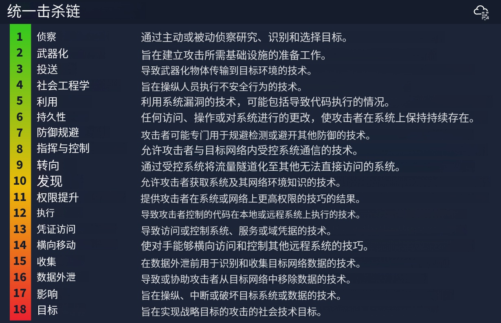
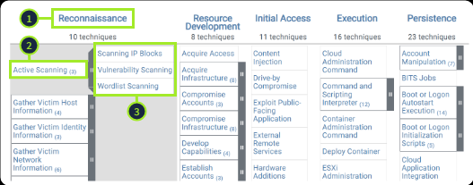
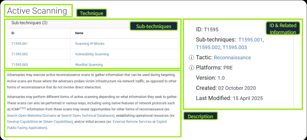
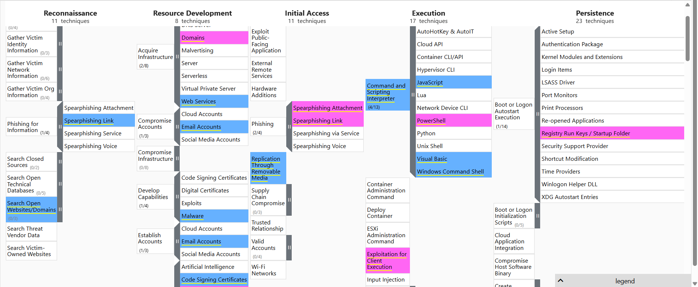
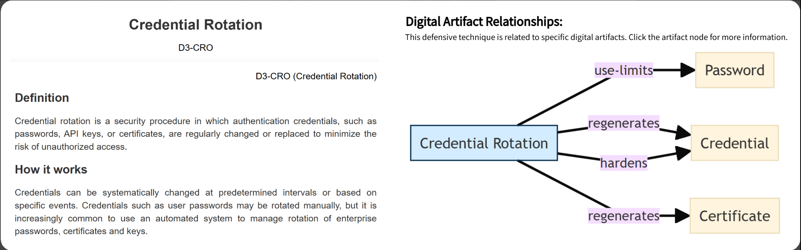

- [痛苦金字塔](#痛苦金字塔)
  - [Hash 值](#hash-值)
    - [1. 中文翻译与核心概念](#1-中文翻译与核心概念)
    - [2. Hash 在安全中的作用](#2-hash-在安全中的作用)
    - [3. 为什么它在金字塔底层？（琐碎级别）](#3-为什么它在金字塔底层琐碎级别)
  - [IP 地址](#ip-地址)
  - [域名](#域名)
    - [1. 为什么域名比 IP 更让黑客“头疼”？](#1-为什么域名比-ip-更让黑客头疼)
    - [2. 常见的域名攻击手段](#2-常见的域名攻击手段)
    - [3. 如何检测恶意域名？](#3-如何检测恶意域名)
    - [4. 实战工具：Any.run 联动分析](#4-实战工具anyrun-联动分析)
  - [主机残留物](#主机残留物)
    - [**1. 级别定义：令攻击者“懊恼”的级别**](#1-级别定义令攻击者懊恼的级别)
    - [**2. 什么是主机残留物？**](#2-什么是主机残留物)
    - [**3. 核心监控案例**](#3-核心监控案例)
  - [网络残留物](#网络残留物)
    - [**常见的网络残留物示例**](#常见的网络残留物示例)
    - [**3. 如何检测网络残留物？**](#3-如何检测网络残留物)
    - [**4. 实战案例：使用 TShark 提取特征**](#4-实战案例使用-tshark-提取特征)
    - [**5. 典型案例：Emotet 远控木马**](#5-典型案例emotet-远控木马)
  - [工具](#工具)
    - [**1. 防御高度：挑战者的难关**](#1-防御高度挑战者的难关)
    - [**2. 攻击者常用的“工具”类型**](#2-攻击者常用的工具类型)
    - [**3. 防御方的核心武器**](#3-防御方的核心武器)
  - [TTPs](#ttps)
- [杀伤链](#杀伤链)
  - [网络杀伤链的七个阶段](#网络杀伤链的七个阶段)
    - [1. 侦察 (Reconnaissance)](#1-侦察-reconnaissance)
    - [2. 武器化 (Weaponization)](#2-武器化-weaponization)
    - [3. 投送 (Delivery)](#3-投送-delivery)
    - [4. 漏洞利用 (Exploitation)](#4-漏洞利用-exploitation)
    - [5. 安装 (Installation)](#5-安装-installation)
    - [6. 命令与控制 (Command \& Control, C2)](#6-命令与控制-command--control-c2)
    - [7. 目标达成 (Actions on Objectives)](#7-目标达成-actions-on-objectives)
  - [统一杀伤链](#统一杀伤链)
- [MITRE](#mitre)
  - [ATT\&CK框架](#attck框架)
    - [介绍](#介绍)
    - [框架的演进与应用](#框架的演进与应用)
    - [ATT\&CK 矩阵 (Matrix) 与 导航器 (Navigator)](#attck-矩阵-matrix-与-导航器-navigator)
    - [深度探索](#深度探索)
  - [ATT\&CK 框架：从理论到实战](#attck-框架从理论到实战)
    - [1. 为什么 ATT\&CK 至关重要？](#1-为什么-attck-至关重要)
    - [实战映射案例：Mustang Panda (G0129)](#实战映射案例mustang-panda-g0129)
  - [](#)
    - [学习要点](#学习要点)
  - [CAR](#car)
    - [CAR 的关键组成部分](#car-的关键组成部分)
  - [MITRE D3FEND 框架](#mitre-d3fend-框架)
    - [1. 核心定位](#1-核心定位)
    - [2. D3FEND 矩阵结构](#2-d3fend-矩阵结构)
    - [3. 实例解析：凭据轮转 (Credential Rotation, D3-CRO)](#3-实例解析凭据轮转-credential-rotation-d3-cro)

# 痛苦金字塔
痛苦金字塔是一个衡量检测难度的模型，它指出：防御者监控的特征越接近黑客的行为逻辑（TTPs）而非简单的技术参数（如 IP 或 Hash），黑客想要绕过防御所付出的成本和“痛苦”就越高。
## Hash 值

### 1. 中文翻译与核心概念

**Hash 值（哈希值）** 是一种固定长度的数值，用于唯一地标识数据。它是哈希算法运行的结果。以下是几种最常见的哈希算法：

* **MD5 (128位):** 由 Ron Rivest 在 1992 年设计。目前已**不再安全**，因为它容易受到“哈希碰撞”（不同文件产生相同哈希）的攻击。
* **SHA-1 (160位):** 由美国 NSA 在 1995 年发明。产生的哈希值为 40 位十六进制数。由于易受暴力破解攻击，NIST 已于 2011 年弃用，并严禁用于数字签名，建议迁移至 **SHA-2** 或 **SHA-3**。
* **SHA-2 (常见为 SHA-256):** 2001 年由 NIST 和 NSA 设计，用于取代 SHA-1。SHA-256 返回 256 位的哈希值（64 位十六进制数），是目前最常用的算法之一。

---

### 2. Hash 在安全中的作用

安全专业人员通常使用 Hash 值来：
1.  **识别恶意软件：** 为特定的恶意文件样本提供唯一身份证明（类似于文件的“指纹”）。
2.  **情报参考：** 在威胁分析报告（如 *The DFIR Report*）的末尾，研究人员通常会附上恶意文件的 Hash 值作为 **IOC（失陷指标）**。
3.  **在线查询：** 通过 **VirusTotal** 或 **MetaDefender (OPSWAT)** 等工具，只需输入 Hash 值，即可查看该文件是否已被标记为病毒。

---

### 3. 为什么它在金字塔底层？（琐碎级别）

尽管 Hash 值能够精准识别已知文件，但它处于痛苦金字塔的最底层，原因如下：

* **极易改变：** 对于攻击者来说，修改文件的哈希值极其简单（Trivial）。哪怕只是在文件末尾添加一个空格或使用 `echo` 命令追加一个字符，产生的哈希值都会完全不同。
* **防御局限性：** 恶意软件会有无数个变种。如果你的检测逻辑仅依赖 Hash 值，黑客只需稍微改动一下代码，你的防御规则就会立刻失效。

## IP 地址

从防御角度看，掌握对手使用的 IP 地址是有价值的。一种常见的防御策略是在边界或外部**防火墙**上拦截、丢弃或拒绝来自这些 IP 地址的入站请求。然而，这种策略并非万无一失，因为对于有经验的对手来说，只需换一个新的公网 IP 地址即可轻松恢复攻击。

**Fast Flux（快速通量）**

对手为了让“IP 封锁”变得困难，常用的一种手段是 **Fast Flux**。

根据 Akamai 的定义，Fast Flux 是一种僵尸网络使用的 **DNS 技术**，旨在将钓鱼、Web 代理、恶意软件分发和通信活动隐藏在充当代理的受损主机之后。使用 Fast Flux 网络的目的，是让安全专业人员难以发现恶意软件与其命令与控制服务器（C&C）之间的通信。

因此，Fast Flux 网络的核心概念是：**一个域名关联多个 IP 地址，并且这些 IP 地址在不断更换。**

这是一份关于\*\*疼痛金字塔：域名（中级/简单级别）\*\*的翻译与整理笔记。

-----

## 域名

### 1\. 为什么域名比 IP 更让黑客“头疼”？

  * **成本提升：** 改变 IP 可能只需要几秒钟，但更换域名通常需要**购买域名、注册信息**并修改 **DNS 记录**。
  * **虽然更难，但仍不够：** 许多 DNS 供应商标准宽松，甚至提供 API 让攻击者能快速自动化地更换域名。

### 2\. 常见的域名攻击手段

#### A. Punycode 攻击 (Punycode Attack)

这是一种利用字符编码误导用户的技术，让恶意域名看起来和官方域名一模一样。

  * **原理：** Punycode 将非 ASCII 字符（如带变音符号的字母）转换为以 `xn--` 开头的 ASCII 字符串。
  * **案例：** \* 看起来像：`adıdas.de`（注意 `i` 下面有一个小点）
      * 实际 Punycode 为：`http://xn--addas-o4a.de/`
  * **现状：** 现代浏览器（Chrome, Edge, Safari 等）现在能很好地识别并自动还原这些混淆字符。

#### B. URL 短链接伪装

攻击者常用短链接服务（如 `bit.ly`, `tinyurl.com`）来隐藏真实的恶意跳转地址。

  * **常用服务：** `goo.gl`, `ow.ly`, `t.co`, `x.co` 等。
  * **防御小技巧：** 在短链接末尾加上一个 **`+`** 号（例如 `bit.ly/xxxx+`）并输入浏览器，通常可以查看该链接的原始跳转目标，而不会直接触发跳转。

-----

### 3\. 如何检测恶意域名？

安全分析师通常通过以下日志来源寻找蛛丝马迹：

  * **代理日志 (Proxy Logs)**
  * **Web 服务器日志**

-----

### 4\. 实战工具：Any.run 联动分析

在 **Any.run** 这种沙箱服务中，我们可以通过“网络 (Networking)”标签页深入分析恶意软件的行为：

| 分析维度 | 描述 | 安全价值 |
| :--- | :--- | :--- |
| **HTTP Requests** | 记录样本运行后所有的 HTTP 请求。 | 观察是否正在下载“投毒器(Dropper)”或与后台通信。 |
| **Connections** | 显示所有网络通信记录（FTP, C2 等）。 | 识别是否有文件上传或与 **C2 (命令与控制服务器)** 的通信。 |
| **DNS Requests** | 显示样本发出的所有 DNS 查询。 | 很多恶意软件会通过查询知名域名来测试网络连通性，判断自己是否处于隔离沙箱中。 |


## 主机残留物

### **1. 级别定义：令攻击者“懊恼”的级别**
在这个检测水平上，防御者已经能让攻击者感到受挫。
* **防御效果**：一旦攻击被检测到，攻击者必须被迫“绕回原点”，重新更换攻击工具和方法论。
* **攻击成本**：这对攻击者来说非常耗时，且需要投入更多的资源来研发或购买对抗性工具。

### **2. 什么是主机残留物？**
**主机残留物（Host Artifacts）** 是指攻击者在受害系统中留下的痕迹或可观察到的特征。主要包括：
* **注册表项值**（Registry Values）的变动。
* **可疑的进程执行**。
* **攻击模式或 IOC**（失陷指标，Indicators of Compromise）。
* **恶意程序释放的文件**（Files dropped）。
* 任何与当前威胁相关的独特性特征。

### **3. 核心监控案例**
为了有效捕获这些残留物，通常需要关注以下场景：

* **来自 Word 的可疑进程执行**：
    * *例如：打开一个 Word 文档后，后台突然启动了 PowerShell 或 CMD。*
* **运行恶意程序后的连带异常事件**：
    * *例如：某个应用启动后，紧接着出现了非正常的系统调用或网络请求。*
* **恶意行为者的文件操作**：
    * *包括被修改的系统文件，或在临时目录（如 Temp 文件夹）中生成的未知可执行文件。*

这是一段关于网络防御中“网络残留物”检测的专业内容。以下是翻译及整理后的笔记：

---

## 网络残留物

### **常见的网络残留物示例**
攻击者在网络流量中留下的独有特征，包括：
* **User-Agent 字符串**：异常或从未在环境中出现的浏览器标识。
* **C2（命令与控制）信息**：与攻击者服务器通信的特征。
* **URI 模式**：HTTP POST 请求中特定的路径结构。

### **3. 如何检测网络残留物？**
通常通过分析流量包（PCAP）或入侵检测系统（IDS）日志来实现：
* **流量分析工具**：**Wireshark**（图形化）或 **TShark**（命令行）。
* **IDS 日志来源**：例如 **Snort** 等系统的告警日志。

### **4. 实战案例：使用 TShark 提取特征**
可以使用以下命令从 `.pcap` 文件中过滤出所有的主机名和 User-Agent，以便发现异常：
```bash
tshark --Y http.request -T fields -e http.host -e http.user_agent -r analysis_file.pcap
```

### **5. 典型案例：Emotet 远控木马**
Emotet 下载器木马通常会使用一些非常规的 User-Agent 字符串。
* **防御逻辑**：如果你能识别并捕获攻击者自定义的 User-Agent，你就可以在防火墙或网关层面实施封禁。
* **结果**：这会为攻击者制造更多障碍，使其渗透尝试变得极其困难且令人沮丧。

## 工具

### **1. 防御高度：挑战者的难关**
* **防御效果**：到了这一阶段，我们针对攻击工具的检测能力已大幅提升。
* **攻击者代价**：由于现有工具失效，攻击者很可能选择放弃，或者不得不退回起点去开发新工具。这通常意味着他们需要投入大量资金、寻找具有同等潜力的新工具，甚至需要重新接受培训以掌握新工具的使用。

### **2. 攻击者常用的“工具”类型**
攻击者通常会利用各类实用程序来制造：
* **恶意宏文档 (Maldocs)**：用于鱼叉式网络钓鱼。
* **后门程序**：用于建立 C2（命令与控制）基础设施。
* **自定义文件**：任何自定义的 `.EXE`、`.DLL` 文件、Payload（载荷）或密码破解器。

### **3. 防御方的核心武器**
在这一阶段，防御者有三件“大杀器”：
* **特征码与规则**：防病毒软件特征码（AV Signatures）、检测规则、以及 **YARA 规则**。
* **威胁情报平台**：
    * **MalwareBazaar** 与 **Malshare**：提供恶意软件样本、恶意馈送（Feeds）和 YARA 扫描结果，对威胁狩猎和事件响应极具价值。
    * **SOC Prime**：安全专家分享针对最新 CVE 漏洞利用的检测规则平台。
* **模糊哈希 (Fuzzy Hashing)**：
    * **原理**：用于执行**相似性分析**。即使两个文件有微小差异，模糊哈希也能识别出它们的相似度。
    * **典型工具**：**SSDeep**。它可以识别出即便经过微改的恶意软件变种。
还没结束，但有个好消息：我们已经成功登顶，到达了“痛苦之金字塔”（Pyramid of Pain）的最顶层——**TTPs**！

以下是针对这段内容的中文翻译与要点整理：

## TTPs

**TTPs** 代表**战术（Tactics）**、**技术（Techniques）**和**程序（Procedures）**。它涵盖了整个 [MITRE ATT&CK 矩阵](https://attack.mitre.org/)，这意味着它包括了对手为实现其目标所采取的所有步骤——从最初的钓鱼攻击到持久化潜伏，再到最终的数据窃取。

如果你能快速检测并响应 TTPs，就能让对手几乎没有还手余地。例如：如果你能通过 Windows 事件日志监控检测到 **哈希传递（Pass-the-Hash）** 攻击并进行修复，你就能迅速定位受感染的主机，并阻止其在内网中的横向移动。

此时，攻击者将面临两种选择：
1. **撤退**：重新进行研究和培训，并重新配置其定制化工具。
2. **放弃**：寻找另一个更容易下手的目标。

显然，第二种选择对于攻击者来说更节省时间和资源成本。这样我们就保护了我们的资产。

# 杀伤链
“杀伤链”（Kill Chain）原本是一个军事概念，描述攻击的结构化过程：从发现目标、下达攻击指令到最终摧毁目标。

2011年，洛克希德·马丁公司（Lockheed Martin）借鉴这一军事理念，为网络安全行业建立了 **网络杀伤链（Cyber Kill Chain®）** 框架。该框架定义了网络空间中攻击者必须经历的各个阶段。对于攻击者而言，只有完成所有环节才能成功；而对于防御者，只要能阻断其中任何一环，就能瓦解整个攻击。


## 网络杀伤链的七个阶段

### 1. 侦察 (Reconnaissance)
这是攻击的准备阶段。攻击者会搜集目标的信息，例如：
* 识别具有漏洞的服务器或系统。
* 通过社交媒体（如 LinkedIn）搜集员工信息、邮箱地址。
* 通过扫描工具寻找暴露在互联网上的资产。

### 2. 武器化 (Weaponization)
攻击者将恶意代码（如远程访问特洛伊木马）与常规文件（如 PDF 或 Office 文档）结合，制作成“武器化”的数据包。此时，攻击尚未开始，只是在制造“弹药”。

### 3. 投送 (Delivery)
将武器化后的载荷发送给目标。常见的手段包括：
* **钓鱼邮件：** 发送带有恶意附件或链接的邮件。
* **水坑攻击：** 在目标经常访问的网站植入恶意代码。
* **USB 投放：** 在物理环境下诱使员工使用带毒 U 盘。

### 4. 漏洞利用 (Exploitation)
恶意载荷被投送后，攻击者利用目标系统的漏洞（软件缺陷、配置错误或人为疏忽）来执行恶意代码。这是攻击从“外部”进入“内部”的关键转折点。

### 5. 安装 (Installation)
攻击者在目标系统中安装持久化工具（如后门或恶意软件）。这一步是为了确保即便系统重启或用户采取简单清理措施，攻击者依然能保持对该系统的访问权限。

### 6. 命令与控制 (Command & Control, C2)
受感染的系统会向攻击者的服务器发送信号（Beacon），建立通信通道。攻击者通过这个 C2 通道对受害机器下达具体指令，实现远程操控。

### 7. 目标达成 (Actions on Objectives)
这是杀伤链的最后一环。攻击者开始执行最终目标，例如：
* 窃取或加密敏感数据（勒索）。
* 破坏系统运行。
* 以此为跳板，向网络内部的其他高价值目标进行横向移动。

## 统一杀伤链


# MITRE
MITRE 是一家非营利组织，在包括网络安全、人工智能、医疗保健和空间系统在内的多个领域开展研发工作。其所有工作的核心都在于履行其使命：“为创造一个更安全的世界而解决问题”。
## ATT&CK框架

### 介绍
#### 什么是 ATT&CK？
**MITRE ATT&CK®** 是一个基于现实世界观察到的、全球可访问的攻击者**战术（Tactics）**和**技术（Techniques）**知识库。
* **核心价值：** 为私营部门、政府以及安全产品和服务社区开发特定威胁模型和方法论提供了基础。
* **诞生背景：** 2013 年，MITRE 意识到需要对高级持续性威胁（APT）组织所使用的标准 **TTP** 进行归档和分类。

#### 核心术语：TTP
了解对手如何运作，需要拆解 TTP 的每一个部分：
* **战术 (Tactic)：** 攻击者的目标或意图。解决的是攻击的 **“为什么” (Why)**。
* **技术 (Technique)：** 攻击者达成其目标或意图的手段。解决的是 **“如何做” (How)**。
* **过程 (Procedure)：** 技术的具体实施方式或执行细节。

---

### 框架的演进与应用

#### 框架演进
* **平台扩展：** 最初专注于 Windows，现已扩展至 **Enterprise（企业）** 矩阵（涵盖 macOS、Linux、云平台等）、**Mobile（移动端）** 和 **ICS（工业控制系统）**。
* **社区驱动：** 框架通过网络安全社区的持续贡献不断壮大。

#### 应用场景
* **蓝队（防御方）：** 用于识别防御缺口、开发检测规则。
* **红队（攻击方）：** 依靠该框架规划真实的攻击模拟，测试组织的防御能力。

---

### ATT&CK 矩阵 (Matrix) 与 导航器 (Navigator)

**ATT&CK 矩阵** 是框架内所有战术和技术的直观展示工具。你可以使用 **ATT&CK Navigator** 来标注和探索矩阵。

**结构层级：**

1.战术 (Tactic)： 位于矩阵顶部（横向列出）。

2.技术 (Technique)： 嵌套在对应战术下方。

3.子技术 (Sub-technique)：** 可展开技术查看更具体的手段。

#### 举例说明：
* **战术 (Tactic)：** 攻击者想要对目标进行 **侦察 (Reconnaissance)**。
* **技术 (Technique)：** 他们可能会利用 **主动扫描 (Active Scanning)** 这种手段。
* **子技术 (Sub-technique)：** 主动扫描包括三种具体方法：**扫描 IP 段**、**漏洞扫描** 或 **目录字典扫描**。

---

### 深度探索
技术详情页面会再次列出子技术。链接页面还包含所有相关信息，包括技术描述和技术 ID，这些信息您在网络安全研究中经常会遇到。



这是一份关于 **ATT&CK 框架实际应用** 的翻译与实战笔记：

---

## ATT&CK 框架：从理论到实战

### 1. 为什么 ATT&CK 至关重要？
* **统一语言：** 它为从业者提供了描述对手行为的**标准一致的语言**。框架通过标准术语和**唯一 ID**，解决了同一攻击行为在不同报告中名称不一的问题，使跨团队通信和数据对比变得简单高效。
* **弥合差距：** 它架起了**威胁情报**与**防御行动**之间的桥梁。防御者可以将威胁报告中的描述映射到具体的 TTP，从而将情报转化为可用的检测逻辑、查询语句和应急预案（Playbooks）。

---

### 实战映射案例：Mustang Panda (G0129)

假设你的组织遭受了攻击。在事后分析中，将攻击过程映射为结构化格式至关重要，这能帮助团队应对未来的类似威胁。

以攻击组织 **Mustang Panda（青铜熊猫/G0129）** 为例，其多年来针对政府及非营利组织的攻击行为已被系统化映射：

* **初始访问 (Initial Access)：** 偏好使用**网络钓鱼 (Phishing)** 技术。
* **持久化 (Persistence)：** 通过**计划任务 (Scheduled Tasks)** 驻留系统。
* **防御绕过 (Defense Evasion)：** 对文件进行**混淆 (Obfuscated Files)** 以规避检测。
* **命令与控制 (C2)：** 使用**入口工具传输 (Ingress Tool Transfer)** 进行通信。

---

### 学习要点
1.  **映射 (Mapping) 是关键：** 分析攻击时，不仅要看发生了什么，还要能对应到 ATT&CK 的具体编号（如 T1566 代表钓鱼）。
2.  **工具辅助：** 利用 **ATT&CK Navigator**（导航器）可以直观地查看特定组织（如 Mustang Panda）的攻击矩阵，从而快速识别其常用的“板斧”。
3.  **动态防御：** 安全不是静态的。正如之前笔记中提到的，即使是“优秀”级别的 Exploit（漏洞利用）也可能失败或导致崩溃，因此通过 ATT&CK 了解攻击者的备选手段（Tactic 的多种 Technique 实现）对防御深度至关重要。

## CAR

**MITRE CAR** （Cyber Analytics Repository, 简称 CAR）是一个基于 ATT&CK 攻击模型开发的**分析检测知识库**。

* **官方定义**：它定义了一套数据模型，不仅提供伪代码表示，还针对特定工具（如 Splunk、EQL）提供了直接可用的检测实现。其核心目标是提供一组经过验证、解释详尽的检测逻辑。
* **通俗理解**：如果说 ATT&CK 是“黑客行为手册”，那么 CAR 就是“**防御者检测手册**”。它是一系列现成的检测方案，告诉防御者针对特定的攻击行为，应该在日志中搜索什么模式。

---

### CAR 的关键组成部分

当你查看一个具体的 CAR 条目（例如 **CAR-2020-09-001**）时，你会看到以下核心板块：

#### 1. 描述与映射 (Description & Mapping)
* 详细描述该检测分析的原理及其背后的逻辑。
* 关联到具体的 ATT&CK 战术（Tactics）和技术（Techniques）。

#### 2. 实现方案 (Implementations)
这是对安全分析师最有用的部分，通常包含：
* **伪代码 (Pseudocode)**：用易于理解的人类语言描述检测逻辑，不依赖特定工具。
* **工具查询语句**：提供如 **Splunk** 或 **LogPoint** 的搜索查询语句。分析师可以直接将这些代码复制到组织的 **SIEM（安全信息和事件管理）** 平台中进行实战检测。

#### 3. 单元测试 (Unit Tests)
* 部分条目提供测试案例，帮助分析师验证当前的检测逻辑是否能按预期触发报警。


## MITRE D3FEND 框架

### 1. 核心定位
* **一句话理解**：通过 MITRE ATT&CK，你学习攻击是如何发生的；通过 **MITRE D3FEND**，你探索如何阻止这些攻击。
* **全称**：网络防御探测、拒绝与破坏框架（Detection, Denial, and Disruption Framework Empowering Network Defense）。
* **作用**：它是一个结构化的框架，系统地罗列了**防御技术**，并为描述安全控制措施（Security Controls）的工作原理建立了一套通用语言。

### 2. D3FEND 矩阵结构
D3FEND 拥有自己的[知识矩阵](https://d3fend.mitre.org/)，该矩阵由 **7 大战术（Tactics）**组成，每项战术下都包含具体的技术及对应的 **ID**。

### 3. 实例解析：凭据轮转 (Credential Rotation, D3-CRO)
以 **D3-CRO** 技术为例，该技术强调通过定期更换密码来防止攻击者复用窃取的凭据。
在 D3FEND 中，你不仅能看到一个名词，还能了解到：
* **防御原理**：该防御措施是如何运作的。
* **实施要点**：在落地部署时需要考虑哪些因素。
* **关联性**：该防御技术涉及哪些**数字资产（Digital Artifacts）**，以及它具体针对哪些 **ATT&CK 攻击技术**。

